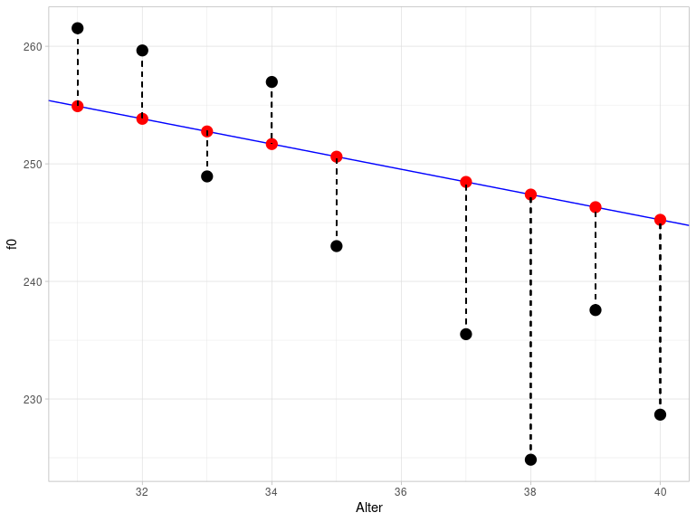

# Einfache lineare Regression

## Packages und Daten laden

Starten Sie das R Projekt, das Sie für diesen Kurs angelegt haben. Öffnen Sie hierfür RStudio und benutzen Sie die Schaltfläche oben rechts oder navigieren Sie zu Ihrem Kursverzeichnis und klicken Sie auf die `.Rproj` Datei.

Laden Sie die folgenden Packages und Data Frame:

```{r}
library(broom)
library(tidyverse)
url <- "http://www.phonetik.uni-muenchen.de/~jmh/lehre/Rdf"
queen <- read.table(file.path(url, "queen.txt")) %>% as_tibble()
```

## Einführung

Bisher haben wir uns mithilfe der deskriptiven Statistik bestimmte Messwerte (Variablen) genauer angeschaut und einiges über empirische und theoretische Verteilungen erfahren. Häufig stehen solche Variablen jedoch in Abhängigkeit zu anderen Variablen. Zum Beispiel ist durch viele Studien belegt worden, dass unsere Reaktionsfähigkeit mit steigendem Schlafmangel abnimmt. Das heißt, dass die Variable Reaktionszeit von der Variable Schlafmangel abhängig ist. Wir sprechen deshalb auch von abhängigen und unabhängigen Variablen. Mit der einfachen linearen Regression lassen sich diese Abhängigkeiten beschreiben. Oft wird auch davon gesprochen, dass man den Wert der abhängigen Variable $y$ durch die unabhängige Variable $x$ vorhersagt. Bevor wir eine lineare Regression durchführen, sprechen wir über Regressionslinien und Korrelation.

## Korrelation

Die Korrelation, auch *Pearson's correlation* $r$, ist ein Maß für die Assoziation zwischen zwei Variablen und kann mit der Funktion `cor()` berechnet werden. Wir werden hier mit den Data Frame `queen` arbeiten:

```{r}
queen %>% head()
```

Darin sind die durchschnittlichen Grundfrequenzwerte von Queen Elizabeth II. bei ihren jährlichen Weihnachtsansprachen festgehalten. Uns interessiert, ob das Alter der Queen einen Einfluss auf ihre Grundfrequenz hat. Erstmal machen wir uns ein Bild von der Lage. Es ist wichtig, dass wir bei Abbildungen für Daten, bei denen wir eine Korrelation vermuten, die unabhängige Variable (hier: Alter) immer auf die x-Achse und die abhängige Variable (hier: f0) immer auf die y-Achse packen.

```{r}
ggplot(queen) + 
  aes(x = Alter, y = f0) + 
  geom_point()
```

Es sieht so aus, als ob es da einen Zusammenhang geben könnte: Je älter die Queen wird, desto mehr sinkt ihre Grundfrequenz! Unseren visuellen Eindruck können wir anhand der Korrelation $r$ überprüfen:

```{r}
cor(queen$Alter, queen$f0)
```

Die Korrelation $r$ nimmt ausschließlich Werte zwischen -1 und 1 an. Je näher der Wert an Null ist, desto schwächer ist die Abhängigkeit zwischen den beiden Variablen. Mit -0.84 liegt eine starke negative Korrelation vor, d.h. unser visueller Eindruck scheint zu stimmen.

## Die Regressionslinie

### Theoretische Informationen

Die Regressionslinie der einfachen linearen Regression lässt sich mit folgender Formel beschreiben:

$y = k + bx$

Hierbei ist $k$ der y-Achsenabschnitt (engl. *intercept*) und $b$ die Steigung (engl. *slope*). Weil Intercept und Slope eine Regressionslinie eindeutig beschreiben, nennt man die beiden Parameter auch **Regressionskoeffizienten**. Durch die oben gegebene Formel lassen sich bei bekanntem Intercept $k$ und bekannter Slope $b$ also für alle möglichen $x$-Werte auch die entsprechenden $y$-Werte vorhersagen. Die Regressionslinie ist immer eine unendliche, exakt gerade Linie und verläuft außerdem durch den Mittelwert der Verteilung. 

In der folgenden Abbildung sehen Sie drei Regressionslinien: blau und grün haben dasselbe Intercept, aber entgegengesetzte Slopes; blau und orange haben unterschiedliche Intercepts, aber die gleiche Slope. Der genaue Wert der Steigung gibt an, um wie viel der $y$-Wert steigt oder sinkt, wenn man um eine $x$-Einheit erhöht. Für $x = 0$ in der Abbildung ist $y = 1$ (für blau und grün). Für $x = 1$ ist $y = 1 + b$, also für blau $y = 1 + 0.5 = 1.5$ und für grün $y = 1 + (-0.5) = 0.5$. Für die orange Linie gilt bei $x = 0$ ist $y = 2$, bei $x = 1$ ist $y = 2 + 0.5 = 2.5$.

```{r}
ggplot() + 
  xlim(-0.5, 1) + ylim(-0.5, 3) + xlab("x") + ylab("y") +
  geom_abline(slope = 0.5, intercept = 1, color = "blue", size = 1.2) + 
  geom_abline(slope = -0.5, intercept = 1, color = "darkgreen", size = 1.2) + 
  geom_abline(slope = 0.5, intercept = 2, color = "orange", size = 1.2) + 
  geom_vline(xintercept = 0, lty = "dashed")
```

Zusammengefasst beschreiben die blaue und orange Linie also eine positive Korrelation zwischen $x$ und $y$ (je größer $x$, desto größer $y$), die grüne Linie beschreibt eine negative Korrelation (je größer $x$, desto kleiner $y$).

**Achtung: Correlation is not causation!** Die lineare Regression kann nur die Korrelation zwischen zwei Variablen beschreiben, nicht aber die Kausalität. Die Kausalität bringen wir mit unserem Wissen ins Spiel. Wir wissen also zum Beispiel, dass es der Schlafmangel ist, der eine langsamere Reaktionszeit verursacht. Die lineare Regression kann nur zeigen, ob eine Beziehung zwischen Reaktionszeit und Schlafmangel besteht, aber genauso gut könnte das aus Sicht der Regression bedeuten, dass eine langsamere Reaktionszeit Schlafmangel verursacht.

### Regressionslinien mit `ggplot2`

Um eine Regressionslinie durch eine `ggplot2`-Abbildung zu legen, können wir entweder `geom_abline()` (s.o.) oder `geom_smooth()` benutzen. Die erste Funktion bekommt die Argumente `slope` und `intercept`, wie Sie in der Abbildung oben sehen können. Die Funktion `geom_smooth()` hingegen bekommt das Argument `method = "lm"`. "lm" steht für **linear model**, d.h. damit berechnet die Funktion *slope* und *intercept* für uns unter der Annahme, dass die Daten in einer linearen Beziehung stehen. Zusätzlich geben wir das Argument `se = F` an, weil wir hier keine Konfidenzintervalle angezeigt bekommen wollen. So sieht die Regressionslinie im Fall der Queen aus:

```{r}
ggplot(queen) + 
  aes(x = Alter, y = f0) + 
  geom_point() + 
  geom_smooth(method = "lm", se = F, color = "blue")
```

Der Unterschied zwischen `geom_abline()` und `geom_smooth()` ist, dass `geom_abline()` eine theoretisch unendlich lange, gerade Linie zeichnet (aber wir sehen natürlich nur einen Ausschnitt davon), während sich `geom_smooth()` nach dem Wertebereich der Daten richtet. `geom_smooth()` kann zusätzlich auch andere Arten von Regressionslinien zeichnen.

## Lineare Regression mit `lm()`

Nun sind wir bereit, eine lineare Regression mittels der Funktion `lm()` durchzuführen. Diese Funktion bekommt als Argumente nur eine Formel und den Data Frame. Die Formel lautet `y ~ x`, d.h. wir wollen die $y$-Werte (die Grundfrequenz) in Abhängigkeit von den $x$-Werten (dem Alter) vorhersagen. Die lineare Regression schätzt Intercept und Slope so ein, dass eine Regressionslinie durch die Datenpunkte gelegt werden kann, die den kleinstmöglichen Abstand zu allen Punkten hat (dieses Verfahren heißt auch **least squares**).

```{r}
queen.lm <- lm(f0 ~ Alter, data = queen)
queen.lm
```

Die Koeffizienten lassen sich separat auch mit `coef()` ausgeben:

```{r}
queen.lm %>% coef()
```

Wir sehen also, dass das geschätzte Intercept bei 288.2 liegt und die Steigung bei -1.07. Die Steigung wird leider verwirrenderweise immer wie die $x$-Variable genannt, in diesem Fall also "Alter". Die Koeffizienten bedeuten folgendes: Bei einem Alter von Null Jahren ($x = 0$) liegt die mittlere Grundfrequenz bei ca. 288 Hz, wenn es einen perfekten linearen Zusammenhang zwischen dem Alter und der Grundfrequenz der Queen gibt. Mit jeden weiteren Jahr ($x$ wird um 1 erhöht) sinkt die Grundfrequenz um 1.07 Hz. Indem wir Intercept und Slope in unsere Formel von vorhin einsetzen, können wir nun für alle möglichen Alter die entsprechende Grundfrequenz vorhersagen:

```{r}
x <- c(0, 40, 50)
f0_fitted <- coef(queen.lm)[1] + coef(queen.lm)[2] * x
f0_fitted
```

Bei einem Alter von Null Jahren lag die geschätzte Grundfrequenz der Queen wie schon gesagt bei 288 Hz. Bei einem Alter von 40 Jahren waren es vermutlich schon nur noch 245 Hz, bei 50 Jahren 234.5 Hz. Wie Sie sehen, lassen sich anhand des von uns "gefitteten Modells" auch $y$-Werte vorhersagen bzw. schätzen, die nicht im originalen Datensatz enthalten waren (wie z.B. den f0-Wert für die 50-jährige Queen). Alle diese Punkte liegen aber genau auf der Regressionslinie und da die Regressionslinie unendlich lang ist, ergibt die Schätzung nicht zwangsläufig für alle Werte Sinn. Halten Sie es beispielsweise für wahrscheinlich, dass die Grundfrequenz der Queen bei ihrer Geburt bei 288 Hz lag? Normalerweise haben Kinder eine Grundfrequenz von 300 bis 400 Hz. Sie müssen für Ihre Daten immer wissen, ob die Schätzungen sinnvoll sind oder nicht. In R können Sie die Schätzungen mit der Funktion `predict()` durchführen, die als Argumente das Modell `queen.lm` und einen Data Frame mit den $x$-Werten bekommt, für die $y$ geschätzt werden soll. Dabei muss die $x$-Variable genauso heißen wie in dem ursprünglichen Data Frame, also hier "Alter":

```{r}
predict(queen.lm, data.frame(Alter = seq(0, 100, by = 10)))
```

## Residuals

Wir sehen oben den geschätzten $y$-Wert für $x = 40$, also den Grundfrequenzwert für die Queen mit 40 Jahren, nämlich ca. 245 Hz. Der tatsächlich gemessene Wert liegt aber weit darunter:

```{r}
queen %>% filter(Alter == 40) %>% pull(f0)
```

Die Differenzen zwischen den geschätzten und gemessenen $y$-Werten werden **Residuals** genannt. Die folgende Abbildung zeigt einen Ausschnitt aus dem vorherigen Plot für die Altersspanne zwischen 30 und 40 Jahren. Die schwarzen Punkte sind die tatsächlich gemessenen f0-Werte, die roten Punkte hingegen sind die geschätzten Werte. Sie liegen genau auf der blauen Regressionslinie. Die vertikalen gestrichelten Linien stellen die Residuals dar. Diese Abbildung verdeutlicht, weshalb Residuals auch als **Error** bezeichnet werden.



Der Abstand zwischen den tatsächlichen und geschätzten Werten wird berechnet als die Summe über die quadrierten Residuals und heißt deshalb auch **sum of squares of error** (SSE). Das Verfahren, mit dem die Parameter der Regressionslinie geschätzt werden, heißt **least squares**, weil es versucht, die SSE so klein wie möglich zuhalten. Das führt dazu, dass die Regressionslinie so durch die Daten gelegt wird, dass alle Datenpunkte so nah wie möglich an der Linie sind.

Die Residuals können mit `resid()` ausgegeben werden:

```{r}
queen.lm %>% resid()
```

SSE kann mit `deviance()` berechnet werden:

```{r}
queen.lm %>% deviance()
```

## Annahmen überprüfen

Statistische Modelle wie die lineare Regression basieren auf Annahmen bezüglich der Daten, die erfüllt sein müssen, damit das Ergebnis des Modells überhaupt aussagekräftig ist. Im Falle der linearen Regression beziehen sich die Annahmen auf die Residuals.

### Normalität der Residuals

Die erste Annahme ist, dass die Residuals normalverteilt sind. Wir überprüfen das mit einem Q-Q-Plot:

```{r}
ggplot(augment(queen.lm)) + 
  aes(sample = .resid) + 
  stat_qq() + 
  stat_qq_line() + 
  ylab("samples") + 
  xlab("theoretical quantiles")
```

Das sieht okay, aber nicht perfekt aus. Wir erstellen noch eine Wahrscheinlichkeitsverteilung mit überlagerter Normalverteilung:

```{r}
ggplot(augment(queen.lm)) + 
  aes(x = .resid) + 
  geom_density() + 
  xlim(-40, 40) + 
  xlab("residuals") +
  stat_function(fun = dnorm, 
                args = list(mean = mean(augment(queen.lm)$.resid), sd = sd(augment(queen.lm)$.resid)), 
                inherit.aes = F, 
                color = "blue")
```

Wenn wir uns jetzt immer noch unschlüssig sind, können wir noch einen Shapiro-Wilk Test durchführen:

```{r}
shapiro.test(augment(queen.lm)$.resid)
```

Da der p-Wert hier höher ist als $\alpha = 0.05$, scheinen die Residuals normalverteilt zu sein.

### Konstante Varianz der Residuals

Die zweite Annahme besagt, dass die Varianz der Residuals für alle geschätzten Werte ähnlich sein sollte. Diese Annahme hat auch den schönen Namen **Homoskedastizität**. Wenn die Annahme nicht erfüllt wird, spricht man von **Heteroskedastizität**. Um die Varianz visuell darzustellen, plotten wir die Residuals gegen die geschätzten Werte. Da der Mittelwert der Residuals immer bei ungefähr Null liegt (gestrichelte Linie in der Abbildung bei $y = 0$), können wir die konstante Varianz daran erkennen, dass sich die Punkte gleichmäßig um diesen Mittelwert verteilen.

```{r}
ggplot(augment(queen.lm)) + 
  aes(x = .fitted, y = .resid) + 
  geom_point() +
  xlab("geschätzte f0-Werte") + 
  ylab("Residuals") + 
  geom_hline(yintercept = 0, lty = "dashed")
```

Da wir hier nur sehr wenige Datenpunkte haben, ist es schwierig einzuschätzen, ob es in dem Plot ein erkennbares Muster gibt, das darauf hinweisen würde, dass die Errors keine konstante Varianz hätten. Die zwei Ausreißer oben rechts sind jedenfalls kein gutes Zeichen, der Rest sieht okay aus. Um Ihre Intuition dafür zu schulen, was gute und schlechte Residual Plots sind, empfehle ich die Abbildungen 6.2 und 6.3 in Winter (2020, S. 111f.).

## Alle Ergebnisse von `lm()` verstehen

Die in diesem Abschnitt genannten Details zur Berechnung der verschiedenen Werte finden sich extrem selten in Büchern über Statistik, Statistik-Blogs, R-Vignetten oder sonstigen Informationsquellen. Sie müssen diese Details nicht auswendig lernen, es geht darum, dass Sie die Ergebnisse von `lm()` nachvollziehen können -- und dazu gehört mehr als nur der p-Wert.

### Geschätzte y-Werte und Residuals

Wie Sie vielleicht bemerkt haben, habe ich die Funktion `augment()` benutzt, um die Ergebnisse des linearen Modells in `ggplot2` nutzen zu können. Diese Funktion stammt aus dem Paket [`broom`](https://cran.r-project.org/web/packages/broom/vignettes/broom.html), das wir anfangs geladen haben und das noch zwei weitere hilfreiche Funktionen bereitstellt: `tidy()` und `glance()`. Das Ergebnis dieser Funktionen ist immer eine `tibble`, also ein Objekt, das wir easy weiterverarbeiten können (im Gegensatz zu den seltsamen Regressionsobjekten):

```{r}
queen.lm %>% class
queen.lm %>% augment() %>% class()
```

Schauen wir uns zuerst an, was `augment()` macht:

```{r}
queen.lm %>% augment()
```

Diese Funktion hängt an die originalen Daten (Spalten `f0` und `Alter`) weitere Spalten an, nämlich die gefitteten (also die vom Modell geschätzten) f0-Werte `.fitted`, die Residuals `.resid`, und weitere, die erstmal nicht interessant für uns sind.

### Regressionskoeffizienten und t-Statistik

Die Funktion `tidy()` gibt eine Tabelle für die geschätzten Regressionskoeffizienten zurück:

```{r}
queen.lm %>% tidy()
```

Die Spalte `estimate` enthält die Schätzungen für Intercept (erste Zeile) und Slope (zweite Zeile). Die Spalte `std.error` enthält den sogenannten **Standard Error**, ein Maß für die Genauigkeit der Schätzung. Hier wollen wir möglichst kleine Werte (in Relation zum Estimate), weil das bedeutet, dass die Schätzungen des Modells für die Regressionskoeffizienten präzise sind. Es folgt eine Spalte mit der Teststatistik `statistic`. Bisher haben wir noch nicht über die statistische Signifikanz der Regression gesprochen. Hier wird ein **t-Test** durchgeführt, um herauszufinden, ob sich die Schätzungen der Regressionskoeffizienten signifikant von Null unterscheiden. Wenn die Regressionskoeffizienten nahe Null sind, tragen sie nichts dazu bei, den $y$-Wert vorherzusagen (erinnern Sie sich an die Formel für die Regressionslinie: Wenn $k$ oder $b$ gleich Null sind, haben sie keinen Einfluss auf die Regressionslinie). Der Wert in der Spalte `statistic`, der in diesem Fall auch **t-Wert** genannt wird, wird berechnet als `estimate / std.error`, so z.B. für die Slope:

```{r}
as.numeric(tidy(queen.lm)[2, "estimate"] / tidy(queen.lm)[2, "std.error"])
```

Die $t$-Statistik hat ihre eigene Wahrscheinlichkeitsdichteverteilung, genannt Student-$t$-Verteilung oder einfach $t$-Verteilung, die wir (analog zur Funktion `dnorm()` für Normalverteilungen) mit der Funktion `dt()` in `ggplot2` zeichnen lassen können. Diese Funktion bekommt ein Argument namens `df`, das steht hier für **degrees of freedom** (Freiheitsgrade). Die Freiheitsgrade sind üblicherweise die Größe der Stichprobe minus die Anzahl der Koeffizienten, also hier `nrow(queen) - 2`.

```{r}
ggplot() +
  xlim(-5, 5) +
  stat_function(fun = dnorm) +
  stat_function(fun = dt, args = list(df = 28), col = "orange") +
  stat_function(fun = dt, args = list(df = 5), col = "darkgreen") +
  xlab("") + ylab("density")
```

Hier sehen Sie die $t$-Verteilung in orange gegen die schwarze Normalverteilung mit Mittelwert Null und Standardabweichung Eins; die beiden Verteilungen sind sich sehr ähnlich. Mit abnehmenden Freiheitsgeraden (zum Beispiel 5 Freiheitsgrade bei der dunkelgrünen Verteilung) werden sich die Normal- und $t$-Verteilung unähnlicher. Wie Sie wissen, ist die Fläche unter diesen Verteilungen immer 1, d.h. auch bei der $t$-Verteilung können wir mittels einer Funktion berechnen, wie groß die Wahrscheinlichkeit ist, dass ein Wert in einen bestimmten Wertebereich fällt. Der t-Wert für die Slope ist in unserem Beispiel ca. -8.02. Unter der orangen $t$-Verteilung, die zu unseren Daten passt, ist nur ein sehr sehr kleine Fläche unter der Kurve für den Wertebereich von minus unendlich bis -8.02 (um dies nachzuvollziehen, brauchen Sie ein bisschen Fantasie, da der Wertebereich in der Abbildung oben erst bei -5 beginnt). In Anlehnung an `pnorm()` heißt die Funktion für die Berechnung der Fläche unter der $t$-Verteilung `pt()`. So können wir unter Einsatz des t-Werts und der Freiheitsgrade den p-Wert berechnen:

```{r}
2 * pt(-8.016248, df = 28)
```

<div class="gray">
**Weiterführende Infos: two-tailed t-Test**

Wir müssen den Wahrscheinlichkeitswert, den `pt()` berechnet, mit 2 multiplizieren, weil es sich bei dem berechneten t-Test nicht um einen one-tailed, sondern um einen two-tailed t-Test handelt. Als *tail* werden die extremen Enden der Verteilungen bezeichnet; für Normal- und $t$-Verteilung gilt, dass sehr hohe und sehr niedrige Werte unwahrscheinlich sind (d.h. es ist nur sehr wenig Fläche unter den Verteilungen von minus unendlich bis zu einem sehr niedrigen x-Wert bzw. von einem sehr hohen x-Wert bis plus unendlich).

Wenn wir hier mit `pt()` eine Wahrscheinlichkeit (bzw. Fläche) berechnen, gilt das nur für den *lower tail* von minus unendlich bis zu dem angegebenen x-Wert. Dieselbe Wahrscheinlichkeit gilt aber für die Fläche von dem ins Positive verkehrten x-Wert (hier: `abs(-8.016248)`) bis plus unendlich (den *upper tail*). Daher machen wir es uns hier einfach, indem wir das Ergebnis oben mit 2 multiplizieren. Wir hätten auch schreiben können:

```{r}
pt(-8.016248, df = 28) + pt(abs(-8.016248), df = 28, lower.tail = F)
```

Etwas Ähnliches haben Sie übrigens schon bei der Berechnung des 95%-Konfidenzintervalls für Normalverteilungen gesehen: Da ging es uns darum, die Fläche von 0.05 gleichmäßig auf beide symmetrischen Hälften der Verteilung aufzuteilen, d.h. wir haben auch da beide *tails* berücksichtigt, und nicht nur einen von beiden.

</div>

Der p-Wert kann hier wie folgt interpretiert werden: Wenn wir davon ausgehen, dass die tatsächliche Steigung Null ist (das ist die Null-Hypothese dieses t-Tests), dann ist die hier beobachtete Steigung von -1.07 höchst unerwartet.

### Gütekriterien für das Modell und F-Statistik

Nun, da wir die Ausgabe von `tidy()` verstehen, bleibt nur noch `glance()`. Die Funktion `glance()` zeigt auf einen Blick ein paar Kriterien, mit denen man die **Güte des Modells** einschätzen kann (für bessere Lesbarkeit verwandeln wir den Data Frame ins lange Format):

```{r}
queen.lm %>% glance() %>% pivot_longer(cols = c(r.squared:nobs))
```

Der Wert `r.squared` ist genau das, was der Name sagt: der quadrierte Korrelationswert $r$, den wir oben mit `cor()` berechnet hatten:

```{r}
cor(queen$Alter, queen$f0)^2
```

**$R^2$** beschreibt die Proportion der Varianz in den Daten, die von dem berechneten Modell beschrieben wird. Hier wird also ca. 70% der Varianz in den Daten durch das Modell mit einem Prädiktor (d.h. einer unabhängigen Variable) beschrieben. In der Linguistik sind viel niedrigere $R^2$-Werte üblicher, weil unser Untersuchungsgegenstand häufig von vielen zufälligen Faktoren beeinflusst wird, die wir nicht erfassen können. Der Wert `adj.r.squared` ist eine Form des $R^2$, die für die Anzahl der unabhängigen Variablen normalisiert. Das ist wichtig, denn bei einer höheren Zahl von unabhängigen Variablen wird $R^2$ automatisch steigen, selbst wenn eine oder mehrere der Variablen aus statistischer Sicht nichts dazu beitragen, die y-Werte zu erklären bzw. zu schätzen. Der *adjusted* $R^2$ hingegen bezieht die Anzahl der unabhängigen Variablen in die Berechnung von $r^2$ ein und ist daher verlässlicher als der einfache $R^2$. Da es hier nur eine Variable gibt, sind sich $R^2$ und *adjusted* $R^2$ sehr ähnlich.

Die Spalte `sigma` enthält den **Residual Standard Error**, das ist eine Schätzung für die Standardabweichung der Fehlerverteilung. Diesen Wert können wir mit `sigma()` berechnen (wir werden gleich nochmal auf diesen Wert zurückkommen):

```{r}
queen.lm %>% sigma()
```

Dann sehen wir wieder eine `statistic` samt `p.value`. Dieses Mal handelt es sich um die **$F$-Statistik**, d.h. diesmal lesen wir den p-Wert aus der F-Verteilung ab, die mit `df()` in `ggplot2` gezeichnet werden kann. Diese Verteilung ist von zwei Parametern abhängig, nämlich `glance(queen.lm)$df` und `glance(queen.lm)$df.residual`. Dies sind die Freiheitsgrade für das Modell und für die Residuals. In orange sehen Sie wieder die F-Verteilung, die zu unseren Daten passt (nämlich mit einem Freiheitsgrad für das Modell und 28 Freiheitsgraden für die Residuals). Die Verteilung kann nur Werte größer als Null annehmen. In dunkelgrün sehen Sie eine $F$-Verteilung, bei der die Freiheitsgrade für das Modell verändert wurden, und in schwarz zum Vergleich die Normalverteilung.

```{r}
ggplot(data.frame(x = 0:5)) +
  aes(x) +
  stat_function(fun = dnorm) +
  stat_function(fun = df, args = list(df1 = 1, df2 = 28), col = "orange") +
  stat_function(fun = df, args = list(df1 = 7, df2 = 28), col = "darkgreen") +
  xlab("") + ylab("density")
```

Wenn wir uns hier die orange Verteilung anschauen, sehen wir schon, dass ein $F$-Wert von 64.3 (s. `statistic`) extrem unwahrscheinlich wäre, daher ist der p-Wert auch sehr klein. Die Null-Hypothese im F-Test, der hier ausgeführt wurde, lautet, dass ein Modell ohne Prädiktoren die Daten genauso gut oder besser erklärt, als das Modell mit dem Prädiktor `Alter`. Das heißt, wenn der p-Wert, der aus dem F-Test resultiert, sehr klein ist, können wir daraus schließen, dass unser Modell mit der unabhängigen Variable `Alter` die Daten besser erklärt, als ein Modell ohne Prädiktoren.

Wir versuchen nun die Werte in den Spalten `statistic`, `df`, `df.residual` und `deviance` nachzuvollziehen. Letzteren kennen Sie schon unter dem Namen **SSE** (*sum of squared error*): 

```{r}
SSE <- queen.lm %>% deviance()
SSE
```

`df` ist wie bereits angedeutet die Anzahl der Freiheitsgrade des Modells und wird berechnet als die Anzahl der Regressionskoeffizienten $k$ minus 1:

```{r}
k <- length(queen.lm$coefficients)
df.SSR <- k-1
df.SSR
```

`df.residual` ist die Anzahl der Freiheitsgrade der Residuals, die als die Anzahl der Beobachtungen $N$ minus die Anzahl der Regressionskoeffizienten $k$ berechnet wird.

```{r}
N <- queen %>% nrow()
df.SSE <- N-k
df.SSE
```

Um zuletzt noch den $F$-Wert in der Spalte `statistic` nachvollziehen zu können, schauen wir uns die Formel dafür an: $F = \frac{MSR}{MSE}$. Hierbei steht **MSR** für *mean squares of regression* und **MSE** für *mean squares of error*. Diese beiden Werte beschreiben die Varianz der geschätzten y-Werte und die Varianz der Residuals. Um MSE und MSR berechnen zu können, müssen wir zuerst zwei andere Werte berechnen: *sum of squares of Y* (**SSY**), die den Abstand der Datenpunkte zum Mittelwert von $y$ beschreibt, und *sum of squares of regression* (**SSR**), die den Unterschied zwischen SSY und SSR beschreibt. Zuerst SSY:

```{r}
SSY <- sum((queen$f0 - mean(queen$f0))^2)
SSY
```

In der Praxis ist SSY die Summe aller Abstände zwischen den schwarzen (tatsächlich gemessenen) Datenpunkten und der orangen Linie, die die y-Achse bei `mean(queen$f0)` schneidet und eine Steigung von Null hat (diese Abbildung zeigt wieder nur einen Ausschnitt aus dem gesamten Wertebereich):


Sie können hier schon rein visuell sehen, dass die orange Linie die Daten viel schlechter beschreibt als die blaue Regressionslinie, deshalb ist SSY auch viel größer als SSE.

Für SSR müssen wir nun nur noch die Differenz von SSY und SSE bilden:

```{r}
SSR <- SSY - SSE
SSR
```

Nun können wir endlich MSE und MSR berechnen:

```{r}
MSE <- SSE/df.SSE
MSE
MSR <- SSR/df.SSR
MSR
```

...Und aus der Division von MSE und MSR entsteht der $F$-Wert:

```{r}
F_wert <- MSR / MSE
F_wert
```

Zwischen der $t$-Statistik und unserer $F$-Statistik besteht übrigens ein quadratischer Zusammenhang: $F = t^2$ bzw. $t = \sqrt{F}$

```{r}
sqrt(F_wert)
```

Deshalb ist auch der p-Wert bei beiden Statistiken genau derselbe.

Zuletzt kommen wir nochmal auf den *residual standard error* zurück, den wir oben als eine Schätzung für die Standardabweichung der Residuen bezeichnet hatten. Dieser berechnet sich als die Quadratwurzel aus MSE:

```{r}
sqrt(MSE)
```

Wenn wir die Standardabweichung der Residuen ermitteln, sollte das sehr nah an dem *residual standard error* liegen (allerdings ist letzterer nur eine Schätzung, daher, müssen die Werte nicht gleich sein):

```{r}
queen.lm %>% augment() %>% pull(.resid) %>% sd()
```

Wenn der *residual standard error* genau Null ist, dann liegen alle Datenpunkte exakt auf der Regressionslinie, d.h. dann kann jeder y-Wert aus dem Dataset genau durch den dazugehörigen x-Wert mittels eines linearen Modells berechnet werden.

## Ergebnis berichten

Nun haben wir alle (für uns relevanten) Ergebnisse aus `lm()` nachvollzogen. Wir haben dies mittels der `broom` Funktionen gemacht. Eine traditionellere Art der Übersicht über die Ergebnisse der linearen Regression bietet `summary()`:

```{r}
queen.lm %>% summary()
```

Sie sollten hier alle Zahlen wiedererkennen.

Es ist außerordentlich wichtig, dass wir unser Ergebnis korrekt berichten. Dafür benötigen wir 

- $R^2$ (oder, weil stabiler: *adjusted* $R^2$): 0.69
- den $F$-Wert: 64.3
- die Freiheitsgrade für das Modell und die Residuals: 1 und 28
- den p-Wert, bzw. das nächst höhere Signifikanzniveau: p < 0.001

Wir berichten: **Es besteht eine signifikante lineare Beziehung zwischen dem Alter der Queen und ihrer Grundfrequenz ($R^2$ = 0.69, $F$[1, 28] = 64.3, $p$ < 0.001).**

## Zusammenfassung

- Bei der linearen Regression werden die Werte der abhängigen Variable $y$ durch die Werte der unabhängigen Variable $x$ geschätzt unter der Annahme, dass zwischen beiden eine lineare Beziehung besteht.
- Die Regressionslinie ist die gerade Linie, zu der der Abstand der Datenpunkte möglichst gering ist (*least squares* Verfahren).
- Die Funktion `lm()` schätzt die Regressionskoeffizienten y-Achsenabschnitt (*intercept*) und Steigung (*slope*).
- Es wird ein t-Test ausgeführt, um zu testen, ob sich die Regressionskoeffizienten von Null unterscheiden. Wenn $p < 0.05$ im t-Test für $x$, dann unterscheidet sich die Steigung signifikant von Null, d.h. $x$ ist ein guter Prädiktor für $y$.
- Die Differenzen zwischen den tatsächlichen und den geschätzten y-Werten heißen *Residuals* oder *Error*; der *residual standard error* ist eine Schätzung für die Standardabweichung der Fehlerverteilung.
- $R^2$ sind das Quadrat des Korrelationswertes $r$ und beschreibt die Proportion der Varianz in der abhängigen Variable $y$, die von dem linearen Modell beschrieben wird.
- Es wird außerdem ein $F$-Test ausgeführt, um zu prüfen, ob das lineare Modell erfolgreich einen signifikanten Anteil der Varianz in der abhängigen Variable erklärt. Wenn $p < 0.05$ im $F$-Test, dann beschreibt das Modell mit dem gewählten Prädiktor besser die empirischen Daten als ein Modell ohne Prädiktoren (Mittelwertmodell).
- *SSE* ist die *sum of squares of error* und beschreibt den Abstand der Datenpunkte zur Regressionslinie; im *least squares* Verfahren wird versucht, SSE zu minimieren
- *SSR* ist die *sum of squares of regression* und beschreibt, wie gut das Regressionsmodell im Vergleich zum Mittelwertmodell ist (SSY)

