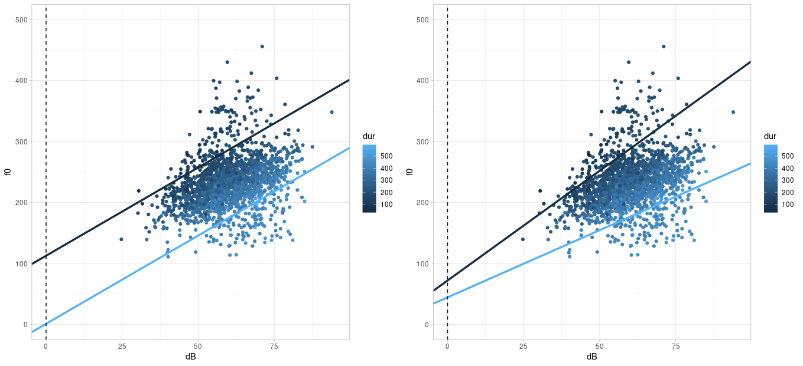

# Multiple Lineare Regression

## Packages und Daten laden

Laden Sie die Pakete und Data Frames:

```{r}
library(broom)
library(emmeans)
library(tidyverse)
library(magrittr)
url <- "http://www.phonetik.uni-muenchen.de/~jmh/lehre/Rdf"
faux <- read.table(file.path(url, "faux.txt"), stringsAsFactors = T, header = T) %>% 
  as_tibble()
int <- read.table(file.path(url, "dbwort.df.txt"), stringsAsFactors = T) %>% 
  as_tibble() %>% 
  rename(vowel = V, gender = G, subject = Vpn, word = Wort)
vlax <- read.table(file.path(url, "vlax.txt"), stringsAsFactors = T) %>%
  as_tibble() %>%
  filter(V %in% c("O", "I") & f0 != 0) %>%
  rename(vowel = V, subject = Vpn, word = Wort, duration = Dauer)
```

## Einführung

Bislang haben wir mit der einfachen linearen Regression gearbeitet, bei der eine Variable (z.B. Grundfrequenz) durch eine weitere Variable (z.B. Alter in Jahren) vorhergesagt wurde. Viel häufiger haben wir aber mehrere Variablen, von denen wir vermuten, dass sie einen Einfluss auf unsere Messwerte haben. Hierfür brauchen wir dann die multiple lineare Regression. Die Formel für die lineare Regression wird so angepasst, dass es für jede unabhängige Variable $x_1$, $x_2$, usw. eine eigene Slope gibt:

$y = k + b_1x_1 + b_2x_2 + ...$

Auch hier steht $k$ wieder für den y-Achsenabschnitt, $b_1$, $b_2$ usw. sind Slopes. Im Folgenden zeige ich Ihnen drei Beispiele für multiple lineare Regressionen, je nach der Art der unabhängigen Variablen (kategorial oder kontinuierlich). Aus Gründen der Übersichtlichkeit enthalten alle Beispiele nur zwei unabhängige Variablen; es können aber natürlich generell auch mehr als zwei Prädiktoren in der Regression vorkommen.

## Kontinuierliche unabhängige Variablen

Zuerst wollen wir herausfinden, ob die Grundfrequenz `f0` im (artifiziell erstellten) Data Frame `faux` von den beiden kontinuierlichen Variablen `dB` (Lautstärke) und `dur` (Wortdauer) abhängig ist. Dafür erstellen wir eine Abbildung von den Daten:

```{r}
ggplot(faux) +
  aes(x = dB, y = f0, col = dur) +
  geom_point()
```

Es ist nicht ganz einfach, diesen Plot zu interpretieren. Wenn wir uns erst einmal nur auf die Abhängigkeit der Grundfrequenz von der Lautstärke konzentrieren, sehen wir, dass eine klare positive Korrelation vorliegt, d.h. je lauter die Versuchspersonen sprachen, desto höher wurde ihre Grundfrequenz. Da die Dauer ebenfalls eine kontinuierliche Variable ist, bleibt uns nur, ein Farbkontinuum für die Visualisierung der Variable zu nutzen (`ggplot()` macht das automatisch durch das Argument `col`). Es scheint so, als ob die dunkleren Punkte (= niedrige Dauerwerte) mit eher hohen f0-Werten assoziiert sind und die helleren Datenpunkte (= hohe Dauerwerte) eher mit niedrigen f0-Werten. Hier könnte also eine negative Korrelation zwischen f0 und Dauer vorliegen. Mittels `cor()` können wir diesen Eindruck überprüfen:

```{r}
cor(faux$f0, faux$dB)
cor(faux$f0, faux$dur)
```

Da wir es hier mit zwei unabhängigen Variablen zu tun haben, müssen wir auch überlegen, ob eine **Interaktion** zwischen ihnen vorliegen könnte. Eine Interaktion liegt vor, wenn sich der Effekt einer unabhängigen auf die abhängige Variable für verschiedene (extreme) Werte der zweiten unabhängigen Variable unterscheidet. In unserem Beispiel ist der Effekt von Lautstärke auf f0 im Allgemeinen ein positiver, d.h. je lauter gesprochen wurde, desto höher f0. Dieser Effekt ist jedoch (visuell) stärker ausgeprägt für niedrige als für hohe Dauerwerte. Stellen Sie sich vor, Sie würden zwei Regressionslinien durch die obige Abbildung legen: eine dunkelblaue für einen beispielhaft niedrigen Dauerwert (z.B. 150 ms) und eine hellblaue für eine beispielhaft hohe Dauer (z.B. 450 ms). Wenn keine Interaktion zwischen den Variablen besteht, sind die zwei beispielhaften Regressionslinien parallel zueinander; andernfalls sind sie es nicht. Für die Daten im Data Frame `faux` habe ich die zwei beispielhaften Regressionslinien eingezeichnet: im linken Plot unter der Annahme, dass keine Interaktion besteht, im rechten unter der Annahme, dass eine Interaktion besteht:



Die Regressionslinien im rechten Plot scheinen die Daten besser zu beschreiben als die Daten im linken Plot; d.h. wir gehen davon aus, dass zwischen Lautstärke und Dauer in dem Datensatz eine Interaktion besteht. Wir werden später sehen, wie genau die Regressionslinien für die beiden Plots berechnet wurden.

<div class="gray">
**Weiterführende Infos: Regressionslinien bei zwei kontinuierlichen Prädiktoren**

Es erfordert ein bisschen Rechenarbeit, Regressionslinien für zwei kontinuierliche Variablen zu zeichnen. Wenn Sie diese Arbeit irgendwann vermeiden wollen, können Sie sich aber die Libraries `ggiraph` und `ggiraphExtra` installieren. In dieser [Vignette](https://cran.r-project.org/web/packages/ggiraphExtra/vignettes/ggPredict.html) finden Sie Informationen über die Funktion `ggPredict()` aus `ggiraphExtra`, die Regressionslinien für multiple Prädiktoren zeichnen kann.
</div>

Wir werden im Folgenden für viele Fragestellungen zuerst eine multiple Regression ohne und dann mit Interaktion berechnen, damit Sie sich mit Interaktionen vertraut machen können. Wenn Sie selbst vor der Entscheidung stehen, ob Sie in Ihrem Datensatz eine Interaktion zwischen unabhängigen Variablen vorliegen könnte, schauen Sie sich Ihren Datensatz in Abbildungen an und überlegen Sie genau, wie eine Interaktion zu interpretieren wäre -- *bevor* Sie die Regression durchführen.

### Ohne Interaktion

Wenn es in einem Modell keine Interaktionen gibt, werden die unabhängigen Variablen in der `lm()`-Formel mit einem Plus verbunden.

```{r}
lm1 <- lm(f0 ~ dB + dur, data = faux)
lm1 %>% 
  tidy() %>% 
  select(term, estimate)
```

Versuchen wir zu verstehen, was genau die Schätzungen in der Spalte `estimate` bedeuten. Die Schätzung für das Intercept ist auch in der multiplen Regression das geschätzte arithmetische Mittel der abhängigen Variable für $x_1 = 0$ und $x_2 = 0$ (und alle möglichen weiteren $x$, wenn es noch mehr unabhängige Variablen gibt). Das heißt, wenn die Lautstärke 0 dB beträgt und die Dauer ebenfalls 0 ms ist, sollte die Grundfrequenz bei 168.6 Hz liegen. Die Slopes messen nun nicht mehr den Effekt jeder einzelnen unabhängigen Variable, sondern den Effekt einer unabhängigen Variable, während alle anderen Variablen konstant bei Null gehalten werden. Jede Erhöhung der Lautstärke um ein Dezibel (bei konstanter Dauer) führt zu einer Erhöhung der Grundfrequenz um 2.9 Hz, jede Erhöhung der Dauer um eine Millisekunde (bei konstanter Lautstärke) führt zu einer Reduktion der Grundfrequenz um 0.4 Hz. Das heißt hier finden wir die erwarteten Zusammenhänge wieder: Lautstärke beeinflusst die Grundfrequenz positiv, Dauer negativ.

Rufen wir uns nochmal die Formel für die Regressionslinie bei zwei unabhängigen Variablen in Erinnerung:

$y = k + b_1x_1 + b_2x_2$

Die Werte für den y-Achsenabschnitt $k$ und die beiden Slopes $b_1$ und $b_2$ können wir uns aus dem Data Frame holen, den `tidy()` zurückgibt:

```{r}
k <- lm1 %>% tidy() %>% filter(term == "(Intercept)") %>% pull(estimate)
k
b_1 <- lm1 %>% tidy() %>% filter(term == "dB") %>% pull(estimate)
b_1
b_2 <- lm1 %>% tidy() %>% filter(term == "dur") %>% pull(estimate)
b_2
```

Nun können wir uns nach Belieben Werte für $x_1$ (Lautstärke in Dezibel) und $x_2$ (Dauer in Millisekunden) ausdenken, zusammen mit den Regressionskoeffizienten in die Formel einsetzen, und so $y$-Werte schätzen. Wenn wir beide $x$-Werte auf Null setzen, kommt genau das Intercept $k$ als geschätzter $y$-Wert heraus:

$$
\begin{aligned}
 y &= k + b_1 \cdot dB + b_2 \cdot dur \\ 
 &= 168.64 + 2.89 \cdot 0 + (-0.37 \cdot 0) \\
 &= 168.64
\end{aligned}
$$

Wenn Sie diese Werte nicht manuell berechnen möchten, steht Ihnen natürlich die Funktion `predict()` zur Verfügung. Bei der multiplen linearen Regression muss der Funktion ein Data Frame übergeben werden, der so viele Spalten hat wie es unabhängige Variablen in der Regression gab; die Spalten müssen auch genau wie die unabhängigen Variablen benannt sein. Zu Demonstrationszwecken zeige ich hier, dass die Grundfrequenz `f0` laut dem berechneten linearen Modell wirklich bei ca. 168 Hz liegt, wenn die Lautstärke bei 0 dB und die Dauer bei 0 ms liegt. Außerdem zeige ich den geschätzten f0-Wert für `db = 1` und `dur = 0` (der 2.9 Hz höher ist als das Intercept) und für `db = 0` und `dur = 1` (der 0.4 Hz niedriger ist als das Intercept). Zuletzt schätzen wir mittels `predict()` den f0-Wert für die durchschnittliche Lautstärke und Dauer.

```{r}
d1 <- data.frame(dB  = c(0, 1, 0, mean(faux$dB)), 
                 dur = c(0, 0, 1, mean(faux$dur)))
d1 %<>% mutate(estimated_f0 = predict(lm1, d1))
d1
```

Jetzt können wir auch nachvollziehen, wie die zwei beispielhaften Regressionslinien im linken Plot oben berechnet wurden. Wir wählen 450 ms als beispielhaft hohen und 150 ms als beispielhaft niedrigen Dauerwert (in der Literatur wird als "extremer Wert" für eine unabhängige Variable auch gerne ihr Mittelwert plus/minus 1.5 Standardabweichungen genommen). Anschließend setzen wir diese Werte zusammen mit den Regressionskoeffizienten in unsere Formel für die Regressionslinie ein (hier zuerst für eine Dauer von 450 ms):

$$
\begin{aligned}
 y &= k + b_1 \cdot dB + b_2 \cdot dur \\ 
 &= 168.64 + 2.89 \cdot dB + (-0.37 \cdot 450) \\
 &= 168.64 + 2.89 \cdot dB + (-167.43) \\
 &= 1.21 + 2.89 \cdot dB
\end{aligned}
$$

Dabei kommt heraus, dass das Intercept einer Regressionslinie für eine Dauer von 450 ms bei 1.21 liegen sollte und die Steigung bei 2.89.

$$
\begin{aligned}
 y &= k + b_1 \cdot dB + b_2 \cdot dur \\ 
 &= 168.64 + 2.89 \cdot dB + (-0.37 \cdot 150) \\
 &= 168.64 + 2.89 \cdot dB + (-55.81) \\
 &= 112.83 + 2.89 \cdot dB
\end{aligned}
$$

Bei der Regressionslinie für eine Dauer von 150 ms hingegen liegt das Intercept bei 112.83 und die Steigung bei 2.89. Die Slope ist also für die beiden Regressionslinien dieselbe, ergo sind diese Linien parallel zueinander. Die beiden berechneten Intercepts und die Slope können nun für `geom_abline()` benutzt werden:

```{r}
high_dur <- 450
low_dur <- 150
slope <- b_1
intercept_high_dur <- k + b_1 * 0 + b_2 * high_dur
intercept_low_dur <- k + b_1 * 0 + b_2 * low_dur

ggplot(faux) + 
  aes(x = dB, y = f0, col = dur) + 
  geom_point() + 
  xlim(0, 95) +
  ylim(0, 500) +
  geom_abline(slope = slope, intercept = intercept_high_dur, color = "#56B1F7", linewidth = 1.2) +
  geom_abline(slope = slope, intercept = intercept_low_dur, color = "#132B43", linewidth = 1.2) +
  geom_vline(xintercept = 0, lty = "dashed")
```

Wir hätten natürlich auch `dur` auf die x-Achse setzen und `dB` durch ein Farbkontinuum darstellen können. Dann müssten wir zwei beispielhaft extreme *Lautstärke*werte wählen, wieder alle Werte (Intercept, Slopes, gewählte Beispielwerte für `dB`) in die Formel einsetzen und kämen auf folgendes Ergebnis:

```{r}
high_dB <- 75
low_dB <- 45
intercept_high_dB <- k + b_1 * high_dB + b_2 * 0
intercept_low_dB <- k + b_1 * low_dB + b_2 * 0
slope <- b_2

ggplot(faux) + 
  aes(x = dur, y = f0, col = dB) + 
  geom_point() + 
  xlim(0, 600) +
  ylim(0, 500) +
  geom_abline(slope = slope, intercept = intercept_high_dB, color = "#56B1F7", linewidth = 1.2) +
  geom_abline(slope = slope, intercept = intercept_low_dB, color = "#132B43", linewidth = 1.2) +
  geom_vline(xintercept = 0, lty = "dashed")
```

Wenn Sie sich ausreichend Zeit genommen haben, um die Regressionskoeffizienten zu verstehen und zu interpretieren, können wir uns jetzt den Statistiken und Gütekriterien des Modells zuwenden. Mit `tidy()` schauen wir uns die $t$-Statistik samt $p$-Wert an, die aussagen, ob sich die Regressionskoeffizienten signifikant von Null unterscheiden:

```{r}
lm1 %>% tidy()
```

Die beiden Regressionskoeffizienten für die unabhängigen Variablen unterscheiden sich laut den Tests signifikant von Null, d.h. sowohl die Lautstärke als auch die Dauer scheinen gute Prädiktoren für die Grundfrequenz zu sein. Die Gütekriterien sind wieder die $F$-Statistik sowie der $R^2$-Wert:

```{r}
lm1 %>% glance() %>% pivot_longer(cols = c(r.squared:nobs))
```

Die beiden unabhängigen Variablen beschreiben 66% der Varianz in den Grundfrequenzwerten. Allgemein betrachtet ist das ein relativ hoher Wert. Noch mehr Bedeutung bekommt der Wert jedoch im Vergleich zu den $R^2$-Werten aus den zwei einfachen linearen Regressionen, die wir mittels der unabhängigen Variablen erstellen können:

```{r}
lm(f0 ~ dB, data = faux) %>% glance() %>% pull(r.squared)
lm(f0 ~ dur, data = faux) %>% glance() %>% pull(r.squared)
```

Das heißt, ein Modell mit der Lautstärke als einziger unabhängiger Variable beschreibt nur knapp 10% der Varianz in den Grundfrequenzwerten, ein Modell mit der Dauer beschreibt ca. 28% dieser Varianz. Wenn man jedoch beide Prädiktoren in einem Modell (ohne Interaktion) vereint, steigt dieser Anteil auf 66%.

Zuletzt sollten wir nicht vergessen, das Ergebnis der Regression zu berichten: **Eine multiple lineare Regression mit Lautstärke und Dauer als unabhängige Variablen zeigte einen signifikanten Effekt von Lautstärke ($t$ = 45.7, $p$ < 0.001) und Dauer ($t$ = 55.7, $p$ < 0.001) auf die Grundfrequenz. Das gewählte Modell beschreibt die Daten besser als ein Modell ohne Prädiktoren ($R^2$ = 0.66, $F$[2, 1866] = 1815, $p$ < 0.001).** In einer wissenschaftlichen Veröffentlichung sollten Sie natürlich noch ein paar Zeilen darauf verwenden zu beschreiben, in welche Richtung die signifikanten Effekte gehen (d.h. ob sie die abhängige Variable positiv oder negativ, stark oder schwach beeinflussen) und ob das den Erwartungen (Hypothesen) entspricht, die Sie idealerweise vor der Datenerhebung aufgestellt haben.

*(Natürlich würden wir unter realistischen Bedingungen hier noch die Annahmen über die Residuals prüfen!)*

### Mit Interaktion

Da wir in unserer ersten Abbildung der Daten in `faux` festgestellt haben, dass es eine Interaktion zwischen Lautstärke und Dauer geben könnte, wollen wir das Modell jetzt *mit* Interaktion berechnen. Interaktionen in einem linearen Modell können auf zwei Arten geschrieben werden: entweder mit einem Asterisk `dB * dur` oder in der ausformulierten Variante `dB + dur + dB:dur`. Bei drei unabhängigen Variablen `A`, `B` und `C` können sowohl Interaktionen zwischen zwei als auch zwischen allen drei Faktoren vorliegen, also: `A * B * C` oder `A + B + C + A:B + A:C + B:C + A:B:C`. Es kann auch sinnvoll sein, eine Interaktion nur zwischen zwei von drei Faktoren zu berechnen, z.B. `A * B + C` oder `A + B + C + A:B`.

Hier wählen wir die Kurzschreibweise und schauen uns zuerst wieder die Schätzungen der Regressionskoeffizienten an:

```{r}
lm2 <- lm(f0 ~ dB * dur, data = faux)
lm2 %>% 
  tidy() %>% 
  select(term, estimate)
```

Der y-Achsenabschnitt für `dB = 0` und `dur = 0` liegt jetzt bei 86 Hz. Die Slopes beschreiben nun den Einfluss einer unabhängigen Variable, wenn alle anderen unabhängigen Variablen konstant bei Null gehalten werden. Die Lautstärke `dB` hat auch in diesem Modell einen positiven Einfluss auf die Grundfrequenz mit einer Steigung von 4.3 Hz, d.h. die Grundfrequenz steigt mit der Lautstärke (wenn die Dauer konstant bei Null gehalten wird). Die Steigung für `dur` hingegen ist mit -0.09 Hz negativ, d.h. für höhere Dauerwerte sinkt die Grundfrequenz (wenn die Lautstärke konstant bei Null gehalten wird). 

Nun gibt es allerdings noch eine weitere Slope, nämlich für die Interaktion `dB:dur`. Diese Slope findet sich auch in der für Interaktionen angepassten Formel für die Regressionslinie:

$y = k + b_1x_1 + b_2x_2 + b_3(x_1 \cdot x_2)$

Die Slope $b_3(x_1 \cdot x_2)$ deutet schon an, dass die Interaktion nur wichtig für die Regressionslinie ist, wenn sowohl $x_1$ als auch $x_2$ ungleich Null ist: denn wenn eine von beiden Null ist, ergibt die Multiplikation $x_1 \cdot x_2$ Null, d.h. die Slope $b_3$ muss mit Null multipliziert werden und fällt somit aus der Formel raus. 

In unserem Modell ist die Steigung für die Interaktion der beiden Prädiktoren negativ. Das lässt sich so interpretieren, dass die Grundfrequenz sinkt, wenn sowohl die Lautstärke als auch die Dauer steigen. Um diese Zusammenhänge genau nachvollziehen zu können, holen wir uns aus dem obigen Data Frame das Intercept $k$, die beiden Slopes $b_1$ (für die Lautstärke) und $b_2$ (für die Dauer), sowie die Interaktion $b_3$:

```{r}
k <- lm2 %>% tidy() %>% filter(term == "(Intercept)") %>% pull(estimate)
k
b_1 <- lm2 %>% tidy() %>% filter(term == "dB") %>% pull(estimate)
b_1
b_2 <- lm2 %>% tidy() %>% filter(term == "dur") %>% pull(estimate)
b_2
b_3 <- lm2 %>% tidy() %>% filter(term == "dB:dur") %>% pull(estimate)
b_3
```

Nun können Sie diese Werte zusammen mit frei gewählten Werten für $x_1$ (Lautstärke) und $x_2$ (Dauer) in die obige Formel einsetzen, um herauszufinden, wie hoch die Grundfrequenz für die gewählten Werte der unabhängigen Variablen sein sollte. Nehmen wir an $x_1$ und $x_2$ sind beide Null, dann gilt wieder, dass der geschätzte y-Wert genau dem Intercept $k$ entspricht:

$$
\begin{aligned}
 y &= k + b_1 \cdot dB + b_2 \cdot dur + b_3(dB \cdot dur) \\ 
 &= 86.02 + 4.30 \cdot 0 + (-0.092 \cdot 0) + (-0.0047 \cdot 0 \cdot 0) \\
 &= 86.02
\end{aligned}
$$

Genauso kann man anstatt der beiden Nullen verschiedene andere Werte für $x_1$ und $x_2$ einsetzen. Als Beispiel wählen wir hier $x_1 = 1$ und $x_2 = 1$, um zu zeigen, dass dann auch die Slope für die Interaktion der beiden Variablen zum Tragen kommt:

$$
\begin{aligned}
 y &= k + b_1 \cdot dB + b_2 \cdot dur + b_3(dB \cdot dur) \\ 
 &= 86.02 + 4.30 \cdot 1 + (-0.092 \cdot 1) + (-0.0047 \cdot 1 \cdot 1) \\
 &= 90.22
\end{aligned}
$$

Oder, indem wir die extrahierten Regressionskoeffizienten nutzen:

```{r}
k + b_1 + b_2 + b_3
```

Auch hier können wir wieder `predict()` einsetzen, um uns für verschiedene Kombinationen von `dB`- und `dur`-Werten den `f0`-Wert schätzen zu lassen:

```{r}
d2 <- data.frame(dB  = c(0, 1, 0, 1, mean(faux$dB)), 
                 dur = c(0, 0, 1, 1, mean(faux$dur)))
d2 %<>% mutate(estimated_f0 = predict(lm2, d2))
d2
```

Nun können wir wieder die beispielhaften Regressionslinien nachvollziehen, die wir oben im rechten Plot gesehen haben. Wir wählen 450 ms und 150 ms als beispielhafte Dauerwerte:

$$
\begin{aligned}
 y &= k + b_1 \cdot dB + b_2 \cdot dur + b_3(dB \cdot dur) \\ 
 &= 86.02 + 4.30 \cdot dB + (-0.092 \cdot 450) + (-0.0047 \cdot dB \cdot 450) \\
 &= 86.02 + 4.30 \cdot dB + (-41.45) + (-2.10 \cdot dB) \\
 &= 44.57 + 2.20 \cdot dB
\end{aligned}
$$

Und für 150 ms:

$$
\begin{aligned}
 y &= k + b_1 \cdot dB + b_2 \cdot dur + b_3(dB \cdot dur) \\ 
 &= 86.02 + 4.30 \cdot dB + (-0.092 \cdot 150) + (-0.0047 \cdot dB \cdot 150) \\
 &= 86.02 + 4.30 \cdot dB + (-13.82) + (-0.70 \cdot dB) \\
 &= 72.20 + 3.60 \cdot dB
\end{aligned}
$$

Dieses Mal unterscheiden sich die Steigungen für die beiden extremen gewählten Dauerwerte, eben weil die Interaktion mit einbezogen wurde. Nun legen wir die berechneten Intercepts und Slopes als Variablen an und setzen diese wieder bei `geom_abline()` ein, um die Regressionslinien zu zeichnen:

```{r}
high_dur <- 450
low_dur <- 150

intercept_low_dur <- k + b_1 * 0 + b_2 * low_dur + b_3 * 0 * low_dur
intercept_low_dur
intercept_high_dur <- k + b_1 * 0 + b_2 * high_dur + b_3 * 0 * high_dur
intercept_high_dur

slope_low_dur <- b_1 + b_3 * low_dur
slope_low_dur
slope_high_dur <- b_1 + b_3 * high_dur
slope_high_dur

ggplot(faux) + 
  aes(x = dB, y = f0, col = dur) + 
  geom_point() + 
  xlim(0, 95) +
  ylim(0, 500) +
  geom_abline(slope = slope_low_dur, intercept = intercept_low_dur, color = "#132B43", linewidth = 1.2) +
  geom_abline(slope = slope_high_dur, intercept = intercept_high_dur, color = "#56B1F7", linewidth = 1.2) +
  geom_vline(xintercept = 0, lty = "dashed")
```

Nachdem wir die Regressionskoeffizienten verstanden haben, schauen wir uns die $t$-Statistik an und stellen fest, dass sowohl die Steigung für `dB` ($t$ = 22.6, $p$ < 0.001) als auch die für `dur` ($t$ = 2.5, $p$ < 0.05) sich signifikant von Null unterscheiden. Zusätzlich unterscheidet sich auch die Steigung für die Interaktion signifikant von Null ($t$ = 7.8, $p$ < 0.001).

```{r}
lm2 %>% tidy()
```

Das bedeutet, dass auch das gesamte Modell voraussichtlich besser ist als ein Modell ohne Prädiktoren. Wir schauen uns mit `glance()` wieder die $F$-Statistik und $R^2$ an:

```{r}
lm2 %>% glance() %>% pivot_longer(cols = c(r.squared:nobs))
```

Somit können wir berichten: **Eine multiple lineare Regression mit Lautstärke und Dauer als unabhängige Variablen mitsamt ihrer Interaktion zeigte einen signifikanten Effekt von Lautstärke ($t$ = 22.6, $p$ < 0.001) und Dauer ($t$ = 2.5, $p$ < 0.05) auf die Grundfrequenz. Zusätzlich war auch die Interaktion signifikant ($t$ = 7.8, $p$ < 0.001). Das gewählte Modell beschreibt die Daten besser als ein Modell ohne Prädiktoren ($R^2$ = 0.67, $F$[3, 1865] = 1269.6, $p$ < 0.001).**

*(Natürlich würden wir unter realistischen Bedingungen hier noch die Annahmen über die Residuals prüfen!)*

## Kategorische unabhängige Variablen

Nun wollen wir anhand der Daten in `int` herausfinden, ob die Lautstärke in Dezibel `db` vom Vokaltyp `vowel` und dem Geschlecht der Versuchsperson `gender` beeinflusst wird.

```{r}
int
```

Erstmal schauen wir uns in einem Boxplot an, ob überhaupt eine Abhängigkeit zwischen den Variablen vorliegen könnte:

```{r}
ggplot(int) + 
  aes(x = vowel, y = db, fill = gender) + 
  geom_boxplot()
```

Der Plot zeigt, allgemein gesprochen, dass Frauen leiser sprechen als Männer. Dieser Effekt unterscheidet sich aber für die beiden Vokale: Bei /a/ ist der Effekt von Geschlecht viel ausgeprägter als bei /i/. Es könnte also eine Interaktion zwischen Vokal und Geschlecht vorliegen. Genauso können wir die Interaktion der unabhängigen Variablen für den Effekt des Vokals betrachten: Im Vokal /i/ ist die Lautstärke generell niedriger als in /a/ -- aber für Männer ist der Effekt stärker als für Frauen (d.h. der Unterschied zwischen den zwei blauen Boxen ist größer als der zwischen den zwei roten Boxen).

Obwohl hier wahrscheinlich eine Interaktion zwischen Vokal und Geschlecht vorliegt, schauen wir uns aus didaktischen Gründen erstmal an, wie eine multiple Regression mit zwei kategorialen Prädiktoren (unabhängigen Variablen) ohne Interaktion aussieht.

### Ohne Interaktion

```{r}
lm3 <- lm(db ~ vowel + gender, data = int)
lm3 %>% 
  tidy() %>% 
  select(term, estimate)
```

Wenn wir es mit *kontinuierlichen* unabhängigen Variablen zu tun haben, ist das Intercept der geschätzte y-Wert für Null in allen unabhängigen Variablen. Was genau ist aber "Null" für *kategoriale* Variablen? Dies bestimmt R durch das sogenannte **Treatment Coding** (auch oft mit dem Überbegriff *Dummy Coding* bezeichnet). Die Variable `gender` kann als Werte entweder `f` (*female*) oder `m` (*male*) annehmen. R geht dann alphabetisch vor und bestimmt, dass `f` als Null und `m` als Eins interpretiert werden soll. Genauso läuft es bei den Vokalen `vowel`, wo `a` als Null und `i` als Eins interpretiert wird. Dementsprechend ist das Intercept in dieser Regression der geschätzte Dezibel-Mittelwert für das `a` von Frauen. Dies können wir rechnerisch leicht nachvollziehen:

```{r}
k <- lm3 %>% 
  augment() %>% 
  filter(vowel == "a" & gender == "f") %>% 
  summarise(m = mean(.fitted)) %>% 
  pull(m)
k
```

Wie Sie sehen, heißen die beiden Slopes in unserem Modell `genderm` und `voweli`. Hierbei wird immer zuerst der Faktor (der Name der kategorialen Variable) genannt und dann das Level des Faktors, das *nicht* im Intercept verarbeitet wurde (also das Level `m` für `gender` und das Level `i` für `vowel`). Die Steigung `genderm` beschreibt die Lautstärkeveränderung von Frauen zu Männern für den Vokal /a/. Diese ist mit 30.1 dB positiv, d.h. Männer produzieren das /a/ deutlich lauter als Frauen. Die Steigung `voweli`beschreibt die Lautstärkeveränderung von /a/ zu /i/ für Frauen und ist mit -20.12 dB negativ, d.h. Frauen produzieren das /i/ leiser als das /a/. Dies stimmt mit unserem Eindruck aus den Boxplots überein.

Wenn wir die Lautstärke-Mittelwerte für alle vier Kombinationen für die Levels von `vowel` und `gender` schätzen wollen, brauchen wir wieder die beiden Slopes $b_1$ (für den Vokal /i/) und $b_2$ (für Männer) aus dem Ergebnis von `tidy()`, sowie das Intercept $k$, das wir oben schon berechnet haben. Erinnern Sie sich außerdem, dass durch das Treatment Coding festgelegt wurde, dass `a = 0`, `i = 1`, `female = 0` und `male = 1`.

```{r}
b_1 <- lm3 %>% tidy() %>% filter(term == "voweli") %>% pull(estimate)
b_1
b_2 <- lm3 %>% tidy() %>% filter(term == "genderm") %>% pull(estimate)
b_2
```

Geschätzte Lautstärke für das /a/ ($x_1 = 0$) von Frauen ($x_2 = 0$):

$$
\begin{aligned}
 y &= k + b_1 \cdot x_1 + b_2 \cdot x_2 \\ 
 &= 53.23 + (-20.12 \cdot 0) + 30.09 \cdot 0 \\
 &= 53.23
\end{aligned}
$$

... für das /a/ ($x_1 = 0$) von Männern ($x_2 = 1$):

$$
\begin{aligned}
 y &= k + b_1 \cdot x_1 + b_2 \cdot x_2 \\ 
 &= 53.23 + (-20.12 \cdot 0) + 30.09 \cdot 1 \\
 &= 83.31
\end{aligned}
$$

... für das /i/ ($x_1 = 1$) von Frauen ($x_2 = 0$):

$$
\begin{aligned}
 y &= k + b_1 \cdot x_1 + b_2 \cdot x_2 \\ 
 &= 53.23 + (-20.12 \cdot 1) + 30.09 \cdot 0 \\
 &= 33.11
\end{aligned}
$$

... und für das /i/ ($x_1 = 1$) von Männern ($x_2 = 1$):

$$
\begin{aligned}
 y &= k + b_1 \cdot x_1 + b_2 \cdot x_2 \\ 
 &= 53.23 + (-20.12 \cdot 1) + 30.09 \cdot 1 \\
 &= 63.19
\end{aligned}
$$

Die `predict()`-Funktion kann uns diese Rechenarbeit aber auch abnehmen:

```{r}
d3 <- data.frame(gender = c("f", "f", "m", "m"), 
                 vowel = c("a", "i", "a", "i"))
d3 %<>% mutate(estimated_mean_dB = predict(lm3, d3))
d3
```

Vergleichen Sie diese geschätzen Mittelwerte auch mit den Boxplots, die wir zuvor gemacht haben oder mit den tatsächlichen Mittelwerten (die Sie mit *tidyverse*-Funktionen berechnen können). Wir streben natürlich danach, dass die Schätzungen möglichst genau sind, denn das bedeutet, dass das von uns gewählte Modell sehr gut zu den Daten passt. In diesem Fall scheinen die Schätzungen schon recht gut zu sein:

```{r}
int %>%
  group_by(gender, vowel) %>% 
  summarise(m = mean(db))
```

<div class="gray">
**Weiterführende Infos: Dummy Coding**

Wenn eine der unabhängigen Variablen mehr als zwei Stufen gehabt hätte (also wenn z.B. noch ein dritter Vokal /o/ im Datensatz vorkäme), dann gäbe es eine weitere Slope für diese Stufe (also z.B. `vowelo`). Es gibt auch noch andere Arten des Dummy Coding, z.B. *Sum Coding*, wie Sie im Kapitel 7 in Winter (2020) nachlesen können.
</div>

Jetzt schauen wir uns erst noch die statistischen Ergebnisse unserer multiplen Regression an:

```{r}
lm3 %>% tidy()
```

Diese Übersicht zeigt, dass es einen signifikanten Einfluss von Geschlecht ($t$ = 8.0, $p$ < 0.001) und von Vokal ($t$ = 5.3, $p$ < 0.001) auf die Lautstärke gab, oder anders gesagt: die Steigungen für Vokal und Gender unterscheiden sich signifikant von Null und sind daher gute Prädiktoren für die Lautstärke. Nun schauen wir uns noch die Gütekriterien an:

```{r}
lm3 %>% glance() %>% pivot_longer(cols = c(r.squared:nobs))
```

Hier sehen wir, dass durch die beiden unabhängigen Variablen Geschlecht und Vokal ca. 43% der Varianz in den Lautstärkemessungen beschrieben werden kann. Der $F$-Test zeigt, dass unser Regressionsmodell die Daten erfolgreicher beschreibt als ein Modell ohne Prädiktoren ($R^2$ = 0.43, $F$[2, 117] = 45.8, $p$ < 0.001). 

*(Natürlich würden wir unter realistischen Bedingungen hier noch die Annahmen über die Residuals prüfen!)*

### Mit Interaktion

Da wir auch in diesem Datensatz eine Interaktion zwischen Vokal und Geschlecht vermuten, binden wir sie in unsere Regression ein:

```{r}
lm4 <- lm(db ~ vowel * gender, data = int)
lm4 %>% 
  tidy() %>% 
  select(term, estimate)
```

Das Intercept beschreibt hier immer noch den geschätzten Dezibel-Mittelwert für /a/ von Frauen, der bei ca. 48 dB liegt. Der Einfluss des Vokals auf die Lautstärke ist wieder negativ, der Einfluss des Geschlechts ist positiv. Nun gibt es zusätzlich die Slope für die Interaktion `voweli:genderm`, die mit -20.2 dB negativ ist. Wenn der Vokal also /i/ ist und das Geschlecht männlich, dann sinkt die Lautstärke. Im folgenden sehen Sie, wie Sie nun unter Einbeziehung der Interaktion die Lautstärke für die vier Kombinationen aus $vowel \times gender$ schätzen können (all dies leitet sich wieder aus der Formel für die Regressionslinie mit Interaktion ab):

```{r}
k <- lm4 %>% tidy() %>% filter(term == "(Intercept)") %>% pull(estimate)
b_1 <- lm4 %>% tidy() %>% filter(term == "genderm") %>% pull(estimate)
b_2 <- lm4 %>% tidy() %>% filter(term == "voweli") %>% pull(estimate)
b_3 <- lm4 %>% tidy() %>% filter(term == "voweli:genderm") %>% pull(estimate)

# female-a
k
# male-a
k + b_1
# female-i
k + b_2
# male-i
k + b_1 + b_2 + b_3
```

Die `predict()`-Funktion kann Ihnen hier aber auch wieder die Rechenarbeit abnehmen:

```{r}
d4 <- data.frame(gender = c("f", "f", "m", "m"), 
                 vowel = c("a", "i", "a", "i"))
d4 %<>% mutate(estimated_mean_dB = predict(lm4, d4))
d4
```

Durch die Einbindung der Interaktion in das Modell sind die Lautstärke-Schätzungen im Vergleich zum Modell vorher präziser geworden! Tatsächlich stimmen die Schätzungen perfekt mit den tatsächlichen Mittelwerten überein (das wird im "echten Leben" so gut wie niemals vorkommen):

```{r}
int %>% 
  group_by(gender, vowel) %>% 
  summarise(m = mean(db))
```

Nun schauen wir uns die $t$-Statistik an, die zeigt, ob unsere Regressionskoeffizienten dazu beitragen, die Varianz in den Dezibelwerten zu erklären:

```{r}
lm4 %>% tidy()
```

Offensichtlich unterscheiden sich die Slope für Geschlecht ($t$ = 7.7, $p$ < 0.001) und die Slope für Vokal ($t$ = 1.9, $p$ = 0.06) (fast) signifikant von Null. Zusätzlich gab es eine signifikante Interaktion zwischen den Faktoren ($t$ = 2.8, $p$ < 0.01).

Oben haben wir festgestellt, dass unser Modell mit Interaktion die Daten besser beschreibt als das vorherige Modell ohne Interaktion. Dies zeigt sich auch in der $F$-Statistik:

```{r}
lm4 %>% glance() %>% pivot_longer(cols = c(r.squared:nobs))
```

Nun werden ca. 46% der Varianz in den Daten durch die beiden Faktoren und ihre Interaktion beschrieben. Das Modell mit der Interaktion beschreibt also mehr Varianz als das Modell ohne Interaktion; d.h. es liefert präzisere Schätzungen der Regressionskoeffizienten. Der $F$-Test zeigt außerdem, dass das Regressionsmodell die Daten besser beschreibt als das Intercept-only Modell ($R^2$ = 0.46, $F$[3, 116] = 34.7, $p$ < 0.001).

*(Natürlich würden wir unter realistischen Bedingungen hier noch die Annahmen über die Residuals prüfen!)*

#### Post-hoc Tests mit emmeans

Wenn in einer multiplen Regression mit mindestens zwei kategorialen unabhängigen Variablen die Interaktion einen signifikanten Effekt auf die gemessene Variable hat, dann sollte man sogenannte **post-hoc Tests** ausführen. Dafür eignet sich das Paket [`emmeans`](https://cran.r-project.org/web/packages/emmeans/vignettes/basics.html) mit der gleichnamigen Funktion außerordentlich gut. Für dieses Paket gibt es mehrere ausführliche Vignetten. 

Die Funktion `emmeans()` führt $t$-Tests auf alle Kombinationen der Werte der kategorialen unabhängigen Variablen aus. So finden wir heraus, welche Kombination(en) dafür sorgen, dass die Interaktion in der Regression signifikant war. Als Argumente bekommt die Funktion das Ergebnis des Regressionsmodells, und dann die Formel `pairwise ~ vowel | gender` (sprich: *pairwise comparisons for vowel given gender*). Die Formel bedeutet hier, dass pro Geschlecht der Unterschied zwischen den Vokalen und dessen Signifikanz ermittelt werden soll.

```{r}
emmeans(lm4, pairwise ~ vowel | gender)
```

Das Ergebnis dieser Funktion sind zwei Tabellen, eine namens `emmeans` und eine namens `contrasts`. In der Tabelle `emmeans`, Spalte `emmean` finden Sie unsere Schätzungen für die Mittelwerte wieder, zuerst für Frauen (`gender = f`), dann für Männer (`gender = m`). `emmeans` steht für *estimated marginal means*. Sie finden hier zusätzlich den Standard Error `SE`, die Freiheitsgrade `df`, sowie das 95%-Konfindenzinterval `lower.CL` und `upper.CL`.

In der Tabelle `contrasts` finden Sie die Differenzen zwischen /a/ und /i/, zuerst für Frauen, dann für Männer. Zuerst wird Ihnen hierfür wieder ein `estimate` angezeigt. Dieser ist ganz einfach die Differenz aus den `emmeans` für /a/ und /i/ pro Geschlecht. Es folgen Standard Error `SE` und dann die Freiheitsgrade `df`, der $t$-Wert `t.ratio` und der $p$-Wert `p.value`. Hier sehen wir im Einklang mit den Boxplots, die wir ganz zu Anfang dieses Kapitels erstellt haben, dass es keinen signifikanten Lautstärke-Unterschied zwischen /a/ und /i/ für Frauen gibt ($t$[116] = 1.9, $p$ = 0.06), sehr wohl aber für Männer ($t$[116] = 5.8, $p$ < 0.001). Nun sollten wir zusätzlich schauen, ob es pro Vokaltyp signifikante Unterschiede zwischen Frauen und Männern gab. Dafür verändern wir einfach die Formel zu `pairwise ~ gender | vowel`:

```{r}
emmeans(lm4, pairwise ~ gender | vowel)
```

Hier können wir berichten, dass sowohl für /a/ ($t$[116] = 7.7, $p$ < 0.001) als auch für /i/ ($t$[116] = 3.8, $p$ < 0.001) ein signifikanter Unterschied zwischen Männern und Frauen vorliegt. Das stimmt ebenfalls mit unserem visuellen Eindruck aus den anfänglichen Boxplots überein.

## Mix aus kontinuierlichen und kategorischen unabhängigen Variablen

Zuletzt beschäftigen wir uns mit der Frage, ob die Grundfrequenzwerte im Data Frame `vlax` vom Vokal `vowel` und von der Lautstärke `dB` beeinflusst werden. Hier haben wir also ein Regressionsmodell mit einer kategorischen und einer kontinuierlichen unabhängigen Variable. Bei einer Abbildung bietet es sich an, die kontinuierliche unabhängige Variable auf die x-Achse zu packen und die Levels der kategorialen Variable durch Farben darzustellen. Hier zeigen wir zusätzlich die Regressionslinien, die `geom_smooth()` für uns berechnen kann.

```{r}
ggplot(vlax) + 
  aes(x = dB, y = f0, col = vowel) + 
  geom_point() + 
  geom_smooth(method = "lm", se = F)
```

Im Allgemeinen scheint es auch hier den bekannten positiven linearen Zusammenhang zwischen `f0` und `dB` zu geben. Dieser Zusammenhang scheint allerdings nur für den Vokal /I/, nicht aber für den Vokal /O/ zu existieren. Auch hier liegt also vermutlich eine Interaktion zwischen den beiden unabhängigen Variablen vor, wir berechnen aber zuerst zu Demonstrationszwecken ein Modell ohne Interaktion. 

### Ohne Interaktion

```{r}
lm5 <- lm(f0 ~ dB + vowel, data = vlax)
lm5 %>% 
  tidy() %>% 
  select(term, estimate)
```

Auch hier wird die kategoriale Variable `vowel` mittels Dummy Coding hinter den Kulissen umgewandelt. Wir sehen, dass die zweite Slope `vowelO` heißt, das bedeutet, dass der Vokal "I" schon im Intercept verarbeitet wurde. Wenn also der Vokal "I" ist und `dB = 0`, dann sollte die Grundfrequenz bei -258.9 Hz liegen. Der Einfluss von Lautstärke auf Grundfrequenz ist wie erwartet ein positiver, d.h. mit jeder Steigerung der Lautstärke um 1 dB steigt die Grundfrequenz um 6.2 Hz (dies sehen Sie z.B. im Vergleich der ersten beiden Zeilen in `d5`). Wenn der Vokal "O" anstatt "I" ist, sinkt die Grundfrequenz um 22.9 Hz (vgl. erste und dritte Zeile in `d5`). Bei durchschnittlicher Lautstärke liegt die Grundfrequenz bei der Produktion von "I" bei 200 Hz und bei der Prodution von "O" bei 177.1 Hz (s. Zeilen vier und fünf in `d5`).

```{r}
d5 <- data.frame(dB = c(0, 1, 0, mean(vlax$dB), mean(vlax$dB)), 
                 vowel = c("I", "I", "O", "I", "O"))
d5 %<>% mutate(estimated_f0 = predict(lm5, d5))
d5
```

Wir können für "I" und "O" jeweils eine Regressionslinie mittels des linearen Models berechnen, indem wir uns die Regressionskoeffizienten holen und wie wie zuvor in die Formel einsetzen:

```{r}
k <- lm5 %>% tidy() %>% filter(term == "(Intercept)") %>% pull(estimate)
k
b_1 <- lm5 %>% tidy() %>% filter(term == "dB") %>% pull(estimate)
b_1
b_2 <- lm5 %>% tidy() %>% filter(term == "vowelO") %>% pull(estimate)
b_2
```

Für den Vokal "I" ($x_2 = 0$) liegt der y-Achsenabschnitt bei -258.9 Hz und die Steigung bei 6.17 Hz.

$$
\begin{aligned}
 y &= k + b_1 \cdot dB + b_2 \cdot x_2 \\ 
 &= -258.87 + (6.17 \cdot dB) + (-22.93 \cdot 0) \\
 &= -258.87 + (6.17 \cdot dB)
\end{aligned}
$$

Für den Vokal "O" ($x_2 = 1$) liegt der y-Achsenabschnitt bei -281.8 Hz, die Steigung aber ebenfalls bei 6.17 Hz.

$$
\begin{aligned}
 y &= k + b_1 \cdot dB + b_2 \cdot x_2 \\ 
 &= -258.87 + (6.17 \cdot dB) + (-22.93 \cdot 1) \\
 &= -281.79 + (6.17 \cdot dB)
\end{aligned}
$$

Die hier berechneten Regressionslinien können nicht denen in der Abbildung der Daten entsprechen, denn die hier berechneten Linien haben dieselbe Steigung und verlaufen dementsprechend parallel zueinander, während die von `geom_smooth()` gezeichneten Linien einander schneiden. Daraus können wir schließen, dass dieses Modell ohne Interaktion nicht besonders gut zu den Daten passt.

Trotzdem zeigt die $t$-Statistik, dass sich die Regressionskoeffizienten signifikant von Null unterscheiden (Slope für Lautstärke: $t$ = 8.1, $p$ < 0.001; Slope für Vokal: $t$ = 2.6, $p$ < 0.01). Das heißt, beide Koeffizienten sind gute Prädiktoren für die Grundfrequenz in diesem Modell.

```{r}
lm5 %>% tidy()
```

Wie immer werfen wir auch noch einen Blick auf die Gütekriterien für das Modell und stellen fest, dass durch die beiden unabhängigen Variablen Vokal und Lautstärke ca. 26.6% der Varianz in den Grundfrequenzwerten beschrieben werden kann. Der $F$-Test zeigt, dass unser Regressionsmodell die Daten erfolgreicher beschreibt als ein Modell ohne Prädiktoren ($R^2$ = 0.27, $F$[2, 175] = 33.0, $p$ < 0.001).

```{r}
lm5 %>% glance() %>% pivot_longer(cols = c(r.squared:nobs))
```

*(Natürlich würden wir unter realistischen Bedingungen hier noch die Annahmen über die Residuals prüfen!)*

### Mit Interaktion

Nun berechnen wir das Modell mitsamt der Interaktion zwischen den unabhängigen Variablen:

```{r}
lm6 <- lm(f0 ~ dB * vowel, data = vlax)
lm6 %>% 
  tidy() %>% 
  select(term, estimate)
```

Das Dummy Coding bleibt gleich, d.h. der Vokal "I" wird als Null und der Vokal "O" als Eins gewertet. Das Intercept liegt bei -318.5 Hz. Der Einfluss von Lautstärke auf Grundfrequenz ist immer noch positiv mit ca. 7 Hz. Auffällig ist, dass sich der Koeffizient `vowelO` im Vergleich zum Modell ohne Interaktion stark verändert hat, von -22.9 zu +615.2 Hz. Das ergibt hier aber auch Sinn, wenn wir uns nochmal die Abbildung anschauen (hier haben wir die x-Achse so verändert, dass sie bei Null beginnt):

```{r}
ggplot(vlax) + 
  aes(x = dB, y = f0, col = vowel) + 
  geom_point() + 
  xlim(0, 90) +
  geom_smooth(method = "lm", se = F)
```

Wenn Sie die blaue Regressionslinie bis zur y-Achse verfolgen, kommen Sie bei knapp unter 300 Hz heraus -- das entspricht dem Intercept (`db = 0` und `vowel = "I"`) plus der Slope für `vowelO`. Dasselbe gilt für die rote Linie, die die y-Achse an einem Punkt schneidet, der hier nicht mehr abgebildet wird, nämlich bei ca. -311 Hz -- das entspricht dem Intercept plus der Slope für `dB`. Wir können diese Berechnungen wie folgt nachvollziehen (oder Sie setzen die Regressionskoeffizienten manuell in die Formel ein, wie oben gezeigt):

```{r}
k <- lm6 %>% tidy() %>% filter(term == "(Intercept)") %>% pull(estimate)
b_1 <- lm6 %>% tidy() %>% filter(term == "dB") %>% pull(estimate)
b_2 <- lm6 %>% tidy() %>% filter(term == "vowelO") %>% pull(estimate)
b_3 <- lm6 %>% tidy() %>% filter(term == "dB:vowelO") %>% pull(estimate)

# "I" bei 0 dB
k
# "I" bei 1 dB
k + b_1
# "O" bei 0 dB
k + b_2
# "O" bei 1 dB
k + b_1 + b_2 + b_3
```

Die `predict()`-Funktion kann Ihnen hier wieder die Rechenarbeit abnehmen:

```{r}
d6 <- data.frame(dB = c(0, 1, 0, 1), 
                 vowel = c("I", "I", "O", "O"))
d6 %<>% mutate(estimated_f0 = predict(lm6, d6))
d6
```

Wenn Sie sich jetzt den Unterschied zwischen Zeile 1 und 2 in `d6` anschauen, sehen Sie, dass die Lautstärke für den Vokal "I" positiv mit der Grundfrequenz korreliert ist, denn mit steigender Lautstäke (von 0 zu 1 dB) steigt auch die geschätzte Grundfrequenz. Für den Vokal "O" hingegen *sinkt* die Grundfrequenz mit steigender Lautstärke (vgl. Zeilen 3 und 4 in `d6`), d.h. die Korrelation zwischen Lautstärke und Grundfrequenz ist negativ für den Vokal "O" -- das entspricht auch den Regressionslinien im obigen Plot sowie den wie folgt berechneten Korrelationswerten $r$:

```{r}
vlax %>% 
  group_by(vowel) %>% 
  summarise(r = cor(dB, f0))
```

Nun schauen wir uns die $t$-Statistik an, die zeigt, ob unsere Regressionskoeffizienten dazu beitragen, die Grundfrequenzwerte zuverlässig zu schätzen:

```{r}
lm6 %>% tidy()
```

Die Slope für Laustärke ($t$ = 9.0, $p$ < 0.001) und die Slope für Vokal ($t$ = 3.2, $p$ < 0.01) unterscheiden sich signifikant von Null und eignen sich dementsprechend gut als Prädiktoren für die Grundfrequenz. Zusätzlich gab es eine signifikante Interaktion zwischen den Faktoren ($t$ = 3.3, $p$ < 0.001).

Die $F$-Statistik zeigt, dass das Regressionsmodell mit den beiden Prädiktoren und ihrer Interaktion die Daten besser beschreibt als ein Mittelwertmodell ($R^2$ = 0.31, $F$[3, 174] = 27.0, $p$ < 0.001). Anhand des $R^2$-Werts sehen wir, dass das Modell nun auch mehr Varianz in den Grundfrequenzwerten beschreibt als im Modell ohne Interaktion, d.h. die Güte des Modells ist durch die Hinzunahme der Interaktion gestiegen.

```{r}
lm6 %>% glance() %>% pivot_longer(cols = c(r.squared:nobs))
```

Für dieses Modell berechnen wir trotz der signifikanten Interaktion zwischen den unabhängigen Variablen keine post-hoc Tests, weil eine der unabhängigen Variablen kontinuierlich ist. Die post-hoc Tests mit `emmeans` ergeben nur Sinn für mehrere kategoriale Variablen.

*(Natürlich würden wir unter realistischen Bedingungen hier noch die Annahmen über die Residuals prüfen!)*

