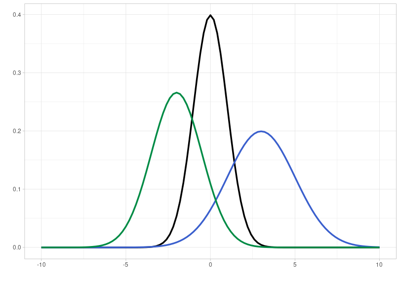

# Introduction to Inferential Statistics

## Packages und Daten laden

Starten Sie das R Projekt, das Sie für diesen Kurs angelegt haben. Öffnen Sie hierfür RStudio und benutzen Sie die Schaltfläche oben rechts oder navigieren Sie zu Ihrem Kursverzeichnis und klicken Sie auf die `.Rproj` Datei. 

Laden Sie dann das *tidyverse* und den folgenden Data Frame:

```{r}
library(tidyverse)
url <- "http://www.phonetik.uni-muenchen.de/~jmh/lehre/Rdf"
df <- read.table(file.path(url, "vdata.txt")) %>% as_tibble() %>% 
  rename(vokal = V, spannung = Tense, konsonant = Cons, tempo = Rate, subject = Subj) %>% 
  mutate(dauer = log(dur)) %>% 
  select(-c(X, Y))
```

## Grundbegriffe

*Statistical analysis [...] is a strikingly subjective process* -- Bodo Winter

Eine **Population** oder Grundgesamtheit ist im statistischen Sinne die Menge aller Einheiten (d.h. Personen, Wörter, etc.), die in bestimmten Identifikationskriterien (z.B. Geschlecht, Herkunft, grammatikalische Funktion, etc.) übereinstimmen. Stellen Sie sich z.B. vor, Sie möchten die durchschnittliche Grundfrequenz (F0) aller Frauen in Deutschland erfassen. Dann ist Ihre Population die Menge aller Frauen in Deutschland, also ca. 40 Mio. Menschen. Den Populationsmittelwert $\mu$ (sprich: /myː/, geschrieben oft: mu) können Sie in diesem Beispiel nur ermitteln, indem Sie zu jeder einzelnen Frau in Deutschland fahren und deren Grundfrequenz messen, was natürlich schon rein wirtschaftlich unmöglich ist. 

Stattdessen erhebt man in der Wissenschaft meist **Stichproben** (*samples*), also z.B. nur einen Teil der weiblichen Bevölkerung, und geht davon aus, dass der so erhaltene Stichprobenmittelwert $m$ nicht allzu weit weg ist vom tatsächlichen Populationsmittelwert $\mu$. Je größer die Stichprobe ist, desto mehr wird sich deren Mittelwert $m$ und Standardabweichung $s$ dem tatsächlichen Populationsmittelwert $\mu$ und der Populationsstandardabweichung $\sigma$ (sigma) annähern. Für die Merkmale einer Population werden im Normalfall griechische Symbole verwendet, für die Merkmale einer empirisch erhobenen Verteilung (d.h. einer Stichprobe) werden römische Buchstaben benutzt.

Die Methoden der **Inferenzstatistik** ermöglichen uns Rückschlüsse von der Stichprobe auf die Population. Genauer gesagt: die Inferenzstatistik hilft uns dabei, die Parameter der Population zu **schätzen**. Es gibt auch Maße wie z.B. den Standard Error, die beschreiben wie gut oder schlecht die Schätzung ist. Bevor ein statistischer Test durchgeführt wird, muss klar sein, was getestet wird: die sogenannte Null-Hypothese (H0). Wir handeln dabei nach dem Prinzip der Falsifizierung, d.h. wir versuchen H0 mit einem statistischen Test zu widerlegen. Zusätzlich spricht man häufig von der Alternativ-Hypothese (H1), die genau das Gegenteil der Null-Hypothese ist. Hier ein Beispiel:

Wir haben ein Experiment durchgeführt, weil wir herausfinden wollen, ob die Spannung einen Einfluss auf die Vokaldauer hat. Die gesammelten Daten sind im Data Frame `df` festgehalten. Dann stellen wir folgende Hypothesen auf:

- H0: *Die Vokaldauer wird nicht von der Spannung beeinflusst.*
- H1: *Die Vokaldauer wird von der Spannung beeinflusst.*

Wir führen dann einen statistischen Test aus, um H0 zu falsifizieren. Aber Achtung: Wenn wir H0 falsifiziert haben, heißt das *nicht*, dass wir H1 verifiziert haben!

Zusätzlich müssen wir *vor* unserem statistischen Test das sog. **Signifikanzniveau**, auch **$\alpha$-Level** (alpha Level) genannt, festlegen. Das ist der Wahrscheinlichkeitswert, ab dem wir unsere Null-Hypothese verwerfen bzw. als falsifiziert betrachten. In der Wissenschaft gibt es drei (arbiträr festgelegte!) $\alpha$-Level: **0.05, 0.01, und 0.001** (wir verwenden hier immer die englische Schreibweise und nutzen Punkte als Dezimalzeichen). Wenn das Ergebnis unseres statistischen Tests das festgelegte Signifikanzniveau *unter*schreitet, betrachten wir H0 als widerlegt und bezeichnen das Ergebnis als "signifikant". Im Falle der hier vorgestellten statistischen Tests wird jeweils der **p-value** (p-Wert) berechnet, der uns Auskunft über das Signifikanzniveau gibt. Bei einem *p-value* von `p < 0.05` ist das Ergebnis des Tests statistisch signifikant.

## Normalverteilung

Oben haben wir auf den Unterschied zwischen einer Population und einer Stichprobe hingewiesen. Parallel dazu unterscheidet man auch zwischen theoretischen und empirischen Verteilungen. **Theoretische Verteilungen** haben häufig feststehende Namen (Normalverteilung, Poisson-Verteilung, Student-t-Verteilung, etc.) und es wird davon ausgegangen, dass Messwerte, die für eine gesamte Population erhoben wurden, einer bestimmten theoretischen Verteilung folgen. Wie wir aber festgestellt haben, können wir so gut wie nie eine Population vermessen und nutzen stattdessen eine Stichprobe. Die Messwerte einer Stichprobe stellen eine **empirische Verteilung** dar, weil sie empirisch erhoben wurden. Wir werden häufig testen müssen, welcher theoretischen Verteilung die erhobene empirische Verteilung am ehesten entspricht.

In vielen empirischen Experimenten entsprechen die Daten einer Normalverteilung (auch Gauss-Verteilung genannt). Diese Verteilung lässt sich durch die zwei Parameter Mittelwert und Standardabweichung vollständig beschreiben. Hier sehen Sie drei verschiedene Normalverteilungen: 

- schwarz: Mittelwert $\mu = 0$ und Standardabweichung $\sigma = 1$
- blau: Mittelwert $\mu = 3$ und Standardabweichung $\sigma = 2$
- grün: Mittelwert $\mu = -2$ und Standardabweichung $\sigma = 1.5$



Wie Sie sehen, verschiebt der Mittelwert die Normalverteilung entlang der x-Achse, während die Standardabweichung zu Veränderungen in der Breite der Verteilung führt: je größer die Standardabweichung, desto breiter die Normalverteilung. Außerdem zeigt die Abbildung, dass die Verteilung *kontinuierlich* ist, d.h. sie deckt den Wertebereich von minus bis plus unendlich ab.

### Auf Normalverteilung testen

Im Data Frame `df` wurde die Dauer von Vokalen festgehalten. Hier wollen wir testen, ob die empirische Verteilung der Dauer der Normalverteilung entspricht. Hier ist zunächst die empirisch gemessene Dauer in einer Wahrscheinlichkeitsdichteverteilung:

```{r}
ggplot(df) + 
  aes(x = dauer) + 
  geom_density() +
  xlim(3.0, 7.0)
```

<div class="gray">
**Weiterführende Infos: Logarithmierung von Daten**

In der Abbildung sehen Sie die Vokaldauer nicht in Millisekunden, sondern in logarithmierter Form, d.h. wir haben den natürlichen Logarithmus auf die Daten angewendet (s. Code Snippet, in dem `df` geladen wurde). Bei bestimmten Messwerten kann es sinnvoll sein, die Daten zu logarithmieren, nämlich dann, wenn die empirische Verteilung ge-*skewed* ist. Bei Reaktionszeiten ist es z.B. nicht möglich, dass es Werte unter Null gibt; auch niedrige Werte (unter 100ms) sind sehr unwahrscheinlich, aber sehr lange Reaktionszeiten kommen durchaus vor. Bei Dauerwerten ist es ähnlich. Die tatsächlichen Dauerwerte in Millisekunden sehen so aus:

```{r}
ggplot(df) + 
  aes(x = dur) + 
  geom_density() + 
  xlab("Dauer (ms)")
```

Diese Verteilung hat einen starken rechtsseitigen *Skew*, eben weil lange Dauerwerte vorkommen, während sehr kurze Dauerwerte selten sind.

</div>

#### Überlagerung der Normalverteilung

Um zu testen, ob Daten normalverteilt sind, sind visuelle Methoden unter angewandten Statistikern und Statistikerinnen beliebter als statistische Tests. Die erste Möglichkeit ist die Überlagerung der Normalverteilung über die empirische Verteilung. Dafür nutzen wir die Funktion `dnorm()`, die als Argumente den Mittelwert `mean` und die Standardabweichung `sd` bekommt. In `ggplot2` können wir nicht einfach "fremde" Funktionen wie `dnorm()` an unseren `ggplot()`-Code anhängen. Wir benutzen stattdessen die `ggplot2`-eigene Funktion `stat_function()`. Diese Funktion hat folgende Argumente:

- `fun`: Die Funktion, mittels derer eine neue Kurve (in unserem Fall: die Kurve der Normalverteilung) erzeugt werden soll.

- `args`: Eine Liste von Argumenten der unter `fun` angegebenen Funktion. In unserem Fall braucht die Funktion `dnorm()` die Argumente `mean` und `sd`.

```{r}
ggplot(df) + 
  aes(x = dauer) + 
  geom_density() + 
  xlim(3.0, 7.0) + 
  stat_function(fun = dnorm, 
                args = list(mean = mean(df$dauer), sd = sd(df$dauer)),
                color = "blue")
```

Es gibt leichte Unterschiede zwischen der blauen Normalverteilung und der schwarzen empirischen Verteilung. Wahrscheinlich sind unsere Daten also nicht perfekt normalverteilt, aber zumindest annähernd.

#### Q-Q-Plot

Neben der Überlagerung der Normalverteilung auf die empirische Verteilung werden häufig sogenannte **Q-Q-Plots** benutzt, wobei Q für **Quantil** steht. Schauen Sie folgendes [YouTube-Video](https://www.youtube.com/watch?v=X9_ISJ0YpGw), um zu verstehen, wie ein Q-Q-Plot berechnet wird. Und lassen Sie sich nicht verwirren: Obwohl im Video auf der y-Achse "*sample quantiles*" steht, sind das einfach nur die aufsteigend geordneten Datenpunkte!

```{r}
ggplot(df) + 
  aes(sample = dauer) + 
  stat_qq() + 
  stat_qq_line() + 
  ylab("samples") + 
  xlab("theoretical quantiles")
```

In `ggplot2` kann diese Abbildung mittels `stat_qq()` erstellt werden. Zusätzlich plotten wir mit `stat_qq_line()` eine gerade Linie, die wir zur Orientierung nutzen können. Wenn die Punkte von der Linie abweichen, sind die Daten nicht normalverteilt (wobei leichte Abweichungen am oberen und unteren Ende der Linie recht häufig sind). In diesem Fall ist ebenfalls eine leichte Abweichung von der Normalverteilung zu erkennen.

#### Interpretation trainieren

Anfänglich kann es schwierig sein, anhand einer oder zwei Abbildungen festzulegen, ob die geplotteten Daten normalverteilt sind. Hier zeigen wir deshalb vier Beispiele für eindeutig nicht normalverteilte Daten, damit Sie Ihren Blick dafür schärfen können, wie Q-Q-Plots und überlagerte Wahrscheinlichkeitsverteilungen *nicht* aussehen sollten, wenn Ihre Daten normalverteilt sind.

Im folgenden sehen Sie vier Wahrscheinlichkeitsverteilungen: für bimodale Daten (es gibt zwei Peaks), für links und rechts ge-*skew*-te Daten, sowie für uniform verteilte Daten (wo jeder Wert theoretisch gleich häufig vorkommt).


Hier sind dieselben Wahrscheinlichkeitsverteilungen mit der jeweils parametrisch angepassten Normalverteilung (d.h. für jede Normalverteilung wurden der der abgebildeten Verteilung entsprechende Mittelwert und die entsprechende Standardabweichung verwendet):


Zuletzt erstellen wir noch für alle vier Verteilungen die Q-Q-Plots, die deutlich von der geraden Linie abweichen:


#### Shapiro-Wilk Test

Zuletzt schauen wir uns noch den **Shapiro-Wilk Test** an, weil das der am häufigsten verwendete Test für Normalverteilungen ist. In R ist dazu die Funktion `shapiro.test()` gedacht, die als einziges Argument die Daten als Vektor bekommt:

```{r}
shapiro.test(df$dauer)
```

Die Null-Hypothese dieses Tests ist, dass die Daten tatsächlich normalverteilt sind. Wenn der p-Wert unter dem allgemein anerkannten Signifikanzniveau von $\alpha = 0.05$ liegt, müssen wir diese Hypothese ablehnen und daher davon ausgehen, dass die Daten nicht normalverteilt sind. Unsere logarithmierten Dauerwerte sind laut diesem Test also nicht normalverteilt. Für den Shapiro-Wilk Test sollte Ihr Datensatz aus weniger als 5000 Beobachtungen bestehen und nicht zu viele Ausreißer oder identische Werte besitzen, da dies die Aussagekraft des Ergebnisses stark beeinflussen kann. Trotz dieses Testergebnisses würde ich wegen der zuvor erstellten Abbildungen davon ausgehen, dass unsere Daten annähernd normalverteilt sind.

<div class="gray">
**Weiterführende Infos: Wissenschaftliche Notation von Zahlen**

Sehr große und sehr kleine Zahlen werden in R häufig in der wissenschaftlichen Notation dargestellt, also z.B. 1e+02 anstatt 100. "e" steht hierbei für Basis 10 und die Zahlen danach sind der Exponent:

```{r}
1e+02 == 1 * 10^2
1e-02 == 1 * 10^-2
```

Bei Zahlen wie 100 oder 0.01 kann man die wissenschaftliche Notation noch ganz gut im Kopf umformen. Aber natürlich kann Ihnen R dies auch abnehmen, und zwar mit der Funktion `format()`, die das Argument `scientific = FALSE` bekommt:

```{r}
format(1e+02, scientific = F)
format(1e-02, scientific = F)
# und für unseren p-value aus dem Shapiro-Wilk Test oben:
format(2.062e-11, scientific = F)
```

Achtung, die Funktion gibt nur Schriftzeichenobjekte zurück, sie müssen also (falls Sie mit der umgewandelten Zahl arbeiten wollen) `as.numeric()` verwenden, um das Ergebnis von `format()` wieder in eine Zahl umzuwandeln:

```{r}
class(format(1e+02, scientific = F))
as.numeric(format(1e+02, scientific = F))
```

</div>

### 68–95–99.7 Regel & Konfidenzintervalle

#### Theoretisch

Für Normalverteilungen (und in Annäherung auch für quasi-normalverteilte Daten) gilt die sogenannte **68–95–99.7 Regel**. Wir illustrieren dies an einer Normalverteilung mit Mittelwert $\mu = 0$ und Standardabweichung $\sigma = 1$:


Die Gesamtfläche unter der Normalverteilung ist 1, d.h. wir können mithilfe der Fläche bestimmen, mit welcher Wahrscheinlichkeit Datenpunkte in einen Wertebereich fallen. Bei der Normalverteilung fallen 68% der Daten in den blauen Bereich, 95% der Daten in den blauen + roten Bereich und 99.7% aller Daten in den gesamten eingefärbten Bereich. Wie Sie anhand der x-Achse dieser Abbildung sehen können, entspricht dies $\mu\pm1\sigma$ (blau), $\mu\pm2\sigma$ (blau+rot) und $\mu\pm3\sigma$ (blau+rot+gelb). Die 68–95–99.7 Regel ist also eine Art Eselsbrücke, mit der man sich merken kann, dass bei (annähernd) normalverteilten Daten 68% der Datenpunkte in einem Wertebereich von $\mu\pm1\sigma$ liegen, usw.

Die Fläche unter der Normalverteilung können wir mit **`pnorm()`** berechnen. Diese Funktion bekommt einen x-Wert und den Mittelwert und die Standardabweichung, die die Normalverteilung beschreiben (der *default* ist Null und Eins, deshalb lasse ich hier diese beiden Argumente weg). Dann berechnet `pnorm()` die Fläche von minus unendlich bis zu dem genannten x-Wert. Wenn wir einen ganz hohen x-Wert eintragen, sollte klar werden, dass die Fläche unter der Normalverteilung tatsächlich 1 ist:

```{r}
pnorm(100)
```

Für `x = 0` (also unseren Mittelwert) sollte die Fläche 0.5 betragen:

```{r}
pnorm(0)
```

Das heißt 50% aller Datenpunkte fallen in den Bereich von minus unendlich bis null. Nun können wir auch die oben eingefärbten Flächen berechnen:

```{r}
# blaue Flächen:
pnorm(0) - pnorm(-1)
pnorm(1) - pnorm(0)
# rote Flächen:
pnorm(-1) - pnorm(-2)
pnorm(2) - pnorm(1)
# gelbe Flächen:
pnorm(-2) - pnorm(-3)
pnorm(3) - pnorm(2)
```

In der Statistik interessieren wir uns häufig dafür, ob Daten in das **Konfidenzintervall** fallen, meist wird vom 95%-Konfidenzintervall gesprochen. Das heißt bei normalverteilten Daten prüfen wir, ob ein Datenpunkt in den Wertebereich $\mu \pm 2\sigma$ fällt. Um wiederum herauszufinden, welcher Wertebereich das genau ist, nutzen wir die **`qnorm()`** Funktion, die wieder Mittelwert und Standardabweichung als Argumente bekommt und zusätzlich die gewünschte Fläche unter der Verteilung. Wenn wir symmetrisch um den Mittelwert eine Fläche von insgesamt 0.95 haben wollen, ist die Fläche am linken und rechten Rand der Verteilung jeweils $(1 - 0.95) / 2 = 0.025$. Für unsere Normalverteilung oben können wir dann berechnen:

```{r}
qnorm(0.025)
qnorm(1-0.025)
```

Das heißt für die Normalverteilung mit Mittelwert $\mu = 0$ und Standardabweichung $\sigma = 1$ liegt eine Fläche von 0.95 (d.h. 95% der Datenpunkte) zwischen -1.96 und 1.96. Oben hatten wir gesagt, dass die Fläche von 0.95 $\mu \pm2\sigma$ entspricht -- genauer hätten wir schreiben müssen $\mu \pm 1.96\sigma$.

#### Empirisch

Nehmen wir an, dass wir festgestellt haben, dass die Dauerwerte in `df` normalverteilt sind. Was wir nun mit unserem Wissen über die 68–95–99.7 Regel und Konfidenzintervalle anstellen können, ist zum Beispiel herauszufinden, mit welcher Wahrscheinlichkeit ein neuer Messpunkt aus demselben Experiment in einen gewissen Wertebereich fällt. Die folgenden Abbildungen zeigen die Normalverteilung mit Mittelwert `mean(df$dauer)` und Standardabweichung `sd(df$dauer)` und nicht die empirische Datenverteilung.

```{r}
mittel <- mean(df$dauer)
stdabw <- sd(df$dauer)
```

Wenn wir also dasselbe Experiment, aus dem `df` entstanden ist, nochmal durchführen, mit welcher Wahrscheinlichkeit würde ein neuer Datenpunkt in einem Wertebereich unter 4.5 (logarithmierte Dauer) liegen?


Das ist äquivalent zu der Frage, wie groß die blaue Fläche ist, denn die gesamte Fläche unter der Normalverteilung ist immer gleich 1. Hierfür benutzen wir die Funktion `pnorm()`: 

```{r}
pnorm(4.5, mean = mittel, sd = stdabw)
```

Die Wahrscheinlichkeit, dass ein neuer Datenpunkt in einen Wertebereich von minus unendlich bis 4.5 fällt, liegt also bei 7.4%. 

Nun dasselbe für die folgende blaue Fläche:


Wir fragen uns also, wie groß diese Fläche ist bzw. mit welcher Wahrscheinlichkeit ein neuer Datenpunkt in den Bereich über 5.1 fällt. Bei der Berechnung müssen wir nun aber zwei Dinge beachten: Erstens berechnet `pnorm()` immer die Fläche zwischen minus unendlich und einem Wert, zweitens ist die Fläche unter der Normalverteilung gleich 1. Deshalb:

```{r}
1 - pnorm(5.1, mean = mittel, sd = stdabw)
```

Die Fläche hat also eine Größe von 0.254, bzw. die Wahrscheinlichkeit liegt bei 25.4%.

Wenn es uns nun um die Wahrscheinlichkeit geht, mit der Werte dem Experiment in einen Wertebereich von 4.9 bis 5.5 fallen, müssen wir `pnorm()` wie folgt austricksen:


```{r}
pnorm(5.5, mean = mittel, sd = stdabw) - pnorm(4.9, mean = mittel, sd = stdabw)
```

Hier liegt die Wahrscheinlichkeit, dass ein neuer Datenpunkt in den abgefragten Wertebereich fällt, bei 49.7%.

Nun wollen wir für unsere Verteilung von Dauerwerten noch das 95%-Konfidenzintervall bestimmen, d.h. den Wertebereich, in dem 95% der Daten liegen. Das bedeutet nichts anderes, als dass wir den Wertebereich zu errechnen versuchen, für den die Fläche unter der Normalverteilung 0.95 ist. Da die Fläche symmetrisch um den Mittelwert verteilt sein soll, muss auf jeder Seite der Randbereich berechnet werden, für den die Fläche jeweils $(1 - 0.95) / 2 = 0.025$ ist.


Hierfür verwenden wir wieder `qnorm()`:

```{r}
qnorm(0.025, mean = mittel, sd = stdabw)
qnorm(0.975, mean = mittel, sd = stdabw)
```

Das bedeutet, dass ein neuer Wert aus dem Experiment mit einer Wahrscheinlichkeit von 95% in den Wertebereich von 4.35 bis 5.47 fallen wird bzw. dass 95% der Daten aus dem aktuellen Experiment in diesem Bereich liegen (unter der Annahme, dass die Daten normalverteilt sind).

```{r}
anzahl <- df %>% 
  filter(dauer > 4.35 & dauer < 5.47) %>% 
  nrow()
anzahl
anzahl / nrow(df)
```

Tatsächlich liegen 96.5% der Daten in dem berechneten Wertebereich. Hier zeigt sich noch einmal der Unterschied zwischen theoretischer und empirischer Verteilung: Wir haben geprüft, dass unsere empirischen Daten annähernd normalverteilt sind und daraufhin mit dem Mittelwert und der Standardabweichung der Daten eine Normalverteilung erstellt. Es ist eine *theoretische* Berechnung, dass 95% der Daten im Wertebereich zwischen 4.35 und 5.47 liegen (und dass 7.4% der Daten in einem Bereich unter 4.5 liegen, etc.), denn dies beruht auf der theoretischen Normalverteilung. Wenn wir uns die tatsächliche Proportion der Werte in den Bereichen und im Konfidenzintervall anschauen, kann sie sich von den theoretisch berechneten Proportionen unterscheiden.
