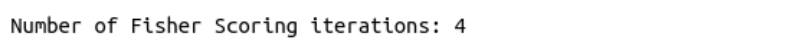
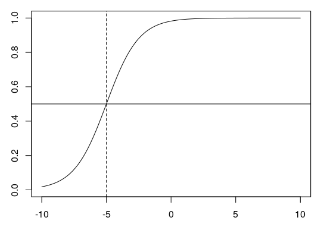

# Logistic Regression

## Setup und Pakete laden

Öffnen Sie das R Projekt, das Sie für diesen Kurs angelegt haben. Öffnen Sie hierfür RStudio und benutzen Sie die Schaltfläche oben rechts oder navigieren Sie zu Ihrem Kursverzeichnis und klicken Sie auf die `.Rproj` Datei.

Laden Sie das `tidyverse`:

```{r}
library(tidyverse)
```

Laden Sie außerdem die folgenden Data Frames:

```{r}
url <- "http://www.phonetik.uni-muenchen.de/~jmh/lehre/Rdf"
ovokal <- read.table(file.path(url, "ovokal.txt"))
pvp <- read.table(file.path(url, "pvp.txt"))
sz <- read.table(file.path(url, "sz.txt"))
```

## Von der linearen zur logistischen Regression

Die logistische Regression ist (genau wie die lineare Regression) ein statistischer Test, der prüft, ob eine abhängige Variable von einem unabhängigen Faktor beeinflusst wird. Der Unterschied zur linearen Regression ist, dass die abhängige Variable in der logistischen Regression immer **kategorial und binär** ist und die unabhängige Variable entweder **numerisch (kontinuierlich) oder kategorial** sein kann. Mit der logistischen Regression können wir unter der Annahme eines Zusammenhangs zwischen abhängiger und unabhängiger Variable die Wahrscheinlichkeit eines bestimmten Wertes schätzen.

Beispiele:

- Inwiefern wird die Vokalisierung von einem finalen /l/ im Englischen (*feel* vs. '*feeu*')
vom Dialekt beeinflusst?
  + Abhängige Variable: Vokalisierung (kategorial mit zwei Stufen: ja, nein)
  + Unabhängige Variable: Dialekt (kategorial mit zwei oder mehr Stufen)

- Wird "passt" in Augsburg im Vergleich zu München eher mit /ʃ/ produziert?
  + Abhängige Variable: Frikativ (kategorial mit zwei Stufen: /s/, /ʃ/)
  + Unabhängige Variable: Dialekt (kategorial mit zwei Stufen: Augsburg, München)

- Der Vokal /a/ in /lam/ wird mit unterschiedlichen Dauern synthetisiert und Hörern vorgespielt. Hören die Probanden eher "lahm" (langes /a:/) als "Lamm" (kurzes /a/) mit zunehmender Dauer des Vokals?
  + Abhängige Variable: Vokal (kategorial mit zwei Stufen: /a/, /a:/)
  + Unabhängige Variable: Dauer (kontinuierlich)

Da die abhängige Variable in der logistischen Regression immer ein Faktor mit zwei Stufen ist, kann man diese Stufen auch als 1 und 0 kodieren und fragen, was auf der Grundlage der gegebenen Daten die Wahrscheinlichkeit $P$ ist, dass die abhängige Variable $y$ den Wert 1 annimmt: $P(y = 1)$. Genauso können wir nach der Wahrscheinlichkeit $Q$ fragen, dass $y$ den Wert 0 annimmt: $1 - P(y = 1)$. Für das dritte Beispiel oben würde das folgendes bedeuten:

- $P$: Wahrscheinlichkeit, dass Probanden mit steigender Vokaldauer "lahm" hören ("Erfolg", denn auf der Grundlage unseres Wissens oder unserer bisherigen Erkenntnisse z.B. aus anderen Experimenten gehen wir davon aus, dass die Probanden bei steigender Vokaldauer "lahm" hören sollten)
- $Q$: Wahrscheinlichkeit, dass Probanden mit steigender Vokaldauer "Lamm" hören ("Misserfolg", denn wieder auf der Grundlage unserer bisherigen Erkenntnisse zu diesem Sachverhalt gehen wir davon aus, dass es seltsam wäre, wenn die Probanden bei steigender Vokaldauer "Lamm" hören würden)

Die Division (das Verhältnis) von $P$ und $Q$ wird als **Odds** (Gewinnchancen) bezeichnet:

$Odds = \frac{P(y = 1)}{1 - P(y = 1)} = \frac{P}{Q}$ 

Die Gewinnchancen liegen immer in einem Wertebereich von 0 bis unendlich. Nun könnte man überlegen, einfach die *Odds* als abhängige Variable in einer linearen Regression zu verwenden, denn jetzt handelt es sich ja nicht mehr um eine kategoriale, binäre abhängige Variable. Das Problem ist, dass `lm()` nicht weiß, dass die *Odds* nur Werte von Null bis Unendlich annehmen können und daher auch Werte außerhalb dieses Bereichs vorhersagen würde. Außerdem sagt das Verhältnis von $P$ und $Q$ nichts darüber aus, wie viele Beobachtungen in die Berechnung dieses Verhältnisses eingeflossen sind (je mehr Beobachtungen, desto aussagekräftiger ist die berechnete Gewinnchance). Wir brauchen also eine Funktion, die uns die *Odds* in etwas umwandelt, dass zum einen in den Wertebereich $±$unendlich fällt und zum anderen die Proportionen anhand der Anzahl der Beobachtungen gewichtet. Diese Funktion heißt allgemein **Linkfunktion** (*link function*) und ist im Fall der logistischen Regression die **Logit Transformation der Odds**. Der Logit ist der Logarithmus der Gewinnchancen und wird deshalb auch als **log odds** bezeichnet:

$log(\frac{P}{Q})$

### Ein Beispiel für $P$, $Q$ und Logit

Zwischen 1950 und 2005 sollen Wörter wie *lost* in einer aristokratischen Form des Englischen (*Received Pronunciation*) immer weniger mit einem hohen Vokal /lo:st/ und zunehmend mit einem tiefen Vokal /lɔst/ produziert worden sein. Für diese Vermutung haben wir Daten im Data Frame `ovokal`:

```{r}
head(ovokal)
```

Unsere Forschungsfrage lautet: *Wird die Aussprache des Vokals (hoch vs. tief = abhängige Variable) vom Jahr (1950... 2005 = unabhängige numerische Variable) beeinflusst?*

Wir wollen $P$ (die Wahrscheinlichkeit, dass der Vokal tief produziert wurde) und $Q$ (die Wahrscheinlichkeit, dass der Vokal hoch produziert wurde) pro Jahr berechnen. Unseren bisherigen Erkenntnissen nach ist die Richtung der Veränderung von der hohen hin zur tiefen Aussprache des Vokals /o/, also bezeichnen wir es als "Erfolg", wenn der Vokal tief produziert wurde, und als "Misserfolg", wenn er hoch produziert wurde. Wir kodieren nun als ersten Schritt in der Berechnung von $P$ und $Q$ tiefe und hohe Aussprache als 1 und 0, bzw. als `TRUE` und `FALSE`:

```{r}
ovokal$Erfolg <- ovokal$Vokal == "tief"
ovokal$Misserfolg <- !ovokal$Erfolg
head(ovokal)
```

Dann nehmen wir uns das erste Jahr vor, 1950, und berechnen hierfür $P$ und $Q$, indem wir zählen, wie viele "Erfolge" bzw. "Misserfolge" wir für dieses Jahr haben:

```{r}
jahr_1950 <- ovokal[ovokal$Jahr == 1950,]
P <- sum(jahr_1950$Erfolg)
P
Q <- sum(jahr_1950$Misserfolg)
Q
```

Das heißt im Jahr 1950 wurde der Vokal /o/ in Wörtern wie *lost* nur 5 Mal tief, aber 30 Mal hoch produziert. So müssten wir das jetzt für jede Stufe der unabhängigen Variable (für jede Jahreszahl) machen... Aber das wäre sehr umständlich. Wir nutzen deshalb das Paket `dplyr` aus dem `tidyverse`. Das bietet eine elegante Schreibweise und sehr viele hilfreiche Funktionen für den Umgang mit Daten.

```{r}
df <- ovokal %>%
  group_by(Jahr) %>%
  dplyr::summarise(P = sum(Erfolg), Q = sum(Misserfolg))
df
```

<div class="gray">
**Erklärung: dplyr**

Im `tidyverse` lassen sich Funktionen mit der Pipe `%>%` aneinanderhängen. Oft wird dabei zuerst der Data Frame genannt, denn danach können alle Spalten aus dem Data Frame einfach per Spaltennamen in den Funktionen verwendet werden. Im obigen Code nutzen wir zwei Funktionen nacheinander, die häufig gemeinsam verwendet werden: `group_by()` gruppiert die Zeilen im Data Frame nach den in den runden Klammern genannten Spalten. Bei uns wird nach der unabhängigen Variable `Jahr` gruppiert. Alle darauf folgenden Funktion werden nicht mehr auf den gesamten Data Frame, sondern nur noch auf die einzelnen Gruppen (Gruppe = alle Beobachtungen, die zu einer Jahreszahl gehören) angewendet. Dieser Vorgang ist quasi unsichtbar, er kommt erst durch die zweite Funktion zum Tragen. 

`summarise()` kann verwendet werden, um zusammenfassende Funktionen wie `sum()`, `mean()`, `median()`, `min()`, `max()`, usw. auf Variablen anzuwenden und das Ergebnis sofort in einer neuen Spalte abzuspeichern. Bei `summarise()` empfehlen wir, grundsätzlich mit `dplyr::` anzugeben, dass die `summarise()`-Funktion aus dem `dplyr` Paket verwendet werden soll, denn es gibt leider sogar innerhalb des `tidyverse` noch andere Packages, die eine `summarise()`-Funktion haben. In der `summarise()`-Funktion geben wir zuerst den Namen der neu zu erstellenden Spalte an, z.B. `P`, und anschließend können wir eine zusammenfassende Funktion wie `sum()` auf eine der Spalten in unserem Data Frame anwenden, z.B. `sum(Erfolg)`. Das zählt dann für jede Jahreszahl, wie viele TRUE-Werte es in `ovokal$Erfolg` gibt.

Sie sehen, dass das Ergebnis ein Data Frame (bzw. eine `tibble`) mit sechs Zeilen ist, eine Zeile pro Jahr (weil wir nach Jahr gruppiert haben) und dann gibt es noch unsere zwei neu erstellten Spalten `P` und `Q`. Alle anderen Spalten aus dem ursprünglichen Data Frame wurden fallen gelassen.

Die erste Zeile in unserem neuen Data Frame `df` bedeutet folglich, dass /o/ im Jahr 1950 fünf Mal tief und 30 Mal hoch produziert wurde. Die zweite Zeile zeigt, dass die Probanden im Jahr 1960 den Vokal bereits öfter tief (P ist 21) als hoch (Q ist 18) produziert haben, usw.

Sie werden in diesem Kurs selbst keinen `dplyr`-Code schreiben müssen, aber Sie sollten ihn lesen können. In diesem [Cheat Sheet](https://rstudio.com/wp-content/uploads/2015/02/data-wrangling-cheatsheet.pdf) finden Sie eine knappe Übersicht über `dplyr` und in [Hadley Wickham's Buch](https://r4ds.had.co.nz/transform.html#grouped-summaries-with-summarise) finden Sie sehr viele weitere Informationen und Beispiele, die Ihnen beim Umgang mit `dplyr` helfen werden.

</div>

Mit $P$ und $Q$ können wir nun die *log odds* (den Logit) berechnen:

```{r}
df$log_odds <- log(df$P/df$Q)
df
```

Schauen wir uns die Verteilung der *log odds* über die Jahrzehnte an:

```{r}
ggplot(df) + 
  aes(x = Jahr, y = log_odds) + 
  geom_point()
```

Es sind diese *log odds*, durch die wir mittels der logistischen Regression eine Regressionslinie legen werden. Diese Regressionslinie wird genauso definiert wie die lineare Regressionslinie, sie schätzt aber eben die *log odds*:

$log(\frac{P}{Q}) = bx + k$

Hier gilt wieder:

- $b$ ist die Steigung
- $x$ ist ein Wert auf der x-Achse
- $k$ ist der y-Achsenabschnitt

Hier können wir $b$ und $k$ jedoch nicht so leicht berechnen wie bei der linearen Regression, d.h. wir lassen sie uns direkt schätzen.

### Die logistische Regressionslinie

Bei der linearen Regression haben wir uns die Regressionskoeffizienten mit der Funktion `lm()` schätzen lassen, die dafür das *least squares* Verfahren benutzt. Die **logistische Regressionslinie** wird hingegen mit dem **maximum likelihood** Verfahren angenähert, das dafür sorgt, dass die geschätzten Datenpunkte des logistischen Modells so ähnlich wie möglich zu den tatsächlichen Werten sind. Zur Schätzung der Regressionskoeffizienten nutzen wir die Funktion `glm()`, das steht für **Generalized Linear Model**. Die Funktion bekommt neben der Formel `y ~ x` und dem Data Frame das Argument `family = binomial`, das der Funktion mitteilt, dass die Logit-Transformation durchgeführt werden soll. Die abhängige Variable muss ein Faktor sein; ggf. müssen Sie die Variable also mit `as.factor()` noch in einen Faktor verwandeln:

```{r}
class(ovokal$Vokal) # kein Faktor
lreg <- glm(as.factor(Vokal) ~ Jahr, family = binomial, data = ovokal)
```

Die Zusammenfassung dieses Modells schauen wir uns etwas später an. Zuerst zeigen wir hier noch die Alternative zu der obigen Anwendung von `glm()` auf den originalen Daten Frame. `glm()` kann auch auf $P$ und $Q$ aus dem zusammengefassten Data Frame `df` ausgeführt werden, indem $P$ und $Q$ durch `cbind()` verbunden und als abhängige Variable verwendet werden:

```{r}
lreg2 <- glm(cbind(P, Q) ~ Jahr, family = binomial, data = df)
```

Wir können wieder `coef()` verwenden, um uns die Regressionskoeffizienten (*Intercept* und *Slope*) anzeigen zu lassen:

```{r}
coefs <- coef(lreg)
coefs

# oder mit $coefficients
lreg$coefficients
```

Mithilfe dieser Maße kann die gerade Regressionslinie auf die Daten im Logit-Raum überlagert werden. Dazu nutzen wir wieder die beiden Möglichkeiten aus `ggplot2`. Wenn `geom_smooth()` benutzt wird, muss `method = "glm"` verwendet werden, und bei `geom_abline()` benutzen wir die geschätzten `coefs` für *intercept* und *slope*.

```{r}
# mit geom_smooth():
ggplot(df) + 
  aes(x = Jahr, y = log_odds) + 
  geom_point() + 
  geom_smooth(method = "glm", se = F)

# mit geom_abline():
ggplot(df) + 
  aes(x = Jahr, y = log_odds) + 
  geom_point() + 
  geom_abline(intercept = coefs[1], slope = coefs[2], color = "blue")
```

Die Werte, die durch die logistische Regression geschätzt werden, sind die *log odds*. Wir können wieder die Funktion `predict()` verwenden, um uns die geschätzten *log odds* anzeigen zu lassen:

```{r}
log_odds_estimate <- predict(lreg)
log_odds_estimate
```

Der Output von `predict()` besteht in diesem Fall aus 220 Zahlen, eine Zahl pro Zeile im originalen Data Frame `ovokal`. Wie Sie sehen, wiederholen sich die geschätzten *log odds*. Das liegt daran, dass ein *log odd* Wert pro Stufe (bzw. Wert) der unabhängigen Variable berechnet wird, in diesem Fall gibt es also sechs einzigartige *log odd* Werte, einen pro Jahreszahl: 

```{r}
unique(log_odds_estimate)
```

Wir können diese vorhergesagten Werte wieder in Rot in unserem `ggplot` von oben einzeichnen und stellen fest, dass die vorhergesagten Werte genau auf der Regressionslinie liegen (wir verwenden hier `geom_abline()`):

```{r}
ggplot(df) + 
  aes(x = Jahr, y = log_odds) + 
  geom_point() + 
  geom_abline(intercept = coefs[1], slope = coefs[2], color = "blue") +
  geom_point(data = data.frame(x = unique(ovokal$Jahr), y = unique(log_odds_estimate)),
             mapping = aes(x, y),
             color = "red")
```

Genau wie bei der linearen Regression können wir `predict()` auch benutzen, um uns die *log odds* Werte vorhersagen zu lassen für x-Werte, die nicht im originalen Datensatz vorkommen. Wenn wir uns zum Beispiel die Logit-Werte für die Jahre 2000 bis 2020 schätzen lassen wollen, funktioniert das wie folgt:

```{r}
predict(lreg, data.frame(Jahr = 2000:2020))
```

### Regression mit `glm()`

Das Ergebnis der Funktion `glm()` ist ein Objekt mit den Klassen "glm" und "lm":

```{r}
class(lreg)
```

Nun wenden wir die `summary()`-Funktion auf das Ergebnis der logistischen Regression `lreg` an und schauen uns das Ergebnis wieder Zeile für Zeile an:

```{r}
summary(lreg)
```

Die Zusammengassung beginnt wieder mit dem *Call*, also der Funktion, die verwendet wurde.

#### Deviance Residuals

Die **Deviance Residuals** sind die Unterschiede zwischen den tatsächlichen und den geschätzten Werten. Es werden uns hier wieder Minimum, Maximum, Median und der Wertebereich der mittleren 50% der *log odds* Werte angezeigt:

{width=60%}

Im Gegensatz zu den Residuals aus der linearen Regression werden die *Deviance Residuals* aber als Logits ausgedrückt, das bedeutet u.a. dass sie nicht normalverteilt sein müssen. Wie bei den Residuals, können wir uns die *Deviance Residuals* mit `resid()` ausgeben lassen:

```{r}
resid(lreg)
```

#### Coefficients

Es folgt wieder die Tabelle der Regressionskoeffizienten:

{width=60%}

In der ersten Zeile dieser Tabelle stehen die Kennzahlen für Intercept, in der zweiten für Slope. In der ersten Spalte finden sich wieder die *Estimates* (Schätzungen) für die Regressionskoeffizienten, die mittels eines *maximum likelihood* Verfahrens ermittelt wurden. In der zweiten Spalte steht der Standard-Error, der beschreibt, wie verlässlich die Schätzungen sind (je kleiner desto besser). Auf die beiden Schätzungen wurde ein **Wald Test** durchgeführt, der prüft, ob sich die Schätzungen signifikant von Null unterscheiden. Das Ergebnis dieses Tests ist der **z-value**, der sich auch aus der Division von Estimate und Standard Error berechnen lässt. Hierbei interessiert uns vor allem die zweite Zeile, deren z-Wert und p-Wert zeigen, ob die unabhängige Variable *Jahr* in signifikantem Maß dazu beiträgt, die *log odds* Werte zu erklären. Wenn der p-Wert, der in der vierten Spalte steht, kleiner ist als 0.05 (siehe auch die Signifikanzniveau-Sternchen), dann unterscheidet sich der Koeffizient signifikant von Null. Im Fall der abhängigen Variable sehen wir, dass der p-Wert kleiner ist als 0.001, d.h. die Variable ist ein guter Prädiktor für die *log odds*.

Standardmäßig wird nach der *Coefficients*-Tabelle ein Statement über den **Dispersion parameter** gedruckt. Das können wir ignorieren.

#### Deviances und AIC

In den folgenden zwei Zeilen stehen die **Null deviance** und die **Residual deviance** sowie das **AIC** (*Akaike Information Criterion*):

{width=60%}

Die *Null deviance* beschreibt, wie gut ein Modell ohne unabhängige Variablen die Daten erklären würde. Ein Modell ohne unabhängige Variablen wird nur durch das Intercept charakterisiert. Für sich alleine genommen ist die *Null deviance* schwierig zu interpretieren. Deshalb steht gleich darunter die *Residual deviance*, die beschreibt, wie gut das tatsächlich verwendete Modell die Daten erklären würde. Aus der Differenz zwischen *Null* und *Residual Deviance* lässt sich also erkennen, wie hilfreich unsere unabhängige Variable in dem Modell ist. Die Freiheitsgrade berechnen sich übrigens aus der Anzahl der Beobachtungen im Data Frame minus die Anzahl der Parameter im Modell. Bei der *Null deviance* gibt es nur einen Parameter (Intercept), bei der *Residual deviance* gibt es zwei (Intercept und unabhängige Variable). Je kleiner die Deviances (also die Abweichungen zwischen den tatsächlichen und den geschätzten Werten) sind, desto besser.

**AIC** steht für **Akaike Information Criterion** und ist vor allem hilfreich, wenn man verschiedene Regressionsmodelle für dasselbe Datenset vergleichen will (wenn man also z.B. für `ovokal` noch ein Modell mit mehr als einer unabhängigen Variable berechnen würde). Je kleiner AIC, desto besser beschreibt das Modell die Varianz in den Daten. Da wir hier nur das eine Modell haben, ist AIC für uns uninteressant.

#### Fisher Scoring iterations

Bei der logistischen Regression berechnet ein iterativer Algorithmus die Regressionsparameter und die **Fisher Scoring iterations** geben Auskunft darüber, wie viele Iterationen benötigt wurden. Das ist ebenfalls uninteressant für uns.

{width=60%}

### Der Chi-Square Test & Ergebnisse berichten

Bei der linearen Regression haben wir als Prüfstatistik einen F-Test durchgeführt. Anstelle dessen führen wir bei der logistischen Regression einen **Chi-Square Test** durch, der prüft, ob das Modell einen signifikanten Anteil der Varianz in der abhängigen Variable erklärt. Da wir oben in der *Coefficients*-Tabelle schon gesehen haben, dass der Wald Test für unsere unabhängige Variable signifikant war, wird wahrscheinlich auch das gesamte Modell signifikant sein. Wir verwenden hierfür die Funktion `anova()` mit dem Argument `test = "Chisq`:

```{r}
anova(lreg, test = "Chisq")
```

Das Ergebnis des Chi-Square Tests hat zwei Zeilen, eine für das Null-Modell (nur Intercept) und das andere für das Modell mit der unabhängigen Variable *Jahr*. In der Spalte `Resid. Df` finden sich die Freiheitsgrade für die *Null* und *Residual Deviance*, die wiederum in der Spalte `Resid. Dev.` angegeben werden. Diese Werte wurden in der Zusammenfassung des logistischen Modells in Kurzform berichtet. Uns interessiert aus dem Ergebnis des Chi-Square Tests vor allem der Wert in der Spalte `Pr(>Chi)`, die den p-Wert enthält. Wenn dieser Wert kleiner ist als 0.05 (siehe auch Signifikanzsternchen), dann erklärt das Modell einen signifikanten Anteil der Variation in den Daten. Nachdem wir den Chi-Square Test durchgeführt haben, berichten wir folgende Kennzahlen: **$\chi^2$[Df] = Deviance, p < Signifikanzniveau**.

Unsere Ausgangsfrage war: *Wird die Aussprache des Vokals (hoch vs. tief) vom Jahr beeinflusst?* 

Nun können wir also berichten: *Jahr hatte einen signifikanten Einfluss auf die Proportion von 'lost' mit tiefem/hohem Vokal ($\chi^2$[1] = 61.1, p < 0.001).*

## Die Sigmoidal-Funktion und der Umkipppunkt

Die Ergebnisse einer logistischen Regression haben wir oben im Logit-Raum präsentiert. Man kann jedoch auch den y-Achsenabschnitt und die Steigung verwenden, um statt der *log odds* auf der y-Achse **Proportionen** abzubilden. In diesem Fall ist die Regressionslinie nicht mehr gerade, sondern **sigmoidal** (s-förmig). Die Formel für die Sigmoid-Funktion lautet:

$f(x) = \frac{e^{bx+k}}{1 + e^{bx+k}}$

In dieser Formel ist $e$ ist die Exponentialfunktion, $b$ und $k$ sind die Steigung und das Intercept. Je größer die Steigung $b$ ist (in der Abbildung: 1, 0.5, 0.25), desto steiler kippt die Sigmoid-Kurve (schwarz, rot, grün):


Wenn die Steigung Null ist, bekommt man eine gerade Linie um den Wert 0.5 auf der y-Achse. Wenn man bei einer Steigung von $b = 0$ den y-Achsenabschnitt $k$ verändert (in der Abbildung: 0, 1, -1), führt das dazu, dass die gerade horizontale Linie nach oben oder unten verschoben wird (schwarz, rot, grün):


### Der Umkipppunkt

Der **Umkipppunkt** ist der Punkt, zu dem die Sigmoid-Kurve **am steilsten** ist. An diesem Punkt ist der Wert auf der y-Achse (die Proportion) immer 0.5 (unten als horizontale Linie). Den x-Wert des Umkipppunkts berechnet man mit $\frac{-k}{b}$. Für $k = 4$ und $b = 0.8$ wäre das zum Beispiel $-4/0.8 = -5$ (hier als gestrichelte Linie): 



### Proportionen abbilden

Für unser Beispiel oben wollen wir nun Proportionen abbilden und anschließend eine sigmoidale Regressionskurve durch unsere Daten legen. Wir nehmen unseren zusammengefassten Data Frame `df` und berechnen die Proportion von $P$ (den Anteil von "Erfolgen") pro Jahr:

```{r}
df$Proportion <- df$P / (df$P + df$Q)
df
```

Für das Jahr 1950 liegt der Anteil an "Erfolgen" (wo also der Vokal /o/ tief produziert wurde) bei 14.3%, für das Jahr 1960 dann schon bei 53.8% usw. Diese Proportionen in der neu angelegten Spalte `df$Proportion` können wir jetzt plotten und dann mittels `geom_smooth()` eine sigmoidale Regressionslinie durch die Daten legen. Die Funktion `glm()`, die von `geom_smooth(method = "glm")` verwendet wird, braucht als Argument aber noch `family = binomial`. Deshalb geben wir `geom_smooth()` noch das Argument `method.args`, das dieses Argument für die `glm()`-Funktion definiert.

```{r}
ggplot(df) + 
  aes(x = Jahr, y = Proportion) + 
  geom_point() + 
  geom_smooth(method = "glm", se = F, method.args = list(family = binomial))
```

In dieser Abbildung ist das vollständige "S" der sigmoidalen Kurve nicht zu erkennen, weil unser Ausschnitt auf der x-Achse zu klein ist. Wir können uns aber einfach weitere Proportionswerte mit `predict()` berechnen. Wie wir vorhin gesehen haben, gibt uns `predict()` aber die *log odds* aus, und nicht die Proportionen. Die Proportionen erhalten wir, wenn wir in `predict()` das Argument `type = "response"` nutzen:

```{r}
predict(lreg, type = "response")
```

Das sind jetzt wieder die geschätzten Werte für alle 220 Beobachtungen im originalen Data Frame. Wir wollen nun ein paar Schätzungen für die Jahre vor 1950 und nach 2010. Also geben wir der `predict()`-Funktion auch noch einen Data Frame mit den gewünschten Jahreszahlen:

```{r}
more_props <- predict(lreg, data.frame(Jahr = c(1910, 1920, 1930, 1940, 2020, 2030)), type = "response")
more_props
```

Wir bauen uns nun einen Data Frame, der nur Jahr und Proportionen enthält, und zwar aus dem originalen Data Frame und den soeben geschätzten Werten:

```{r}
Jahr <- c(df$Jahr, 1910, 1920, 1930, 1940, 2020, 2030)
Proportion <- c(df$Proportion, more_props)
df <- data.frame(Jahr, Proportion)

ggplot(df) + 
  aes(x = Jahr, y = Proportion) + 
  geom_point() + 
  geom_smooth(method = "glm", se = F, method.args = list(family = binomial))
```

Wir können für diese Daten auch noch den Umkipppunkt berechnen und zwar aus den oben bereits gespeicherten `coefs`:

```{r}
-coefs[1] / coefs[2]
```

Das Jahr, in dem sich die Aussprache von /o/ in der *Received Pronunciation* von "hoch" in "tief" wandelt, ist also laut unserem Modell ungefähr das Jahr 1965.

## Umkipppunkte in Perzeptionstests

Umkipppunkte werden häufig in Perzeptionstests verwendet, die wie folgt konstruiert werden: Wir haben ein 11-stufiges Kontinuum zwischen /pUp/ und /pYp/ synthetisiert. Phonetisch betrachtet ist der Unterschied zwischen /U/ und /Y/ der zweite Formant, der bei /U/ niedrig und bei /Y/ hoch ist. Diesen F2-Wert haben wir im Kontinuum also in 11 Schritten langsam verändert. Das erste und letzte Token aus diesem Kontinuum klingen sehr eindeutig wie PUPP oder PÜPP, dazwischen kann es aber schwierig für Hörer sein, zwischen PUPP und PÜPP zu unterscheiden. Nun wurde einigen Probanden jedes Token aus dem Kontinuum in randomisierter Reihenfolge vorgespielt und der Proband musste entscheiden, ob es sich um PUPP oder PÜPP handelte. Uns interessiert, ab welchem F2-Wert die Wahrnehmung der Probanden von PUPP auf PÜPP umschaltet. Anders gesagt: Uns interessiert hier der Umkipppunkt.

Daten aus einem solchen Perzeptionsexperiment haben wir im Data Frame `pvp` gespeichert:

```{r}
head(pvp)
levels(pvp$Urteil)
unique(pvp$F2)
```

Wir erwarten, dass die Probanden mit steigendem F2-Wert eher /Y/ als /U/ hören, also kodieren wir das Urteil /Y/ als Erfolg und /U/ als Misserfolg:

```{r}
pvp$Erfolg <- pvp$Urteil == "Y"
pvp$Misserfolg <- !pvp$Erfolg
head(pvp)
```

Nun verwenden wir wieder `dplyr`, um $P$ und $Q$ zu berechnen:

```{r}
df <- pvp %>%
  group_by(F2) %>%
  dplyr::summarise(P = sum(Erfolg), Q = sum(Misserfolg))
df
```

Anschließend berechnen wir die Proportionen von $P$ und $Q$ und plotten die sigmoidale Regressionslinie in den Daten:

```{r}
df$Proportionen <- df$P / (df$P + df$Q)
df
ggplot(df) + 
  aes(x = F2, y = Proportionen) + 
  geom_point() + 
  geom_smooth(method = "glm", se = F, method.args = list(family = binomial))
```

Um den Umkipppunkt dieser Sigmoid-Kurve zu ermitteln, berechnen wir das Generalized Linear Model:

```{r}
pvp.glm <- glm(as.factor(Urteil) ~ F2, family = binomial, data = pvp)
```

Mit den geschätzten Regressionskoeffizienten können wir jetzt den perzeptiven Umkipppunkt der Probanden berechnen:

```{r}
coefs <- coef(pvp.glm)
-coefs[1] / coefs[2]
```

Das heißt ab einem F2-Wert von ca. 1151 Hz hören die Probanden eher PÜPP als PUPP.

Zuletzt wollen wir noch herausfinden, ob die Urteile der Probanden tatsächlich durch F2 beeinflusst wurden. Dafür nutzen wir den Chi-Square Test:

```{r}
anova(pvp.glm, test = "Chisq")
```

Wir berichten: *Die Proportion von pUp/pYp-Antworten wurde signifikant von F2 beeinflusst ($\chi^2$[1] = 109.0, p < 0.001).* 

## Kategorialer unabhängiger Faktor

Die logistische Regression kann auf eine ähnliche Weise verwendet werden, wenn die **unabhängige Variable kategorial** ist. Der wesentliche Unterschied ist, dass kein Umkipppunkt berechnet und kein Sigmoid abgebildet werden muss.

Im Data Frame `sz` haben wir Informationen darüber abgespeichert, wie 20 Versuchspersonen das Wort "Sonne" aussprechen: entweder mit initialem [s] (stimmlos) oder initialem [z] (stimmhaft). Von den 20 Versuchspersonen kamen 9 aus Bayern und 11 aus Schleswig-Holstein:

```{r}
head(sz)
```

Unsere Frage ist nun: *Wird die Stimmhaftigkeit (zwei Stufen: s, z) vom Dialekt (zwei Stufen: BY, SH) beeinflusst?*

Da beide Variablen in diesem Fall kategorial sind, können wir einen Barplot erstellen, um einen Eindruck von den Daten zu gewinnen:

```{r}
ggplot(sz) + 
  aes(fill = Frikativ, x = Dialekt) + 
  geom_bar(position = "fill")
```

Es sieht sehr danach aus, dass der initiale Frikativ deutlich häufiger stimmlos in Bayern als in Schleswig-Holstein produziert wird. Nun wenden wir, genau wie zuvor, eine logistische Regression mit anschließendem Chi-Square Test auf die Daten an:

```{r}
sz.glm <- glm(as.factor(Frikativ) ~ Dialekt, family = binomial, data = sz)
anova(sz.glm, test = "Chisq")
```

Der Chi-Square Test zeigt: *Die Verteilung von stimmhaftem und stimmlosen /s/ in Worten wie Sonne wurde signifikant vom Dialekt beeinflusst ($\chi^2$[1] = 5.3, p < 0.05).*

