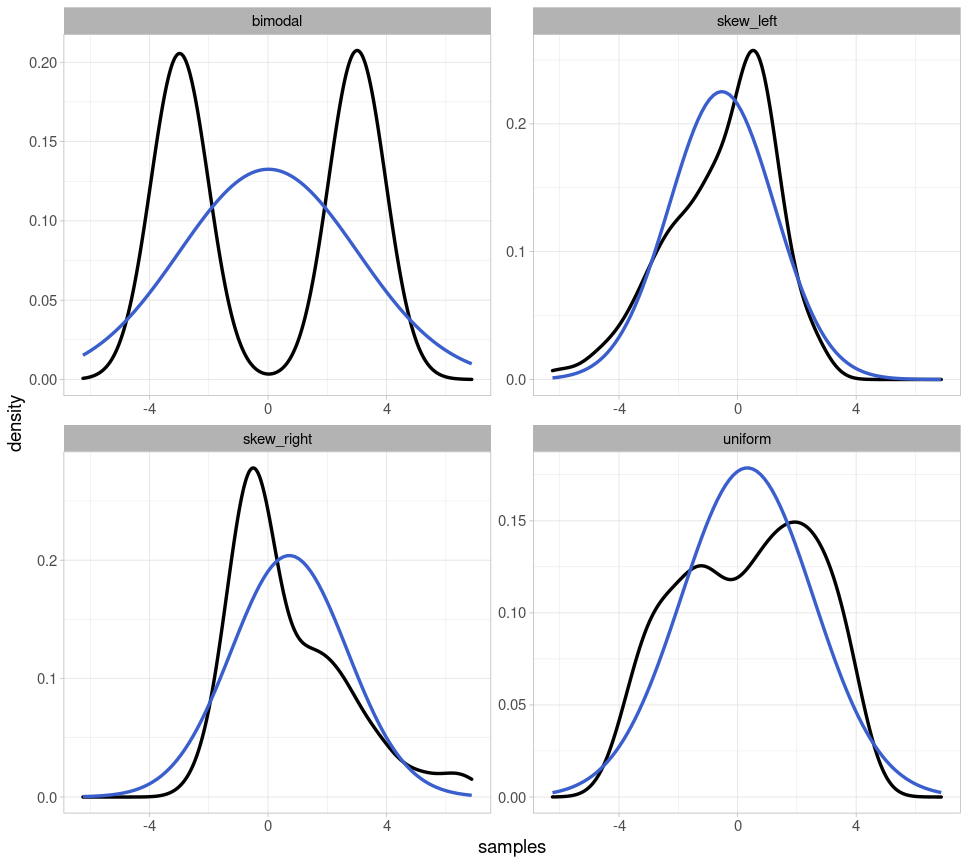

# Introduction to Inferential Statistics

## Load Packages and Data

Open the R project which you created for this tutorial. To that end, open RStudio and use the button on the top right or navigate to your course directory and double click on the `.Rproj` file. 

Then load the *tidyverse* and the following data frame:

```{r}
library(tidyverse)
url <- "http://www.phonetik.uni-muenchen.de/~jmh/lehre/Rdf"
df <- read.table(file.path(url, "vdata.txt")) %>% as_tibble() %>% 
  rename(vowel = V, tension = Tense, consonant = Cons, rate = Rate, subject = Subj) %>% 
  mutate(duration = log(dur)) %>% 
  select(-c(X, Y))
```

## Basic Terminology

*Statistical analysis [...] is a strikingly subjective process* -- Bodo Winter

In statistics, a **population** is the set of all units (i.e., people, words, etc.) that meet certain identification criteria (e.g., gender, origin, grammatical function, etc.). For example, imagine you want to determine the average fundamental frequency (f0) of all women in Germany. Then your population is the set of all women in Germany, which is approximately 40 million people. In this example, you could only determine the population mean $\mu$ (pronounced as /myː/, often written mu) by traveling to every woman in Germany and measuring her fundamental frequency, which is, of course, impossible for many reasons.

Instead, in science, one usually collects **samples**, e.g. a subset of the female population, and assumes that the resulting sample mean $m$ is not too far from the true population mean $\mu$. The larger the sample, the closer its mean $m$ and standard deviation $s$ will approximate the true population mean $\mu$ and the population standard deviation $\sigma$ (sigma). Greek symbols are typically used for the characteristics of a population, while Roman letters are used for the characteristics of an empirically collected distribution (i.e., a sample).

The methods of **inferential statistics** allow us to draw conclusions about the population from the sample. More precisely, inferential statistics helps us to *estimate* the parameters of the population. There are also measures, such as the standard error, that describe how good or bad the estimate is. Before a statistical test is conducted, it must be clear what is being tested: the so-called null hypothesis (H0). We operate according to the principle of falsification, i.e., we try to refute H0 with a statistical test. In addition, the alternative hypothesis (H1) is often mentioned, which is the exact opposite of the null hypothesis. Here is an example:

We have conducted an experiment because we want to investigate whether the duration of a vowel is influenced by the vowel's tension. The collected data is stored in the data frame `df`. We then formulate the following hypotheses:

- H0: *The vowel duration is not influenced by tension.*
- H1: *The vowel duration is influenced by tension.*

We then perform a statistical test to falsify H0. But be careful: If we have falsified H0, that does *not* mean that we have verified H1!

In addition, *before* conducting our statistical test, we must define the so-called **significance level**, also known as the **$\alpha$-level** (alpha level). This is the probability value at which we reject our null hypothesis or consider it falsified. In science, there are three (arbitrarily defined!) $\alpha$-levels: **0.05, 0.01, and 0.001**. If the result of our statistical test falls *below* the defined significance level, we consider H0 refuted and describe the result as "significant". In the case of the statistical tests presented here, the **$p$-value** is calculated, which provides information about the significance level. With a $p$-value of $p$ < 0.05, the test result is statistically significant.

## Normal Distribution

Above, we pointed out the difference between a population and a sample. Similarly, a distinction is also made between theoretical and empirical distributions. **Theoretical distributions** often have established names (normal distribution, Poisson distribution, Student's $t$-distribution, etc.), and it is assumed that measurements taken for an entire population follow a specific theoretical distribution. However, as we have noted, we can almost never measure an entire population and instead use a sample. The measurements from a sample represent an **empirical distribution** because they were collected empirically. We will frequently need to test which theoretical distribution the observed empirical distribution most closely resembles.

In many empirical experiments, the data follows a normal distribution (also called a Gaussian distribution). This distribution can be completely described by two parameters: its mean and standard deviation. Here you see three different normal distributions:

- black: mean $\mu = 0$ and standard deviation $\sigma = 1$
- blue: mean $\mu = 3$ and standard deviation $\sigma = 2$
- green: mean $\mu = -2$ and standard deviation $\sigma = 1.5$


As you can see, the mean shifts the normal distribution along the x-axis, while the standard deviation leads to changes in the width of the distribution: the larger the standard deviation, the wider the normal distribution. Furthermore, the plot shows that the distribution is *continuous*, meaning it covers the range of values from minus to plus infinity.

### Testing for Normal Distribution

The duration of vowels was recorded in the data frame `df`. We want to test whether the empirical distribution of the duration corresponds to the normal distribution. First, here is the empirically measured duration in a probability density distribution:

```{r}
ggplot(df) + 
  aes(x = duration) + 
  geom_density() +
  xlab("Log. Duration") + ylab("Probability Density") +
  xlim(3.0, 7.0)
```

<div class="gray">
**Further information: Taking the logarithm**

In the figure, you see the vowel duration not in milliseconds, but in logarithmic form, i.e., we have applied the natural logarithm to the data (see code snippet where `df` was loaded). For certain measurements, it can be useful to logarithmically transform the data, namely when the empirical distribution is skewed. With reaction times, for example, it is not possible to have values below zero; very low values (below 100ms) are also very unlikely, but very long reaction times do occur. The same goes for duration values. The actual duration values in milliseconds look like this:

```{r}
ggplot(df) + 
  aes(x = dur) + 
  geom_density() + 
  xlab("Duration (ms)") + ylab("Probability Density")
```

This distribution has a strong right-hand side skew, precisely because long durations occur while very short durations are rare.

</div>

#### Superimposing the Normal Distribution

In order to test whether data is normally distributed, visual methods are more popular amongst statisticians than statistical tests. The first method is to superimpose a normal distribution with the same mean and standard deviation as the empirical distribution onto the latter. We can use the function `dnorm()` for this, which receives the arguments `mean` and `sd`. In `ggplot2`, we cannot simply add "foreign" functions such as `dnorm()` to our `ggplot()` code. Instead, we use the function `stat_function()` from the `ggplot2` package. This function takes the following arguments:

- `fun`: the function with which a new curve shall be created (here: the curve of a normal distribution).

- `args`: a list of arguments belonging to the function given to the argument `fun`. In our case, the function `dnorm()` needs the arguments `mean` and `sd`.

```{r}
ggplot(df) + 
  aes(x = duration) + 
  geom_density() + 
  xlim(3.0, 7.0) + 
  xlab("Log. Duration") + ylab("Probability Density") +
  stat_function(fun = dnorm, 
                args = list(mean = mean(df$duration), sd = sd(df$duration)),
                color = "blue")
```

There are small differences between the blue normal distribution and the black empirical one. Our data may not be perfectly normally distributed, but at least approximately so.

#### Q-Q Plot

In addition to superimposing a normal distribution onto the empirical distribution, so-called **Q-Q plots** are frequently used, where Q stands for **quantile**. Watch the following [YouTube video](https://www.youtube.com/watch?v=X9_ISJ0YpGw) to understand how this plot is computed. And don't get confused: Although the video shows "*sample quantiles*" on the y-axis, these are simply the data points ordered in ascending order!

```{r}
ggplot(df) + 
  aes(sample = duration) + 
  stat_qq() + 
  stat_qq_line() + 
  ylab("samples") + 
  xlab("theoretical quantiles")
```

In `ggplot2`, this plot can be created using `stat_qq()`. Additionally, we use `stat_qq_line()` to plot a straight line that serves as a reference. If the points deviate from the line, the data are not normally distributed (although slight deviations at the upper and lower ends of the line are quite common). In this case, a slight deviation from the normal distribution is also visible.

#### Practice Your Interpretation

Initially, it can be difficult to determine from one or two plots whether the plotted data are normally distributed. Therefore, we show four examples of clearly non-normally distributed data so that you can hone your ability to recognize what Q-Q plots and overlaid probability distributions *should not* look like if your data are normally distributed.

Below, you will see four probability distributions: for bimodal data (there are two peaks), for left- and right-skewed data, and for uniformly distributed data (where each value theoretically occurs with equal frequency).


Here are the same probability distributions with the respective parametrically fitted normal distribution (i.e., for each normal distribution, the mean and standard deviation corresponding to the depicted distribution were used):



Finally, we also create Q-Q plots for all four distributions, which deviate significantly from the straight line:


#### Shapiro-Wilk Test

Finally, we take a look at the **Shapiro-Wilk test** because it is the most frequently used test for normal distributions. In R, the function `shapiro.test()` conducts that test and takes the data as a vector as its only argument:

```{r}
shapiro.test(df$duration)
```

The null hypothesis of this test is that the data are indeed normally distributed. If the $p$-value is below the generally accepted significance level of $\alpha = 0.05$, we must reject this hypothesis and therefore assume that the data are not normally distributed. According to this test, our log-transformed duration values are therefore not normally distributed. For the Shapiro-Wilk test, your dataset should consist of fewer than 5000 observations and should not contain too many outliers or identical values, as this can strongly influence the validity of the result. Despite this test result, based on the plots created earlier, I would assume that our data are approximately normally distributed.

<div class="gray">
**Further information: Scientific notation of numbers**

Very large and very small numbers in R are often represented using scientific notation, e.g., 1e+02 instead of 100. "e" here stands for base 10, and the numbers that follow are the exponent:

```{r}
1e+02 == 1 * 10^2
1e-02 == 1 * 10^-2
```

With numbers like 100 or 0.01, you can still easily convert scientific notation in your head. But of course, R can do this for you, using the `format()` function, which takes the argument `scientific = FALSE`:

```{r}
format(1e+02, scientific = F)
format(1e-02, scientific = F)
# and for the p-value from our Shapiro-Wilk test above:
format(2.062e-11, scientific = F)
```

Attention! This function returns character objects, so if you want to work with the converted number you must use `as.numeric()` to convert the result of `format()` back into a number:

```{r}
class(format(1e+02, scientific = F))
as.numeric(format(1e+02, scientific = F))
```

</div>

### 68–95–99.7 Rule & Confidence Intervals

#### Theoretical

For normal distributions (and, approximately, also for quasi-normally distributed data), the so-called **68–95–99.7 rule** applies. We illustrate this with a normal distribution with mean $\mu = 0$ and standard deviation $\sigma = 1$:


The total area under the normal distribution is 1, meaning we can use the area to determine the probability that data points fall within a given range of values. With a normal distribution, 68% of the data falls within the blue area, 95% within the blue + red area, and 99.7% within the entire shaded area. As you can see from the x-axis of this figure, this corresponds to $\mu\pm1\sigma$ (blue), $\mu\pm2\sigma$ (blue + red), and $\mu\pm3\sigma$ (blue + red + yellow). The 68–95–99.7 rule is therefore a mnemonic to help remember that with (approximately) normally distributed data, 68% of the data points lie within a range of $\mu\pm1\sigma$, and so on.

We can calculate the area under the normal distribution using **`pnorm()`**. This function takes an x-value and the mean and standard deviation that describe the normal distribution (the default is zero and one, so I'm omitting these two arguments here). Then, `pnorm()` calculates the area from negative infinity up to the specified x-value. If we enter a very high x-value, it should become clear that the area under the normal distribution is indeed 1:

```{r}
pnorm(100)
```

For `x = 0` (i.e. our mean), the area should be 0.5:

```{r}
pnorm(0)
```

This means that 50% of all data points fall within the range from negative infinity to zero. Now we can also calculate the areas highlighted above:

```{r}
# blue areas:
pnorm(0) - pnorm(-1)
pnorm(1) - pnorm(0)
# read areas:
pnorm(-1) - pnorm(-2)
pnorm(2) - pnorm(1)
# yellow areas:
pnorm(-2) - pnorm(-3)
pnorm(3) - pnorm(2)
```

In statistics, we are often interested in whether data falls within a **confidence interval**, usually referred to as the 95% confidence interval. This means that for normally distributed data, we check whether a data point falls within the range $\mu \pm 2\sigma$. To determine the precise range of values, we use the **`qnorm()`** function, which again takes the mean and standard deviation as arguments, and additionally the desired area under the distribution. If we want a total area of 0.95 symmetrically around the mean, the area at the left and right edges of the distribution is $(1 - 0.95) / 2 = 0.025$. For our normal distribution above, we can then calculate:

```{r}
qnorm(0.025)
qnorm(1-0.025)
```

This means that for a normal distribution with mean $\mu = 0$ and standard deviation $\sigma = 1$, an area of 0.95 (i.e., 95% of the data points) lies between -1.96 and 1.96. Above, we stated that the area of 0.95 corresponds to $\mu \pm2\sigma$ -- more precisely, we should have written $\mu \pm 1.96\sigma$.

#### Empirical

Let's assume we've determined that the duration values in `df` are normally distributed. Using our knowledge of the 68–95–99.7 rule and confidence intervals, we can, for example, find out the probability that a new measurement point from the same experiment falls within a certain range of values. The following figures show the normal distribution with mean `mean(df$duration)` and standard deviation `sd(df$duration)`, and not the empirical data distribution.

```{r}
mean_dur <- mean(df$duration)
sd_dur <- sd(df$duration)
```

So, if we repeat the same experiment from which `df` was derived, what is the probability that a new data point would lie in a range of values below 4.5 (logarithmic duration)?


This is equivalent to asking how large the blue area is, because the total area under the normal distribution is always equal to 1. For this, we use the function `pnorm()`:

```{r}
pnorm(4.5, mean = mean_dur, sd = sd_dur)
```

The probability that a new data point falls within a value range from negative infinity to 4.5 is therefore 7.4%.

Now the same for the following blue area:


So we ask ourselves how large this area is, or rather, with what probability a new data point falls into the range above 5.1. However, we must consider two things when calculating this: First, `pnorm()` always calculates the area between negative infinity and a value; second, the area under the normal distribution is equal to 1. Therefore:

```{r}
1 - pnorm(5.1, mean = mean_dur, sd = sd_dur)
```

The area is therefore 0.254, i.e. the probability is 25.4%.

If we are now interested in the probability that the values in the experiment fall within the range of 4.9 to 5.5, we need to manipulate `pnorm()` as follows:


```{r}
pnorm(5.5, mean = mean_dur, sd = sd_dur) - pnorm(4.9, mean = mean_dur, sd = sd_dur)
```

So the probability that a new data point falls within the queried range of values is 49.7%.

Now, we want to determine the 95% confidence interval for our distribution of duration values, i.e., the range of values in which 95% of the data lie. This simply means that we are trying to calculate the range of values for which the area under the normal distribution is 0.95. Since the area should be symmetrically distributed around the mean, the boundary region on each side must be calculated for which the area is $(1 - 0.95) / 2 = 0.025$.


To this end, we once again use `qnorm()`:

```{r}
qnorm(0.025, mean = mean_dur, sd = sd_dur)
qnorm(0.975, mean = mean_dur, sd = sd_dur)
```

This means that a new value from the experiment will fall within the range of 4.35 to 5.47 with a probability of 95%, or that 95% of the data from the current experiment lie within this range (assuming that the data are normally distributed).

```{r}
count <- df %>% 
  filter(duration > 4.35 & duration < 5.47) %>% 
  nrow()
count
count / nrow(df)
```

In fact, 96.5% of the data lies within the calculated range. This again illustrates the difference between theoretical and empirical distribution: We verified that our empirical data is approximately normally distributed and then created a normal distribution using the mean and standard deviation of the data. It is a *theoretical* calculation that 95% of the data lies within the range of 4.35 to 5.47 (and that 7.4% of the data lies below 4.5, etc.), because this is based on the theoretical normal distribution. If we look at the actual proportions of the values within the ranges and the confidence interval, they may differ from the theoretically calculated proportions.
