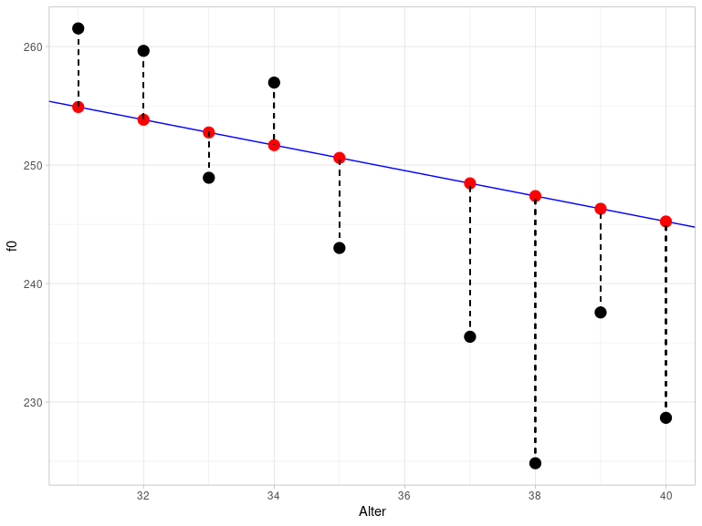

# Simple Linear Regression

## Load Packages and Data

Load the following packages and data frame:

```{r}
library(broom)
library(tidyverse)
url <- "http://www.phonetik.uni-muenchen.de/~jmh/lehre/Rdf"
queen <- read.table(file.path(url, "queen.txt")) %>% as_tibble() %>% 
  rename(age = Alter)
```

## Introduction

So far, we have used descriptive statistics to examine specific measurements (variables) in more detail and learned about empirical and theoretical distributions. However, such variables are often dependent on other variables. For example, many studies have shown that our reaction time decreases with increasing sleep deprivation. This means that the variable reaction time depends on the variable sleep deprivation. Therefore, we also speak of dependent and independent variables. These dependencies can be described using simple linear regression. In other words, the value of the dependent variable $y$ is predicted by the independent variable $x$. Before we perform a linear regression, we will discuss regression lines and correlation.

## Correlation

Correlation, also known as *Pearson's correlation* $r$, is a measure of the association between two variables and can be calculated using the `cor()` function. Here, we will be working with the `queen` data frame.

```{r}
queen %>% head()
```

This data frame holds the average fundamental frequency values of Queen Elizabeth II during her annual Christmas addresses. We are interested in whether the Queen's age has had an influence on her fundamental frequency. First, let's get an overview of the situation. It is important that, when plotting data where we suspect a correlation, we always place the independent variable (here: age) on the x-axis and the dependent variable (here: f0) on the y-axis.

```{r}
ggplot(queen) + 
  aes(x = age, y = f0) + 
  geom_point()
```

It looks like there might be a connection: the older the Queen got, the more her fundamental frequency decreased! We can verify our visual impression using the correlation $r$:

```{r}
cor(queen$age, queen$f0)
```

The correlation $r$ takes values exclusively between -1 and 1. The closer the value is to zero, the weaker the relationship between the two variables. A strong negative correlation of -0.84 indicates a strong negative correlation, meaning our visual impression appears to be correct.

## The Regression Line

### Theoretical Information

The regression line of simple linear regression can be described by the following formula:

$y = k + bx$

Here, $k$ is the y-intercept and $b$ is the slope. Because the intercept and slope unambiguously describe a regression line, these two parameters are also called **regression coefficients**. Using the formula above, if the intercept $k$ and the slope $b$ are known, the corresponding $y$ values can be predicted for all possible $x$ values. The regression line is always an infinite, perfectly straight line and also passes through the mean of the distribution.

In the following figure, you see three regression lines: blue and green have the same intercept but opposite slopes; blue and orange have different intercepts but the same slope. The exact value of the slope indicates by how much the $y$ value increases or decreases when $x$ is increased by one unit. For $x = 0$ in the figure, $y = 1$ (for blue and green). For $x = 1$, $y = 1 + b$, so for blue $y = 1 + 0.5 = 1.5$ and for green $y = 1 + (-0.5) = 0.5$. For the orange line, when $x = 0$, $y = 2$, and when $x = 1$, $y = 2 + 0.5 = 2.5$.

```{r}
ggplot() + 
  xlim(-0.5, 1) + ylim(-0.5, 3) + xlab("x") + ylab("y") +
  geom_abline(slope = 0.5, intercept = 1, color = "blue", linewidth = 1.2) + 
  geom_abline(slope = -0.5, intercept = 1, color = "darkgreen", linewidth = 1.2) + 
  geom_abline(slope = 0.5, intercept = 2, color = "orange", linewidth = 1.2) + 
  geom_vline(xintercept = 0, lty = "dashed")
```

In summary, the blue and orange lines describe a positive correlation between $x$ and $y$ (the larger $x$, the larger $y$), while the green line describes a negative correlation (the larger $x$, the smaller $y$).

**Important: Correlation is not causation!** Linear regression can only describe the correlation between two variables, not causality. We introduce causality through our knowledge. For example, we know that sleep deprivation causes a slower reaction time. Linear regression can only show whether a relationship exists between reaction time and sleep deprivation, but from a regression perspective, it could just as easily mean that a slower reaction time causes sleep deprivation.

### Regression Lines with `ggplot2`

To fit a regression line through a `ggplot2` figure, we can use either `geom_abline()` (see above) or `geom_smooth()`. The first function takes the arguments `slope` and `intercept`, as you can see in the image above. The function `geom_smooth()`, on the other hand, takes the argument `method = "lm"`. "lm" stands for *linear model*, meaning that the function calculates slope and intercept for us, assuming that the data are in a linear relationship. We also specify the argument `se = F` because we don't want confidence intervals displayed here. This is what the regression line looks like in the case of the Queen:

```{r}
ggplot(queen) + 
  aes(x = age, y = f0) + 
  geom_point() + 
  geom_smooth(method = "lm", se = F, color = "blue")
```

The difference between `geom_abline()` and `geom_smooth()` is that `geom_abline()` draws a theoretically infinitely long, straight line (but of course we only see a portion of it), while `geom_smooth()` is limited by the range of values of the data. `geom_smooth()` can also draw other types of regression lines.

## Linear Regression with `lm()`

Now we are ready to perform a linear regression using the `lm()` function. This function takes only a formula and the data frame as arguments. The formula is `y ~ x`, meaning we want to predict the $y$ values (the fundamental frequency) as a function of the $x$ values (the age). Linear regression estimates the intercept and slope so that a regression line can be fitted through the data points that has the smallest possible distance to all points (this method is also called **least squares**; more on that below).

```{r}
queen.lm <- lm(f0 ~ age, data = queen)
queen.lm
```

The coefficients can be displayed on their own using `coef()`:

```{r}
queen.lm %>% coef()
```

So we see that the estimated intercept is 288.2 and the slope is -1.07. Confusingly, the slope is always referred to by the same name as the $x$ variable, in this case, "age". The coefficients mean the following: At an age of zero years ($x = 0$), the mean fundamental frequency is approximately 288 Hz, assuming a perfect linear relationship between age and the Queen's fundamental frequency. With each additional year ($x$ increases by 1), the fundamental frequency decreases by 1.07 Hz. By substituting the intercept and slope into our previous formula, we can now predict the corresponding fundamental frequency for all possible ages:

```{r}
x <- c(0, 40, 50)
f0_fitted <- coef(queen.lm)[1] + coef(queen.lm)[2] * x
f0_fitted
```

As mentioned, the Queen's estimated fundamental frequency at birth was 288 Hz. At age 40, it was likely only 245 Hz, and at age 50, 234.5 Hz. As you can see, our "fitted" model can also predict or estimate $y$ values that were not included in the original dataset (such as the f0 value for the 50-year-old Queen). However, all these points lie precisely on the regression line, and since the regression line is infinitely long, the estimate does not necessarily make sense for all values. For example, do you consider it likely that the Queen's fundamental frequency was 288 Hz at birth? Children typically have a fundamental frequency of 300 to 400 Hz. You must always be aware of whether the estimates are *meaningful* or not when working with your data. In R, you can perform the estimations using the `predict()` function, which takes as arguments the model `queen.lm` and a data frame containing the $x$ values for which $y$ is to be estimated. The $x$ variable must have the same name as in the original data frame, in this case, "age".

```{r}
predict(queen.lm, data.frame(age = seq(0, 100, by = 10)))
```

## Residuals

Above we see the estimated $y$ value for $x = 40$, which is the fundamental frequency for the Queen at 40 years old, namely approximately 245 Hz. However, the actual measured value is much lower:

```{r}
queen %>% filter(age == 40) %>% pull(f0)
```

The differences between the estimated and measured $y$ values are called **residuals**. The following figure shows a section of the previous plot for the age range between 30 and 40 years. The black dots are the actually measured f0 values, while the red dots are the estimated values. They lie exactly on the blue regression line. The vertical dashed lines represent the residuals. This figure illustrates why residuals are also referred to as **errors**.



The difference between the actual and estimated values is calculated as the sum of the squared residuals and is therefore also called the **sum of squares of error** (SSE). The method used to estimate the parameters of the regression line is called **least squares** because it attempts to keep the SSE as small as possible. This results in the regression line being positioned through the data so that all data points are as close to the line as possible.

The residuals can be output using `resid()`:

```{r}
queen.lm %>% resid()
```

SSE can be calculated with `deviance()`:

```{r}
queen.lm %>% deviance()
```

## Testing Assumptions

Statistical models such as the linear regression are based on assumptions about the data that must be met for the model's result to be meaningful. In the case of linear regression, these assumptions relate to the residuals.

### Normal Distribution of Residuals

The first assumption is that the residuals are normally distributed. We check this with a Q-Q plot:

```{r}
ggplot(augment(queen.lm)) + 
  aes(sample = .resid) + 
  stat_qq() + 
  stat_qq_line() + 
  ylab("samples") + 
  xlab("theoretical quantiles")
```

That looks okay, but not perfect. In addition, let's look at the probability distribution with a superimposed normal distribution:

```{r}
ggplot(augment(queen.lm)) + 
  aes(x = .resid) + 
  geom_density() + 
  xlim(-40, 40) + 
  xlab("residuals") +
  stat_function(fun = dnorm, 
                args = list(mean = mean(augment(queen.lm)$.resid), sd = sd(augment(queen.lm)$.resid)), 
                inherit.aes = F, 
                color = "blue")
```

If we are still undecided, we can perform a Shapiro-Wilk test:

```{r}
shapiro.test(augment(queen.lm)$.resid)
```

Since the $p$-value is higher than $\alpha = 0.05$, the residuals of the model seem to be approximately normally distributed.

### Constant Variance of the Residuals

The second assumption states that the variance of the residuals should be similar for all estimated values. This assumption is also known as **homoscedasticity** (try saying that three times fast). If the assumption is not met, we speak of **heteroscedasticity**. To visually represent the variance, we plot the residuals against the estimated values. Since the mean of the residuals is always approximately zero (dashed line in the figure at $y = 0$), we can recognize the constant variance by the fact that the points are evenly distributed around this mean.

```{r}
ggplot(augment(queen.lm)) + 
  aes(x = .fitted, y = .resid) + 
  geom_point() +
  xlab("estimated f0 values") + 
  ylab("residuals") + 
  geom_hline(yintercept = 0, lty = "dashed")
```

Since we have very few data points here, it's difficult to assess whether there's a recognizable pattern in the plot that would indicate that the errors don't have constant variance. The two outliers in the upper right are certainly not a good sign; but the rest looks okay. For now, we'll assume that the residuals are homoscedastic. To develop your intuition for what constitutes good and bad residual plots, I recommend Figures 6.2 and 6.3 in Winter (2020, pp. 111f.).

## Understanding all Results of `lm()`

The details mentioned in this section for calculating the various values are extremely rare in statistics books, statistics blogs, R vignettes, or other information sources. You don't need to memorize these details; the point is that you can understand the results of `lm()` -- and that involves more than just the $p$-value.

### Estimated $y$-Values and Residuals

As you may have noticed, I used the `augment()` function to utilize the results of the linear model in `ggplot2`. This function comes from the package [`broom`](https://cran.r-project.org/web/packages/broom/vignettes/broom.html), which we loaded at the beginning and which also provides two other helpful functions: `tidy()` and `glance()`. The result of these functions is always a `tibble`, an object that we can easily process further (unlike the strange regression objects):

```{r}
queen.lm %>% class
queen.lm %>% augment() %>% class()
```

Let's first take a look at the results of `augment()`:

```{r}
queen.lm %>% augment()
```

This function appends further columns to the original data (columns `f0` and `age`), namely the fitted (i.e., the model-estimated) f0 values `.fitted`, the residuals `.resid`, and others that are not of interest to us at this time.

### Regression Coefficients and $t$-Statistic

The `tidy()` function returns a table of the estimated regression coefficients:

```{r}
queen.lm %>% tidy()
```

The `estimate` column contains the estimates for intercept (first row) and slope (second row). The `std.error` column contains the so-called **Standard Error**, a measure of the accuracy of the estimate. Here, we want the smallest possible values (relative to the estimate) because this means that the model's estimates for the regression coefficients are precise. A column with the test statistic, `statistic`, follows. So far, we haven't discussed the statistical significance of the regression. Here, a **$t$-test** is performed to determine whether the estimated regression coefficients differ significantly from zero. If the regression coefficients are close to zero, they contribute nothing to predicting the $y$ value (recall the formula for the regression line: if $k$ or $b$ are equal to zero, they have no effect on the regression line). The value in the `statistic` column, which in this case is also called the **$t$-value**, is calculated as `estimate / std.error`, e.g. for the slope:

```{r}
as.numeric(tidy(queen.lm)[2, "estimate"] / tidy(queen.lm)[2, "std.error"])
```

The $t$-statistic has its own probability density distribution, called the Student's $t$ distribution or simply the $t$ distribution, which we can plot using the `dt()` function in `ggplot2` (analogous to the `dnorm()` function for normal distributions). This function takes an argument called `df`, which stands for **degrees of freedom**. The degrees of freedom are usually the sample size minus the number of coefficients, so here `nrow(queen) - 2`.

```{r}
ggplot() +
  xlim(-5, 5) +
  stat_function(fun = dnorm) +
  stat_function(fun = dt, args = list(df = 28), col = "orange") +
  stat_function(fun = dt, args = list(df = 5), col = "darkgreen") +
  xlab("") + ylab("density")
```

Here you see the $t$ distribution in orange compared to the black normal distribution with a mean of zero and a standard deviation of one; the two distributions are very similar. With decreasing degrees of freedom (for example, 5 degrees of freedom for the dark green distribution), the normal and $t$ distributions become less similar. As you know, the area under these distributions is always 1, meaning that even with the $t$ distribution, we can use a function to calculate the probability of a value falling within a specific range. The $t$-value for the slope in our example is approximately -8.02. Under the orange $t$ distribution, which matches our data, there is only a very, very small area under the curve for the range of values from negative infinity to -8.02 (you'll need a bit of imagination here, as the range in the figure above only starts at -5). Following the example of `pnorm()`, the function for calculating the area under the $t$ distribution is called `pt()`. Using the $t$-value and the degrees of freedom, we can calculate the $p$-value:

```{r}
2 * pt(-8.016248, df = 28)
```

<div class="gray">
**Further Information: two-tailed t-test**

We need to multiply the probability value calculated by `pt()` by 2 because the calculated $t$-test is not a one-tailed but a two-tailed $t$-test. The extreme ends of the distribution are called the *tail*; for the normal and $t$ distributions, very high and very low values are unlikely (i.e., there is very little area under the distribution from negative infinity to a very low x-value or from a very high x-value to positive infinity).

When we calculate a probability (or area) here with `pt()`, it only applies to the *lower tail* from negative infinity to the specified x-value. However, the same probability applies to the area from the positive x-value (here: `abs(-8.016248)`) to positive infinity (the *upper tail*). Therefore, we simplify things by multiplying the result above by 2. We could also have written:

```{r}
pt(-8.016248, df = 28) + pt(abs(-8.016248), df = 28, lower.tail = F)
```

You have seen something similar when calculating the 95% confidence interval for normal distributions: Our aim was to divide the area of 0.05 equally between both symmetrical halves of the distribution, i.e., we considered both *tails*, and not just one of them.

</div>

The $p$-value can be interpreted as follows: If we assume that the actual slope is zero (this is the null hypothesis of this $t$-test), then the observed slope of -1.07 is highly unexpected.

### Quality Criteria for the Model and $F$-Statistic

Now that we understand the output of `tidy()`, only `glance()` remains to be discovered. The `glance()` function displays at a glance a few criteria that can be used to assess the **quality of the model** (also called goodness-of-fit; for better readability, we convert the data frame to the long format):

```{r}
queen.lm %>% glance() %>% pivot_longer(cols = c(r.squared:nobs))
```

The value `r.squared` is exactly what the name suggests: the squared correlation value $r$, which we calculated above using `cor()`:

```{r}
cor(queen$age, queen$f0)^2
```

The **$R^2$** value describes the proportion of the variance in the data that is described by the fitted model. In this case, approximately 70% of the variance in the data is described by the model with a predictor (i.e., an independent variable). In linguistics, much lower $R^2$ values are more common because our subject of study is often influenced by many arbitrary factors that we cannot capture. The `adj.r.squared` value is a form of $R^2$ that is normalized for the number of independent variables. This is important because with a higher number of independent variables, $R^2$ will automatically increase, even if one or more of the variables do not contribute statistically to explaining or estimating the y-values. The *adjusted* $R^2$, on the other hand, incorporates the number of independent variables into the calculation of $R^2$ and is therefore more reliable than the simple $R^2$. Since there is only one variable here, $R^2$ and *adjusted* $R^2$ are very similar.

The column `sigma` contains the **Residual Standard Error**, which is an estimate of the standard deviation of the error distribution. We can calculate this value using `sigma()` (we will return to this value shortly):

```{r}
queen.lm %>% sigma()
```

Then we see another `statistic` along with `p.value`. This time it's the **$F$ statistic**, meaning we read the $p$-value from the $F$ distribution, which can be plotted using `df()` in `ggplot2` (the function's name stands for $F$ distribution, not for degrees of freedom). This distribution depends on two parameters: `glance(queen.lm)$df` and `glance(queen.lm)$df.residual`. These are the degrees of freedom for the model and for the residuals. In orange, you see the $F$ distribution that fits our data (namely, with one degree of freedom for the model and 28 degrees of freedom for the residuals). The distribution can only take values greater than zero. In dark green, you see an $F$ distribution where the degrees of freedom for the model have been changed, and in black, for comparison, the normal distribution.

```{r}
ggplot(data.frame(x = 0:5)) +
  aes(x) +
  stat_function(fun = dnorm) +
  stat_function(fun = df, args = list(df1 = 1, df2 = 28), col = "orange") +
  stat_function(fun = df, args = list(df1 = 7, df2 = 28), col = "darkgreen") +
  xlab("") + ylab("density")
```

Looking at the orange distribution here, we can already see that an $F$-value of 64.3 (see `statistic`) would be extremely unlikely, hence the very small $p$-value. The null hypothesis of the $F$-test performed here is that a model without predictors explains the data as well as, or better than, the model with the predictor `age`. That is, if the $p$-value resulting from the $F$-test is very small, we can conclude that our model with the independent variable `age` explains the data better than a model without predictors.

We will now try to understand the values in the columns `statistic`, `df`, `df.residual`, and `deviance`. You already know the latter as **SSE** (sum of squared error):

```{r}
SSE <- queen.lm %>% deviance()
SSE
```

`df`, as already indicated, is the number of degrees of freedom of the model and is calculated as the number of regression coefficients $k$ minus 1:

```{r}
k <- length(queen.lm$coefficients)
df.SSR <- k-1
df.SSR
```

`df.residual` is the number of degrees of freedom of the residuals, which is calculated as the number of observations $N$ minus the number of regression coefficients $k$.

```{r}
N <- queen %>% nrow()
df.SSE <- N - k
df.SSE
```

Finally, to understand the $F$-value in the `statistic` column, let's look at its formula: $F = \frac{MSR}{MSE}$. Here, **MSR** stands for *mean squares of regression* and **MSE** for *mean squares of error*. These two values describe the variance of the estimated y-values and the variance of the residuals. To calculate MSE and MSR, we first need to calculate two other values: *sum of squares of Y* (**SSY**), which describes the distance of the data points from the mean of $y$, and *sum of squares of regression* (**SSR**), which describes the difference between SSY and SSR. First, SSY:

```{r}
SSY <- sum((queen$f0 - mean(queen$f0))^2)
SSY
```

In practice, SSY is the sum of all distances between the black (actually measured) data points and the orange line that intersects the y-axis at `mean(queen$f0)` and has a slope of zero (this figure again only shows a section of the entire range of values):


You can already see visually that the orange line describes the data much less accurately than the blue regression line, which is why SSY is much larger than SSE.

To calculate SSR, we now only need to find the difference between SSY and SSE:

```{r}
SSR <- SSY - SSE
SSR
```

Now we can finally calculate MSE and MSR:

```{r}
MSE <- SSE/df.SSE
MSE
MSR <- SSR/df.SSR
MSR
```

... and the $F$-value is obtained from the division of MSE and MSR:

```{r}
F_wert <- MSR / MSE
F_wert
```

Incidentally, there is a quadratic relationship between the $t$-statistic and our $F$-statistic: $F = t^2$ or $t = \sqrt{F}$:

```{r}
sqrt(F_wert)
```

Therefore, the $p$-value is exactly the same for both statistics.

Finally, let's return to the residual standard error, which we described above as an estimate of the standard deviation of the residuals. This is calculated as the square root of MSE:

```{r}
sqrt(MSE)
```

When we determine the standard deviation of the residuals, it should be very close to the residual standard error (however, the latter is only an estimate, therefore the values do not have to be the same):

```{r}
queen.lm %>% augment() %>% pull(.resid) %>% sd()
```

If the residual standard error is exactly zero, then all data points lie exactly on the regression line, i.e., every y-value from the dataset can be calculated exactly by the corresponding x-value using a linear model.

## Reporting the Result

We have now reviewed all the (relevant) results from `lm()`. We did this using the `broom` functions. A more traditional way to summarize the results of the linear regression is provided by `summary()`:

```{r}
queen.lm %>% summary()
```

You should recognize all the numbers here.

It is extremely important that we report our results correctly. For this, we need:

- $R^2$ (or, because it's more stable: *adjusted* $R^2$): 0.69
- the $F$-value: 64.3
- the degrees of freedom for the model and the residuals: 1 and 28
- the $p$-value, or the next higher significance level: $p < 0.001$

We report: **There is a significant linear relationship between the Queen's age and her fundamental frequency ($R^2$ = 0.69, $F$[1, 28] = 64.3, $p$ < 0.001).**

## Summary

- In a linear regression, the values of the dependent variable $y$ are estimated using the values of the independent variable $x$, assuming a linear relationship exists between them.
- The regression line is the straight line to which the data points are closest (least squares method).
- The function `lm()` estimates the regression coefficients y-intercept and slope.
- A $t$-test is performed to determine if the regression coefficients differ from zero. If $p < 0.05$ in the $t$-test for $x$, then the slope differs significantly from zero, meaning $x$ is a good predictor of $y$.
- The differences between the actual and estimated y-values are called residuals or errors; the residual standard error is an estimate of the standard deviation of the error distribution.
- $R^2$ is the square of the correlation coefficient $r$ and describes the proportion of the variance in the dependent variable $y$ that is described by the linear model.
- An $F$-test is also performed to check whether the linear model successfully explains a significant proportion of the variance in the dependent variable. If $p < 0.05$ in the $F$-test, then the model with the chosen predictor describes the empirical data better than a model without predictors (mean model).
- *SSE* is the *sum of squares of error* and describes the distance of the data points from the regression line; the *least squares* method attempts to minimize SSE.
- *SSR* is the *sum of squares of regression* and describes how well the regression model performs compared to the mean model (SSY).
