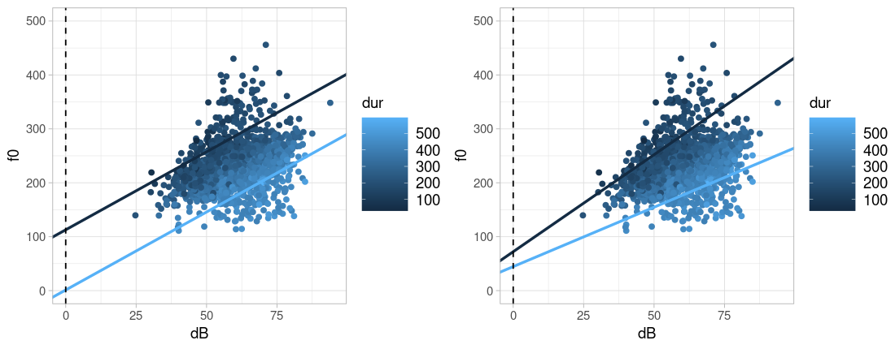

# Multiple Linear Regression

## Load Packages and Data

Please load the following packages and datasets:

```{r}
library(broom)
library(emmeans)
library(tidyverse)
library(magrittr)
url <- "http://www.phonetik.uni-muenchen.de/~jmh/lehre/Rdf"
faux <- read.table(file.path(url, "faux.txt"), stringsAsFactors = T, header = T) %>% 
  as_tibble()
int <- read.table(file.path(url, "dbwort.df.txt"), stringsAsFactors = T) %>% 
  as_tibble() %>% 
  rename(vowel = V, gender = G, subject = Vpn, word = Wort)
vlax <- read.table(file.path(url, "vlax.txt"), stringsAsFactors = T) %>%
  as_tibble() %>%
  filter(V %in% c("O", "I") & f0 != 0) %>%
  rename(vowel = V, subject = Vpn, word = Wort, duration = Dauer)
```

## Introduction

Up to now, we have worked with simple linear regression, where one variable (e.g., fundamental frequency) was predicted by another variable (e.g., age in years). However, we more often have multiple variables that we suspect influence our measurements. For this, we need multiple linear regression. The formula for linear regression is adapted so that there is a separate slope for each independent variable $x_1$, $x_2$, etc.:

$y = k + b_1x_1 + b_2x_2 + ...$

Here again, $k$ represents the y-intercept, and $b_1$, $b_2$, etc., are slopes. Below, we show three examples of multiple linear regressions, depending on the type of independent variables (categorical or continuous). For clarity, all examples contain only two independent variables; however, regressions can, of course, generally include more than two predictors.

## Continuous Independent Variables

First, we want to find out if the fundamental frequency `f0` in the (artificially created) data frame `faux` depends on the two continuous variables `dB` (volume) and `dur` (word duration). To do this, we create a plot of the data:

```{r}
ggplot(faux) +
  aes(x = dB, y = f0, col = dur) +
  geom_point()
```

Interpreting this plot isn't entirely straightforward. If we initially focus solely on the relationship between fundamental frequency and volume, we see a clear positive correlation; that is, the louder the participants spoke, the higher their fundamental frequency became. Since duration is also a continuous variable, we can only use a color continuum to visualize it (`ggplot()` does this automatically with the `col` argument). It appears that the darker points (= low duration values) are associated with relatively high f0 values, and the lighter data points (= high duration values) with relatively low f0 values. Therefore, there could be a negative correlation between f0 and duration. We can verify this impression using `cor()`:

```{r}
cor(faux$f0, faux$dB)
cor(faux$f0, faux$dur)
```

Since we are dealing with two independent variables, we must also consider whether there might be an **interaction** between them. An interaction exists when the effect of one independent variable on the dependent variable differs for different (extreme) values of the second independent variable. In our example, the effect of volume on f0 is generally positive, meaning the louder the speech, the higher f0. However, this effect is (visually) more pronounced for low than for high duration values. Imagine placing two regression lines through the figure above: a dark blue one for an example of a low duration value (e.g., 150 ms) and a light blue one for an example of a high duration (e.g., 450 ms). If there is no interaction between the variables, the two example regression lines will be parallel to each other; otherwise, they will not. For the data in the `faux` data frame, I have drawn the two example regression lines: in the left plot under the assumption that there is no interaction, in the right plot under the assumption that there is an interaction:



The regression lines in the right-hand plot appear to describe the data better than the data in the left-hand plot; that is, we assume there is an interaction between volume and duration in the dataset. We will see later exactly how the regression lines for the two plots were calculated.

<div class="gray">
**Further Information: Regression lines for two continuous predictors**

Drawing regression lines for two continuous variables requires some computation. However, if you want to avoid this work at some point, you can install the libraries `ggiraph` and `ggiraphExtra`. This [vignette](https://cran.r-project.org/web/packages/ggiraphExtra/vignettes/ggPredict.html) provides information about the `ggPredict()` function from `ggiraphExtra`, which can draw regression lines for multiple predictors.
</div>

In the following sections, we will first calculate a multiple regression without and then with interaction for many research questions, so that you can familiarize yourself with interactions. If you are faced with the decision of whether there might be an interaction between independent variables in your dataset, visualize your data and consider carefully how an interaction would be interpreted -- *before* you run the regression.

### Without Interaction

If there are no interactions in a model, the independent variables in the `lm()` formula are connected with a plus sign.

```{r}
lm1 <- lm(f0 ~ dB + dur, data = faux)
lm1 %>% 
  tidy() %>% 
  select(term, estimate)
```

Here we try to understand exactly what the estimates in the `estimate` column mean. The estimate for the intercept, as in the simple linear regression, is the estimated arithmetic mean of the dependent variable for $x_1 = 0$ and $x_2 = 0$ (and all possible additional $x$ values if there are more independent variables). That is, if the volume is 0 dB and the duration is also 0 ms, the fundamental frequency should be 168.6 Hz. The slopes no longer measure the effect of each individual independent variable, but rather the effect of one independent variable, while all other variables are held constant at zero. Every increase in volume by one decibel (at constant duration) leads to an increase in the fundamental frequency of 2.9 Hz, and every increase in duration by one millisecond (at constant volume) leads to a reduction in the fundamental frequency of 0.4 Hz. This means we find the expected relationships: volume positively influences the fundamental frequency, duration negatively.

Let's recall the formula for the regression line with two independent variables:

$y = k + b_1x_1 + b_2x_2$

We can retrieve the values for the y-intercept $k$ and the two slopes $b_1$ and $b_2$ from the data frame returned by `tidy()`:

```{r}
k <- lm1 %>% tidy() %>% filter(term == "(Intercept)") %>% pull(estimate)
k
b_1 <- lm1 %>% tidy() %>% filter(term == "dB") %>% pull(estimate)
b_1
b_2 <- lm1 %>% tidy() %>% filter(term == "dur") %>% pull(estimate)
b_2
```

Now we can choose any values for $x_1$ (volume in decibels) and $x_2$ (duration in milliseconds), insert them into the formula along with the regression coefficients, and thus estimate y-values. If we set both $x$ values to zero, the estimated $y$ value is exactly the intercept $k$:

$$
\begin{aligned}
 y &= k + b_1 \cdot dB + b_2 \cdot dur \\ 
 &= 168.64 + 2.89 \cdot 0 + (-0.37 \cdot 0) \\
 &= 168.64
\end{aligned}
$$

If you don't want to calculate these values manually, the `predict()` function can do it for you. For multiple linear regression, the function requires a data frame with as many columns as there were independent variables in the regression; the columns must also be named exactly like the independent variables. For demonstration purposes, we show that the fundamental frequency `f0`, according to the calculated linear model, is indeed approximately 168 Hz when the loudness is 0 dB and the duration is 0 ms. We also show the estimated f0 value for `db = 1` and `dur = 0` (which is 2.9 Hz higher than the intercept) and for `db = 0` and `dur = 1` (which is 0.4 Hz lower than the intercept). Finally, we use `predict()` to estimate the f0 value for the average loudness and duration.

```{r}
d1 <- data.frame(dB  = c(0, 1, 0, mean(faux$dB)), 
                 dur = c(0, 0, 1, mean(faux$dur)))
d1 %<>% mutate(estimated_f0 = predict(lm1, d1))
d1
```

Now we can also understand how the two example regression lines in the left plot above were calculated. We choose 450 ms as an example of a high duration and 150 ms as an example of a low duration (in the literature, the mean plus/minus 1.5 standard deviations of an independent variable is often used as an "extreme value"). We then insert these values, along with the regression coefficients, into our formula for the regression line (here first for a duration of 450 ms):

$$
\begin{aligned}
 y &= k + b_1 \cdot dB + b_2 \cdot dur \\ 
 &= 168.64 + 2.89 \cdot dB + (-0.37 \cdot 450) \\
 &= 168.64 + 2.89 \cdot dB + (-167.43) \\
 &= 1.21 + 2.89 \cdot dB
\end{aligned}
$$

The result is that, for a duration of 450 ms, the intercept of a regression line should be 1.21 and the slope should be 2.89.

$$
\begin{aligned}
 y &= k + b_1 \cdot dB + b_2 \cdot dur \\ 
 &= 168.64 + 2.89 \cdot dB + (-0.37 \cdot 150) \\
 &= 168.64 + 2.89 \cdot dB + (-55.81) \\
 &= 112.83 + 2.89 \cdot dB
\end{aligned}
$$

For the regression line with a duration of 150 ms, the intercept is at 112.83 and the slope is at 2.89. Therefore, the slope is the same for both regression lines, meaning these lines are parallel to each other. The two calculated intercepts and the slope can now be used for `geom_abline()`:

```{r}
high_dur <- 450
low_dur <- 150
slope <- b_1
intercept_high_dur <- k + b_1 * 0 + b_2 * high_dur
intercept_low_dur <- k + b_1 * 0 + b_2 * low_dur

ggplot(faux) + 
  aes(x = dB, y = f0, col = dur) + 
  geom_point() + 
  xlim(0, 95) +
  ylim(0, 500) +
  geom_abline(slope = slope, intercept = intercept_high_dur, color = "#56B1F7", linewidth = 1.2) +
  geom_abline(slope = slope, intercept = intercept_low_dur, color = "#132B43", linewidth = 1.2) +
  geom_vline(xintercept = 0, lty = "dashed")
```

We could, of course, have placed `dur` on the x-axis and represented `dB` using a color continuum. Then we would have to choose two extreme example *volume* values, insert all the values (intercept, slopes, chosen example values for `dB`) into the formula, and we would arrive at the following result:

```{r}
high_dB <- 75
low_dB <- 45
intercept_high_dB <- k + b_1 * high_dB + b_2 * 0
intercept_low_dB <- k + b_1 * low_dB + b_2 * 0
slope <- b_2

ggplot(faux) + 
  aes(x = dur, y = f0, col = dB) + 
  geom_point() + 
  xlim(0, 600) +
  ylim(0, 500) +
  geom_abline(slope = slope, intercept = intercept_high_dB, color = "#56B1F7", linewidth = 1.2) +
  geom_abline(slope = slope, intercept = intercept_low_dB, color = "#132B43", linewidth = 1.2) +
  geom_vline(xintercept = 0, lty = "dashed")
```

If you have taken sufficient time to understand and interpret the regression coefficients, we can now turn to the statistics and goodness-of-fit criteria of the model. Using `tidy()`, we examine the $t$-statistic along with the $p$-value, which indicates whether the regression coefficients differ significantly from zero:

```{r}
lm1 %>% tidy()
```

According to the tests, the two regression coefficients for the independent variables differ significantly from zero, meaning that both the volume and the duration appear to be good predictors of the fundamental frequency. The goodness-of-fit criteria are again the $F$-statistic and $R^2$:

```{r}
lm1 %>% glance() %>% pivot_longer(cols = c(r.squared:nobs))
```

The two independent variables describe 66% of the variance in the fundamental frequency values. Generally speaking, this is a relatively high value. However, this value becomes even more impressive when compared to the $R^2$ values from the two simple linear regressions that we can perform using the independent variables:

```{r}
lm(f0 ~ dB, data = faux) %>% glance() %>% pull(r.squared)
lm(f0 ~ dur, data = faux) %>% glance() %>% pull(r.squared)
```

This means that a model with volume as the only independent variable describes just under 10% of the variance in the fundamental frequency values, while a model with duration describes approximately 28% of this variance. However, when both predictors are combined in a single model (without interaction), this proportion increases to 66%.

Finally, we should not forget to report the results of the regression: **A multiple linear regression with volume and duration as independent variables showed a significant effect of volume ($t$ = 45.7, $p$ < 0.001) and duration ($t$ = 55.7, $p$ < 0.001) on the fundamental frequency. The chosen model describes the data better than a model without predictors ($R^2$ = 0.66, $F$[2, 1866] = 1815, $p$ < 0.001).** In a scientific publication, you should, of course, dedicate a few lines to describing the direction of the significant effects (i.e., whether they positively or negatively, strongly or weakly, influence the dependent variable) and whether this corresponds to the expectations (hypotheses) that you ideally formulated before data collection.

*(Of course, under realistic conditions, we would also check the assumptions about the residuals here!)*

### With Interaction

Since we determined in our first plot of the data in `faux` that there might be an interaction between volume and duration, we now want to calculate the model *with* this interaction. Interactions in a linear model can be written in two ways: either with an asterisk `dB * dur` or in the more explicit form `dB + dur + dB:dur`. With three independent variables `A`, `B`, and `C`, interactions can occur between any two factors as well as between all three, i.e., `A * B * C` or `A + B + C + A:B + A:C + B:C + A:B:C`. It can also be useful to calculate an interaction between only two of the three factors, e.g., `A * B + C` or `A + B + C + A:B`.

Here, we choose the shorthand notation and first look again at the estimates of the regression coefficients:

```{r}
lm2 <- lm(f0 ~ dB * dur, data = faux)
lm2 %>% 
  tidy() %>% 
  select(term, estimate)
```

The y-intercept for `dB = 0` and `dur = 0` is now at 86 Hz. The slopes describe the influence of an independent variable when all other independent variables are held constant at zero. The loudness `dB` also has a positive influence on the fundamental frequency in this model, with a slope of 4.3 Hz, meaning the fundamental frequency increases with loudness (when the duration is held constant at zero). The slope for `dur`, however, is negative at -0.09 Hz, meaning the fundamental frequency decreases for higher duration values (when the volume is held constant at zero).

Now, there is another slope, namely for the interaction `dB:dur`. This slope is also found in the formula for the regression line adapted for interactions:

$y = k + b_1x_1 + b_2x_2 + b_3(x_1 \cdot x_2)$

The slope $b_3(x_1 \cdot x_2)$ already indicates that the interaction is only important for the regression line if both $x_1$ and $x_2$ are non-zero: because if either of them is zero, the multiplication $x_1 \cdot x_2$ results in zero, meaning the slope $b_3$ must be multiplied by zero and thus disappears from the formula.

In our model, the slope for the interaction of the two predictors is negative. This can be interpreted as the fundamental frequency decreasing when both the volume and the duration increase. To understand these relationships precisely, we retrieve the intercept $k$, the two slopes $b_1$ (for volume) and $b_2$ (for duration), and the interaction $b_3$ from the data frame above:

```{r}
k <- lm2 %>% tidy() %>% filter(term == "(Intercept)") %>% pull(estimate)
k
b_1 <- lm2 %>% tidy() %>% filter(term == "dB") %>% pull(estimate)
b_1
b_2 <- lm2 %>% tidy() %>% filter(term == "dur") %>% pull(estimate)
b_2
b_3 <- lm2 %>% tidy() %>% filter(term == "dB:dur") %>% pull(estimate)
b_3
```

Now you can insert these values, along with freely chosen values for $x_1$ (volume) and $x_2$ (duration), into the formula above to find out what the fundamental frequency should be for the chosen values of the independent variables. Let's assume $x_1$ and $x_2$ are both zero; then, again, the estimated y-value corresponds exactly to the intercept $k$:

$$
\begin{aligned}
 y &= k + b_1 \cdot dB + b_2 \cdot dur + b_3(dB \cdot dur) \\ 
 &= 86.02 + 4.30 \cdot 0 + (-0.092 \cdot 0) + (-0.0047 \cdot 0 \cdot 0) \\
 &= 86.02
\end{aligned}
$$

Similarly, instead of the two zeros, you can use different values for $x_1$ and $x_2$. As an example, we choose $x_1 = 1$ and $x_2 = 1$ to show that the slope then also comes into play for the interaction of the two variables:

$$
\begin{aligned}
 y &= k + b_1 \cdot dB + b_2 \cdot dur + b_3(dB \cdot dur) \\ 
 &= 86.02 + 4.30 \cdot 1 + (-0.092 \cdot 1) + (-0.0047 \cdot 1 \cdot 1) \\
 &= 90.22
\end{aligned}
$$

Or, by using the extracted regression coefficients:

```{r}
k + b_1 + b_2 + b_3
```

Here again we can use `predict()` to estimate the `f0` value for different combinations of `dB` and `dur` values:

```{r}
d2 <- data.frame(dB  = c(0, 1, 0, 1, mean(faux$dB)), 
                 dur = c(0, 0, 1, 1, mean(faux$dur)))
d2 %<>% mutate(estimated_f0 = predict(lm2, d2))
d2
```

Now we can re-create the example regression lines that we saw in the right-hand plot above. We choose 450 ms and 150 ms as example duration values:

$$
\begin{aligned}
 y &= k + b_1 \cdot dB + b_2 \cdot dur + b_3(dB \cdot dur) \\ 
 &= 86.02 + 4.30 \cdot dB + (-0.092 \cdot 450) + (-0.0047 \cdot dB \cdot 450) \\
 &= 86.02 + 4.30 \cdot dB + (-41.45) + (-2.10 \cdot dB) \\
 &= 44.57 + 2.20 \cdot dB
\end{aligned}
$$

And for 150ms:

$$
\begin{aligned}
 y &= k + b_1 \cdot dB + b_2 \cdot dur + b_3(dB \cdot dur) \\ 
 &= 86.02 + 4.30 \cdot dB + (-0.092 \cdot 150) + (-0.0047 \cdot dB \cdot 150) \\
 &= 86.02 + 4.30 \cdot dB + (-13.82) + (-0.70 \cdot dB) \\
 &= 72.20 + 3.60 \cdot dB
\end{aligned}
$$

This time, the slopes for the two extreme chosen duration values differ precisely because the interaction was included. Now we define the calculated intercepts and slopes as variables and insert them again into `geom_abline()` to draw the regression lines:

```{r}
high_dur <- 450
low_dur <- 150

intercept_low_dur <- k + b_1 * 0 + b_2 * low_dur + b_3 * 0 * low_dur
intercept_low_dur
intercept_high_dur <- k + b_1 * 0 + b_2 * high_dur + b_3 * 0 * high_dur
intercept_high_dur

slope_low_dur <- b_1 + b_3 * low_dur
slope_low_dur
slope_high_dur <- b_1 + b_3 * high_dur
slope_high_dur

ggplot(faux) + 
  aes(x = dB, y = f0, col = dur) + 
  geom_point() + 
  xlim(0, 95) +
  ylim(0, 500) +
  geom_abline(slope = slope_low_dur, intercept = intercept_low_dur, color = "#132B43", linewidth = 1.2) +
  geom_abline(slope = slope_high_dur, intercept = intercept_high_dur, color = "#56B1F7", linewidth = 1.2) +
  geom_vline(xintercept = 0, lty = "dashed")
```

Having understood the regression coefficients, we take a look at the $t$-statistic and find that both the slope for `dB` ($t$ = 22.6, $p$ < 0.001) and that for `dur` ($t$ = 2.5, $p$ < 0.05) are significantly different from zero. Additionally, the slope for the interaction is also significantly different from zero ($t$ = 7.8, $p$ < 0.001).

```{r}
lm2 %>% tidy()
```

This means that the entire model is also likely to be better than a model without predictors. We'll use `glance()` again to look at the $F$-statistic and $R^2$:

```{r}
lm2 %>% glance() %>% pivot_longer(cols = c(r.squared:nobs))
```

Thus, we can report: **A multiple linear regression with volume and duration as independent variables, including their interaction, showed a significant effect of volume ($t$ = 22.6, $p$ < 0.001) and duration ($t$ = 2.5, $p$ < 0.05) on the fundamental frequency. Additionally, the interaction was also significant ($t$ = 7.8, $p$ < 0.001). The chosen model describes the data better than a model without predictors ($R^2$ = 0.67, $F$[3, 1865] = 1269.6, $p$ < 0.001).**

*(Of course, under realistic conditions, we would also test the assumptions about the residuals!)*

## Categorical Independent Variables

Now we want to use the data in `int` to find out if the volume in decibels `db` is influenced by the vowel type `vowel` and the gender of the test subject `gender`.

```{r}
int
```

First, we'll look at a boxplot to see if there could be any dependency between the variables:

```{r}
ggplot(int) + 
  aes(x = vowel, y = db, fill = gender) + 
  geom_boxplot()
```

The plot shows, generally speaking, that women speak more quietly than men. However, this effect differs for the two vowels: For /a/, the effect of gender is much more pronounced than for /i/. Therefore, there could be an interaction between vowel and gender. Similarly, we can consider the interaction of the independent variables for the effect of the vowel: The volume is generally lower for the vowel /i/ than for /a/ -- but for men, the effect is stronger than for women (i.e., the difference between the two blue boxes is greater than the difference between the two red boxes).

Although there is likely an interaction between vowel and gender here, for didactic reasons, let's first look at what a multiple regression with two categorical predictors (independent variables) without interaction looks like.

### Without Interaction

```{r}
lm3 <- lm(db ~ vowel + gender, data = int)
lm3 %>% 
  tidy() %>% 
  select(term, estimate)
```

When dealing with *continuous* independent variables, the intercept is the estimated y-value for zero across all independent variables. But what exactly is "zero" for *categorical* variables? R determines this through treatment coding (often also referred to as dummy coding). The variable `gender` can take the values `f` (*female*) or `m` (*male*). R then proceeds alphabetically and determines that `f` should be interpreted as zero and `m` as one. The same applies to the vowels `vowel`, where `a` is interpreted as zero and `i` as one. Accordingly, the intercept in this regression is the estimated decibel mean for the female `a` sound. We can easily verify this mathematically:

```{r}
k <- lm3 %>% 
  augment() %>% 
  filter(vowel == "a" & gender == "f") %>% 
  summarise(m = mean(.fitted)) %>% 
  pull(m)
k
```

As you can see, the two slopes in our model are called `genderm` and `voweli`. The factor (the name of the categorical variable) is always listed first, followed by the level of the factor that was *not* processed in the intercept (i.e., the level `m` for `gender` and the level `i` for `vowel`). The slope `genderm` describes the change in volume from women to men for the vowel /a/. At 30.1 dB, it is positive, meaning men produce /a/ significantly louder than women. The slope `voweli` describes the change in volume from /a/ to /i/ for women and is negative at -20.12 dB, meaning women produce /i/ more quietly than /a/. This aligns with our impressions from the boxplots.

If we want to estimate the average volume levels for all four combinations of `vowel` and `gender`, we again need the two slopes $b_1$ (for the vowel /i/) and $b_2$ (for male) from the result of `tidy()`, as well as the intercept $k$, which we already calculated above. Also, remember that the treatment coding specifies that `a = 0`, `i = 1`, `female = 0`, and `male = 1`.

```{r}
b_1 <- lm3 %>% tidy() %>% filter(term == "voweli") %>% pull(estimate)
b_1
b_2 <- lm3 %>% tidy() %>% filter(term == "genderm") %>% pull(estimate)
b_2
```

Estimated volume of /a/ ($x_1 = 0$) produced by women ($x_2 = 0$):

$$
\begin{aligned}
 y &= k + b_1 \cdot x_1 + b_2 \cdot x_2 \\ 
 &= 53.23 + (-20.12 \cdot 0) + 30.09 \cdot 0 \\
 &= 53.23
\end{aligned}
$$

... for /a/ ($x_1 = 0$) produced by men ($x_2 = 1$):

$$
\begin{aligned}
 y &= k + b_1 \cdot x_1 + b_2 \cdot x_2 \\ 
 &= 53.23 + (-20.12 \cdot 0) + 30.09 \cdot 1 \\
 &= 83.31
\end{aligned}
$$

... for /i/ ($x_1 = 1$) produced by women ($x_2 = 0$):

$$
\begin{aligned}
 y &= k + b_1 \cdot x_1 + b_2 \cdot x_2 \\ 
 &= 53.23 + (-20.12 \cdot 1) + 30.09 \cdot 0 \\
 &= 33.11
\end{aligned}
$$

... and for /i/ ($x_1 = 1$) produced by men ($x_2 = 1$):

$$
\begin{aligned}
 y &= k + b_1 \cdot x_1 + b_2 \cdot x_2 \\ 
 &= 53.23 + (-20.12 \cdot 1) + 30.09 \cdot 1 \\
 &= 63.19
\end{aligned}
$$

The `predict()` function can also do this calculation work for us:

```{r}
d3 <- data.frame(gender = c("f", "f", "m", "m"), 
                 vowel = c("a", "i", "a", "i"))
d3 %<>% mutate(estimated_mean_dB = predict(lm3, d3))
d3
```

Compare these estimated means with the boxplots we created earlier or with the actual means (which you can calculate using *tidyverse* functions). We naturally aim for the most accurate estimates possible, as this indicates that our chosen model fits the data very well. In this case, the estimates already appear to be quite good:

```{r}
int %>%
  group_by(gender, vowel) %>% 
  summarise(m = mean(db))
```

<div class="gray">
**Further Information: Dummy Coding**

If one of the independent variables had more than two levels (i.e., if, for example, a third vowel /o/ occurred in the dataset), then there would be another slope for that level (e.g., `vowelo`). There are also other types of dummy coding, such as sum coding, as you can read in Chapter 7 in Winter (2020).
</div>

Now let's take a look at the statistical results of our multiple regression:

```{r}
lm3 %>% tidy()
```

This overview shows that there was a significant influence of gender ($t$ = 8.0, $p$ < 0.001) and vowel ($t$ = 5.3, $p$ < 0.001) on loudness; or in other words, the slopes for vowel and gender differ significantly from zero and are therefore good predictors of volume. Now let's look at the goodness-of-fit criteria:

```{r}
lm3 %>% glance() %>% pivot_longer(cols = c(r.squared:nobs))
```

Here we see that the two independent variables, gender and vowel, can explain approximately 43% of the variance in the volume measurements. The $F$-test shows that our regression model describes the data more successfully than a model without predictors ($R^2$ = 0.43, $F$[2, 117] = 45.8, $p$ < 0.001).

*(Of course, under realistic conditions, we would also test the assumptions about the residuals here!)*

### With Interaction

Since we also suspect an interaction between vowel and gender in this dataset, we include it in our regression:

```{r}
lm4 <- lm(db ~ vowel * gender, data = int)
lm4 %>% 
  tidy() %>% 
  select(term, estimate)
```

The intercept still describes the estimated average decibel level for /a/ for females, which is approximately 48 dB. The influence of the vowel on loudness is again negative, while the influence of gender is positive. Now, there is also the slope for the interaction `voweli:genderm`, which is negative at -20.2 dB. Therefore, if the vowel is /i/ and the gender is male, the loudness decreases. Below, you can see how, by including the interaction, you can estimate the loudness for the four combinations of $vowel \times gender$ (all of this is again derived from the formula for the regression line with interaction):

```{r}
k <- lm4 %>% tidy() %>% filter(term == "(Intercept)") %>% pull(estimate)
b_1 <- lm4 %>% tidy() %>% filter(term == "genderm") %>% pull(estimate)
b_2 <- lm4 %>% tidy() %>% filter(term == "voweli") %>% pull(estimate)
b_3 <- lm4 %>% tidy() %>% filter(term == "voweli:genderm") %>% pull(estimate)

# female-a
k
# male-a
k + b_1
# female-i
k + b_2
# male-i
k + b_1 + b_2 + b_3
```

The `predict()` function can once again do the calculations for you:

```{r}
d4 <- data.frame(gender = c("f", "f", "m", "m"), 
                 vowel = c("a", "i", "a", "i"))
d4 %<>% mutate(estimated_mean_dB = predict(lm4, d4))
d4
```

By integrating the interaction into the model, the volume estimates have become more precise compared to the previous model! In fact, the estimates perfectly match the actual average values (this will almost never happen in "real life"):

```{r}
int %>% 
  group_by(gender, vowel) %>% 
  summarise(m = mean(db))
```

Now let's look at the $t$-statistic, which shows whether our regression coefficients help to explain the variance in the decibel values:

```{r}
lm4 %>% tidy()
```

The slope for gender ($t$ = 7.7, $p$ < 0.001) and the slope for vowel ($t$ = 1.9, $p$ = 0.06) (almost) differ significantly from zero. Additionally, there was a significant interaction between the factors ($t$ = 2.8, $p$ < 0.01).

Above, we established that our model with interaction better describes the data than the previous model without interaction. This is also reflected in the $F$-statistic:

```{r}
lm4 %>% glance() %>% pivot_longer(cols = c(r.squared:nobs))
```

Now, approximately 46% of the variance in the data is described by the two factors and their interaction. The model with the interaction therefore describes more variance than the model without interaction; that is, it provides more precise estimates of the regression coefficients. The $F$-test also shows that the regression model describes the data better than the intercept-only model ($R^2$ = 0.46, $F$[3, 116] = 34.7, $p$ < 0.001).

*(Of course, under realistic conditions, we would also test the assumptions about the residuals here!)*

#### Post-hoc Tests with emmeans

If, in a multiple regression with at least two categorical independent variables, the interaction has a significant effect on the measured variable, then so-called **post-hoc tests** should be performed. The package [`emmeans`](https://cran.r-project.org/web/packages/emmeans/vignettes/basics.html) with its eponymous function is exceptionally well-suited for this purpose. Several detailed vignettes are available for this package.

The `emmeans()` function performs $t$-tests on all combinations of the values of the categorical independent variables. This allows us to determine which combination(s) resulted in the interaction being significant in the regression. The function takes the result of the regression model as an argument, followed by the formula `pairwise ~ vowel | gender` (pronounced: *pairwise comparisons for vowel given gender*). This formula means that the difference between the vowels and its significance are determined for each gender.

```{r}
emmeans(lm4, pairwise ~ vowel | gender)
```

The result of this function is two tables, one called `emmeans` and one called `contrasts`. In the `emmeans` table, column `emmeans` contains our estimates for the means, first for women (`gender = f`), then for men (`gender = m`). `emmeans` stands for *estimated marginal means*. Here you will also find the standard error `SE`, the degrees of freedom `df`, and the 95% confidence intervals `lower.CL` and `upper.CL`.

In the `contrasts` table, you will find the differences between /a/ and /i/, first for women, then for men. Here, you will again first see an `estimate`. This is simply the difference between the `emmeans` for /a/ and /i/ for each gender. The standard error `SE` is followed by the degrees of freedom `df`, the $t$-value `t.ratio`, and the $p$-value `p.value`. In accordance with the boxplots we created at the very beginning of this chapter, we see that there is no significant volume difference between /a/ and /i/ for women ($t$[116] = 1.9, $p$ = 0.06), but there is for men ($t$[116] = 5.8, $p$ < 0.001). Now we should also check whether there were significant differences between women and men for each vowel type. To do this, we simply change the formula to `pairwise ~ gender | vowel`:

```{r}
emmeans(lm4, pairwise ~ gender | vowel)
```

We can report that there is a significant difference between men and women for both /a/ ($t$[116] = 7.7, $p$ < 0.001) and /i/ ($t$[116] = 3.8, $p$ < 0.001). This also agrees with our visual impression from the initial boxplots.

## Mix of Continuous and Categorical Variables

Finally, we examine whether the fundamental frequency values in the data frame `vlax` are influenced by the vowel `vowel` and the loudness `dB`. This will be a regression model with one categorical and one continuous independent variable. For a graph, it is useful to place the continuous independent variable on the x-axis and represent the levels of the categorical variable with colors. We also show the regression lines that `geom_smooth()` can calculate for us.

```{r}
ggplot(vlax) + 
  aes(x = dB, y = f0, col = vowel) + 
  geom_point() + 
  geom_smooth(method = "lm", se = F)
```

In general, the familiar positive linear relationship between `f0` and `dB` also appears to exist here. However, this relationship seems to exist only for the vowel /I/, but not for the vowel /O/. Therefore, there is likely an interaction between the two independent variables, but for demonstration purposes, we will first calculate a model without interaction.

### Without Interaction

```{r}
lm5 <- lm(f0 ~ dB + vowel, data = vlax)
lm5 %>% 
  tidy() %>% 
  select(term, estimate)
```

Here too, the categorical variable `vowel` is transformed behind the scenes using dummy coding. We see that the second slope is called `vowelO`, which means that the vowel "I" has already been processed in the intercept. Therefore, if the vowel is "I" and `dB = 0`, then the fundamental frequency should be -258.9 Hz. The influence of loudness on the fundamental frequency is, as expected, positive; that is, with every increase in loudness of 1 dB, the fundamental frequency increases by 6.2 Hz (you can see this, for example, in the comparison of the first two lines in `d5`). If the vowel is "O" instead of "I", the fundamental frequency decreases by 22.9 Hz (see the first and third lines in `d5`). At average volume, the fundamental frequency is 200 Hz when producing "I" and 177.1 Hz when producing "O" (see lines four and five in `d5`).

```{r}
d5 <- data.frame(dB = c(0, 1, 0, mean(vlax$dB), mean(vlax$dB)), 
                 vowel = c("I", "I", "O", "I", "O"))
d5 %<>% mutate(estimated_f0 = predict(lm5, d5))
d5
```

We can calculate a regression line for "I" and "O" using the linear model by obtaining the regression coefficients and inserting them into the formula as before:

```{r}
k <- lm5 %>% tidy() %>% filter(term == "(Intercept)") %>% pull(estimate)
k
b_1 <- lm5 %>% tidy() %>% filter(term == "dB") %>% pull(estimate)
b_1
b_2 <- lm5 %>% tidy() %>% filter(term == "vowelO") %>% pull(estimate)
b_2
```

For the vowel "I" ($x_2 = 0$) the y-intercept is -258.9 Hz and the slope is 6.17 Hz.

$$
\begin{aligned}
 y &= k + b_1 \cdot dB + b_2 \cdot x_2 \\ 
 &= -258.87 + (6.17 \cdot dB) + (-22.93 \cdot 0) \\
 &= -258.87 + (6.17 \cdot dB)
\end{aligned}
$$

For the vowel "O" ($x_2 = 1$) the y-intercept is -281.8 Hz, but the slope is also 6.17 Hz.

$$
\begin{aligned}
 y &= k + b_1 \cdot dB + b_2 \cdot x_2 \\ 
 &= -258.87 + (6.17 \cdot dB) + (-22.93 \cdot 1) \\
 &= -281.79 + (6.17 \cdot dB)
\end{aligned}
$$

The regression lines calculated here cannot correspond to those in the plot, because the lines calculated here have the same slope and are therefore parallel to each other, while the lines drawn by `geom_smooth()` intersect. From this, we can conclude that this model, without interaction, does not fit the data particularly well.

Nevertheless, the $t$-statistic shows that the regression coefficients differ significantly from zero (slope for loudness: $t$ = 8.1, $p$ < 0.001; slope for vowel: $t$ = 2.6, $p$ < 0.01). This means that both coefficients are good predictors of the fundamental frequency in this model.

```{r}
lm5 %>% tidy()
```

As always, we also take a look at the goodness-of-fit criteria for the model and find that the two independent variables, vowel sound and volume, can describe approximately 26.6% of the variance in the fundamental frequency values. The $F$-test shows that our regression model describes the data more successfully than a model without predictors ($R^2$ = 0.27, $F$[2, 175] = 33.0, $p$ < 0.001).

```{r}
lm5 %>% glance() %>% pivot_longer(cols = c(r.squared:nobs))
```

*(Of course, under realistic conditions we would also check the assumptions about the residuals here!)*

### With Interaction

Now we calculate the model including the interaction between the independent variables:

```{r}
lm6 <- lm(f0 ~ dB * vowel, data = vlax)
lm6 %>% 
  tidy() %>% 
  select(term, estimate)
```

The dummy coding remains the same, meaning the vowel "I" is treated as zero and the vowel "O" as one. The intercept is at -318.5 Hz. The influence of volume on the fundamental frequency is still positive at approximately 7 Hz. It is noticeable that the coefficient `vowelO` has changed significantly compared to the model without interaction, from -22.9 to +615.2 Hz. This makes sense when we look at the figure again (we have adjusted the x-axis so that it starts at zero):

```{r}
ggplot(vlax) + 
  aes(x = dB, y = f0, col = vowel) + 
  geom_point() + 
  xlim(0, 90) +
  geom_smooth(method = "lm", se = F)
```

If you trace the blue regression line to the y-axis, you'll arrive at just under 300 Hz -- this corresponds to the intercept (`db = 0` and `vowel = "I"`) plus the slope for `vowelO`. The same applies to the red line, which intersects the y-axis at a point not shown here, namely at approximately -311 Hz -- this corresponds to the intercept plus the slope for `dB`. We can replicate these calculations as follows (or you can manually insert the regression coefficients into the formula, as shown above):

```{r}
k <- lm6 %>% tidy() %>% filter(term == "(Intercept)") %>% pull(estimate)
b_1 <- lm6 %>% tidy() %>% filter(term == "dB") %>% pull(estimate)
b_2 <- lm6 %>% tidy() %>% filter(term == "vowelO") %>% pull(estimate)
b_3 <- lm6 %>% tidy() %>% filter(term == "dB:vowelO") %>% pull(estimate)

# "I" at 0 dB
k
# "I" at 1 dB
k + b_1
# "O" at 0 dB
k + b_2
# "O" at 1 dB
k + b_1 + b_2 + b_3
```

Once again, the `predict()` function can do the calculations for you:

```{r}
d6 <- data.frame(dB = c(0, 1, 0, 1), 
                 vowel = c("I", "I", "O", "O"))
d6 %<>% mutate(estimated_f0 = predict(lm6, d6))
d6
```

If you now look at the difference between lines 1 and 2 in `d6`, you will see that the loudness for the vowel "I" is positively correlated with the fundamental frequency, because as the loudness increases (from 0 to 1 dB), the estimated fundamental frequency also increases. For the vowel "O", however, the fundamental frequency *decreases* with increasing loudness (see lines 3 and 4 in `d6`), i.e., the correlation between loudness and fundamental frequency is negative for the vowel "O" -- this also corresponds to the regression lines in the plot above and the correlation values $r$ calculated as follows:

```{r}
vlax %>% 
  group_by(vowel) %>% 
  summarise(r = cor(dB, f0))
```

Now let's look at the $t$-statistic, which shows whether our regression coefficients help to reliably estimate the fundamental frequency values:

```{r}
lm6 %>% tidy()
```

The slope for loudness ($t$ = 9.0, $p$ < 0.001) and the slope for vowel ($t$ = 3.2, $p$ < 0.01) differ significantly from zero and are therefore well-suited as predictors of fundamental frequency. Additionally, there was a significant interaction between the factors ($t$ = 3.3, $p$ < 0.001).

The $F$-statistic shows that the regression model with the two predictors and their interaction describes the data better than a mean model ($R^2$ = 0.31, $F$[3, 174] = 27.0, $p$ < 0.001). Based on the $R^2$ value, we see that the model now also describes more variance in the fundamental frequency values than the model without interaction; that is, the goodness-of-fit of the model has increased with the addition of the interaction.

```{r}
lm6 %>% glance() %>% pivot_longer(cols = c(r.squared:nobs))
```

For this model, we do not calculate post-hoc tests despite the significant interaction between the independent variables because one of the independent variables is continuous. Post-hoc tests with `emmeans` only make sense for multiple categorical variables.

*(Of course, under realistic conditions, we would also test the assumptions about the residuals here!)*
