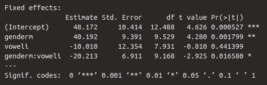

# Mixed Linear Regression

## Load Packages and Data

Please load the following packages and datasets:

```{r}
library(emmeans)
library(lmerTest)
library(MuMIn)
library(tidyverse)
library(magrittr)
url <- "http://www.phonetik.uni-muenchen.de/~jmh/lehre/Rdf"
df <- read.table(file.path(url, "int_new.txt"), stringsAsFactors = T, header = T) %>% 
  mutate(subject = factor(subject, levels = paste0("S", 1:10))) %>% 
  as_tibble()
```

## Mixed Models (LMERs): Introduction

A Linear Mixed Effects Regression (LMER; also: Linear Mixed Model) is used to test whether a measured dependent variable is influenced by one or more independent variables. This type of model is called "mixed" because it can include both variables whose influence on the dependent variable is of interest to researchers (fixed effects) and variables whose influence is arbitrary and therefore uninteresting (random effects). Fixed effects in a mixed model can be categorical or continuous, while random effects are exclusively categorical.

This extends simple and multiple linear regression, which used only fixed effects as predictors. In phonetics and linguistics, study participants and items or words are often used as random effects in LMERs. This is because we select a *random* sample of participants and/or words from a specific language and hope that the results will be generalizable to other participants and/or words from the same language. This random selection process introduces noise into our experiment, which we can then "remove" using LMER. While we expect fixed effects to have a predictable influence on the dependent variable, the influence of random effects is unpredictable, i.e., random.

Let's look at the data frame `df`, which we already know from previous chapters (it has been slightly modified for this chapter):

```{r}
df
```

Here we have the speakers in the `subject` column and the words produced in the `word` column. We are interested in whether the vowel sound (`vowel`) and gender (`gender`) have an influence on the volume (`db`). To answer this question, we will look at the data in a figure:

```{r}
ggplot(df) + 
  aes(x = vowel, y = db, fill = gender) + 
  geom_boxplot()
```

We see (as in the previous chapter) that women produced vowels more quietly than men and that /i/ was produced somewhat quieter than /a/. It can also be assumed that there is an interaction between gender and vowel sound, since the effect of gender is more pronounced for /a/ than for /i/ (or vice versa: the effect of vowel sound is more pronounced for men than for women).

However, we know that we recorded several participants and various words to investigate this question. We are not interested in the precise influence of the individuals or words on the volume; on the contrary, we want to derive a general statement about the participants and words that (theoretically) applies to all possible participants and words. Should there be significant volume differences between the individual participants and/or the individual words, we have caused noise through our random selection of participants and words. Using boxplots, we examine whether there are significant variations in decibel levels between the speakers and/or between the words.

```{r}
ggplot(df) + 
  aes(x = subject, y = db) + 
  geom_boxplot()
ggplot(df) + 
  aes(x = word, y = db) + 
  geom_boxplot()
```

Since there are sometimes large volume differences between individual speakers and between individual words, it is absolutely essential that we use random effects for these two variables in the mixed model we will construct for our research question.

A second extremely important reason for random effects is that we frequently conduct so-called **repeated measure** experiments, in which, for example, several data points come from the same participant and/or words are repeated multiple times. This means that the data points are no longer independent of each other (for example, data points from the same participant will often be closer together than those from other participants). However, this is an important assumption in regression models, which we have not yet discussed. Therefore, when considering which statistical model might be suitable for the data and our research question, we must take into account whether the data points are independent of each other or not (in previous chapters, we sometimes ignored this assumption for didactic reasons). If the data points cannot be considered independent, a mixed model must be used, as random effects account for the dependencies between data points. One difference between the independence assumption and the other two assumptions you have encountered so far is that the independence assumption refers directly to the measured data, while the normality and variance assumptions refer to the residuals.

In simple and multiple linear regression, an intercept and then a slope are estimated for each independent variable (per fixed effect). Mixed models also do this, but we can now allow the intercept and the slope(s) to differ for the levels of the random effects. To explain the concepts of **random intercept** and **random slope**, we will first focus on `subject` as a random effect.

## Random Intercepts vs. Random Slopes

### Random Intercepts

You may recall that, using treatment coding, the vowel /a/ is interpreted as zero and the vowel /i/ as one. Similarly, the level `f` (*female*) of the variable `gender` is interpreted as zero and `m` (*male*) as one. The estimation of the mean volume of /a/ for women is therefore the intercept in our mixed model (just as it was previously in the multiple regression). Using the boxplots above, we observed that the participants differed significantly in terms of volume. It is now of interest to us whether participants of the same gender also differ in the mean volume of /a/ (the level of `vowel` processed in the "general" intercept). If so, we can use a random intercept for the variable `subject`, requiring that the intercept be allowed to vary from person to person (hence the alternative term *varying intercepts*).

The following figure shows the decibel levels for the vowels /a/ and /i/, separated by participant. Participants S1-S5 are male, and participants S6-S10 are female. The orange crosses mark the mean decibel levels per person and vowel. If we now look at the mean /a/ levels per participant within the same row (the leftmost orange cross in each panel), there are significant differences, for example, between S1 and S4 or between S8 and S10. This indicates that it is advisable to calculate a random intercept for each speaker.

```{r}
ggplot(df) + 
  aes(x = vowel, y = db) + 
  geom_point() + 
  facet_wrap(~subject, nrow = 2) + 
  geom_point(data = df %>% 
               group_by(subject, vowel) %>% 
               summarise(db = mean(db)),
             color = "orange", size = 3, stroke = 2, shape = 4) + 
  geom_line(data = df %>% 
              group_by(subject, vowel) %>% 
              summarise(db = mean(db)),
            aes(x = vowel, y = db, group = subject),
             lty = "dashed")
```

In R notation, a random intercept is written as `(1 | subject)`. Here, `1` represents intercept, and the formula essentially means "estimate speaker-specific intercepts." In practice, however, a mixed model using such a random intercept doesn't calculate one intercept per person, but rather the *standard deviation* of the subject intercepts from the estimated "general" intercept across all data points. This is important because calculating the mixed model would take an extremely long time and likely produce errors if it actually estimated one intercept per subject.

### Random Slopes

In the figure above, you can see the mean values for /a/ and /i/, as well as a dashed line connecting them. This dashed line represents, in effect, the ideal regression line for each participant. Since the lines vary considerably in steepness, we can infer that the individual participants have different slopes. For example, participant S7 makes hardly any difference in volume between /a/ and /i/ (the slope is approximately 0), while participant S6 produces /a/ significantly louder than /i/ (the slope is negative). Again, we are only comparing the slopes within each gender group, i.e., for S1-S5 and for S6-S10. Here, it seems sensible to also calculate speaker-specific random slopes because the effect of the vowel on volume differs for each participant.

It is generally assumed that a random intercept should also be estimated when estimating random slopes. Therefore, the formula for random slopes is `(1 + vowel | subject)`, meaning "estimate speaker-specific intercepts and speaker-specific slopes relative to the vowel." However, the shorthand notation `(vowel | subject)` is often used instead, as it makes it clear that the function should calculate both random slopes and random intercepts. Here again, the deviation from the "general" slope is estimated, and not actually a slope per subject. If you really only want to estimate the random slope without the random intercept, the formula needs to be `(0 | subject)`.

You might now be wondering why the fixed effect `gender` seems to play a somewhat subordinate role here compared to `vowel`. Why, for example, are we not interested in `(1 + gender | subject)` or `(1 + vowel + gender | subject)`? This is because the levels of the variable `gender` do not vary per participant, as the participants here are *either* male *or* female, as the following table shows:

```{r}
table(df$subject, df$gender)
```

Therefore, there is no variation here that we could factor out using the corresponding random slope. For the levels of the variable `vowel`, however, we have values for each participant (they produced both /a/ and /i/). This, in turn, means that the effect of vowel on volume can differ from participant to participant (the effect of gender on volume, however, cannot differ between participants).

```{r}
table(df$subject, df$vowel)
```

### Determining the Random Effects Structure for `word`

Now that we know what the random effect looks like for `subject`, we'll go through the same procedure for the variable `word`. This time, we'll start by finding out if there are measurements for each word from both genders and from both vowels:

```{r}
table(df$word, df$gender)
table(df$word, df$vowel)
```

This seems to be the case for gender, but not for vowel; that is, the effect of gender on volume can vary from word to word. However, the effect of vowel on volume cannot vary from word to word because every word contained *either* /a/ *or* /i/. Therefore, the maximum random effects structure we could create for the variable `word` is `(1 + gender | word)` (both random intercept and random slope relative to gender).

First, let's see if we even need a random intercept for `word` (although the word-specific boxplots above already strongly suggest that we do). We'll use a similar plot to the one before, allowing us to compare the mean volume levels for women per word (`f` was the level of the variable `gender` processed in the intercept). Of course, you could also calculate these mean levels using *tidyverse* functions. The words in the top row of the image contain /a/, those in the bottom row contain /i/.

```{r}
ggplot(df) + 
  aes(x = gender, y = db) + 
  geom_point() + 
  facet_wrap(~word) + 
  geom_point(data = df %>% 
               group_by(word, gender) %>% 
               summarise(db = mean(db)),
             color = "orange", size = 3, stroke = 2, shape = 4) + 
  geom_line(data = df %>% 
              group_by(word, gender) %>% 
              summarise(db = mean(db)),
            aes(x = gender, y = db, group = word),
             lty = "dashed")
```

The average loudness level for women (the leftmost orange cross in each panel) differs for various words. For example, the word `w1` has a significantly lower average loudness level than `w3` when produced by women. The average volume levels for women in words containing /i/ (`w4`-`w6`) also differ considerably. Therefore, calculating a random intercept for `word` is appropriate: `(1 | word)`.

Interestingly, the dashed lines connecting the orange crosses are almost parallel for the three words in each row in the figure. This means that the effect of gender on the words `w1`, `w2`, and `w3` is the same (or at least very similar). The same applies to the words `w4`, `w5`, and `w6`, which hardly differ in the slope of their dashed lines. Thus, within a vowel group, the effect of gender on the different words is the same. This means that a word-specific random slope relative to gender `(1 + gender | word)` would not be appropriate for this dataset. `(1 | word)` remains the random effect structure for the variable `word`.

## LMER in R

The classic package used for LMERs is called `lme4`. Here, we're using `lmerTest` instead, which is a wrapper for `lme4`. The function for calculating a mixed model is called `lmer()`. Our complete formula contains the usual first part for the fixed effects (including interaction, if needed), and then the random effects for `subject` and `word`. This time, we'll look at the results of the mixed model using the `summary()` function. The function optionally takes the argument `corr = F` to suppress the display of a specific correlation table that isn't relevant to our purposes.

<div class="gray">
**Further Information: Show LMER results**

Instead of `summary()`, you can also download the package [`broom.mixed`](https://cran.r-project.org/web/packages/broom.mixed/vignettes/broom_mixed_intro.html), which provides the functions `tidy()`, `augment()` and `glance()` for LMERs.
</div>

The function `lmer()` receives the formula we painstakingly developed, using the familiar fixed effects structure `db ~ gender * vowel`, followed by the random effects connected by plus signs. Additionally, the data frame is specified with the argument `data`. In this case, we also specify `REML = F`. `REML` stands for *Restricted Maximum Likelihood*. By giving the function the argument `REML = F`, a true maximum likelihood estimate of the desired parameters is now performed instead (more on this later).

```{r}
df.lmer <- lmer(db ~ gender * vowel + (1 + vowel | subject) + (1 | word), data = df, REML = F)
df.lmer %>% summary(corr = F)
```

Here, we are first shown exactly what kind of model was calculated and which formula was used. This is followed by a list of measures for the *model selection*, namely `AIC` (*Akaike information criterion*), `BIC` (*Bayesian information criterion*), and `logLik` (logarithmic likelihood). These absolute values have no meaning; however, when compared with values from other models for the same data, lower values for `AIC` and `BIC`, as well as higher values for `logLik`, indicate a better fit of the model to the data. `df.resid` stands for *residual degrees of freedom*; this is the number of data points minus the number of estimated parameters. The data frame `df` has 120 observations (rows, data points), and nine parameters were estimated by our model:

- for the fixed effects: `(Intercept)`, `genderm`, `voweli`, `genderm:voweli`
- for the random effects: `subject (Intercept)`, `subject voweli`, `word (Intercept)`, `Residual`, `Corr` for the speaker-specific slope by vowel.

The usual summary statistics for the residuals follow. New to us is the table for random effects, while the table for fixed effects is familiar. We will examine these two tables in more detail below.

### Fixed Effects



The table for the fixed effects looks familiar. We see the estimate for the intercept and then the estimates for the slopes `genderm`, `voweli`, and the interaction `genderm:voweli`. The estimated average dB level for the /a/ of women is 48.2 dB. Men apparently speak significantly louder, as the slope for `genderm` is high and positive. This means that the /a/ of men is approximately $48.2 + 40.2 = 88.4$ dB. The vowel /i/, on the other hand, is produced more quietly than /a/, as the slope is negative at -10 dB, meaning that the /i/ of women was produced at approximately $48.2 - 10.0 = 38.2$ dB. Finally, we see that 20.2 dB must be subtracted for the /i/ of men, meaning the estimated mean for the /i/ of men is $48.2 + 40.2 + (-10.0) + (-20.2) = 58.2$ dB.

We are also given the standard errors and the results of the $t$-statistic, which tests whether the regression coefficients differ significantly from zero. According to this statistic, gender had a significant influence on loudness ($t$[9.5] = 4.3, $p$ < 0.01), and the interaction between gender and vowel was also significant ($t$[9.2] = 2.9, $p$ < 0.05). The vowel, however, had no significant influence on loudness. As you can see, the $t$-statistic is reported here along with the degrees of freedom from the `df` column, because the degrees of freedom are the defining parameter for the Student's $t$ distribution. The degrees of freedom are also an estimate here, which is why the values are often decimal.

*Since there is a significant interaction between the categorical independent variables, we will later perform post-hoc tests using `emmeans`.*

### Random Effects


Now let's take a closer look at the random effects. As mentioned earlier, instead of calculating an intercept and a slope for each participant, the standard deviation of the person-specific intercepts and slopes from the estimated "general" intercept and the estimated "general" slope is estimated. Each value in the `Std.Dev` column is therefore a parameter estimated by the mixed model. The standard deviation for the speaker-specific intercepts is 14.7 dB, meaning the speaker variation around the "general" intercept of 48.2 dB is $\pm 14.7$ dB, which is relatively large. We can apply the 68-95-99.7 rule here: 95% of the speaker-specific intercepts should lie within the range of $Intercept \pm 2 \cdot Std.Dev$, i.e., between 77.6 dB and 18.8 dB. This large range of values shows that there were indeed large differences in the intercepts of the different test subjects.

The speaker variation around the "general" slope for `voweli` of -10 dB is 10.5 dB, which is a very large standard deviation: this means that 95% of the speaker-specific slopes lie in the range of -31 dB to 11 dB, which in turn means that the vowel effect was extremely different for each speaker. This again justifies the calculation of the speaker-specific random slope. Additionally, the `Corr` column contains the correlation value $r$ for the correlation between the speaker-specific random intercept and the speaker-specific random slope. Since the correlation here is negative, this means that subjects with a higher intercept have a steeper negative slope for /i/. So, if someone produced the /a/ particularly loudly, that person also produced a quieter /i/ (note: we are describing a correlation here, not causality!). The correlation `Corr` is considered another parameter that was estimated by the model.

## Convergence Problems and Simplifying the Model

When calculating LMERs, so-called convergence problems regularly occur. The most common error is the following:


This error, roughly speaking, means that the desired model could not be estimated. This is usually due to the inclusion of unnecessarily complex random effect structures and/or too many independent variables and interactions overall. Therefore, you should carefully consider which formula you use for the mixed model; every fixed effect, every interaction, and every random effect should be meaningful for the data and the research question.

Previously, we established that it would not be meaningful to estimate a random slope for gender given a word `(1 + gender | word)` for the data in `df`. We will do this anyway to demonstrate how to handle the resulting error.

```{r}
df.wrong <- lmer(db ~ gender * vowel + (1 + vowel | subject) + (1 + gender | word), data = df, REML = F)
df.wrong %>% summary(corr = F)
```

The introduction of the word-specific random slope has indeed created a convergence problem -- and yet the result is still displayed. However, this result is not reliable and must not be reported under any circumstances.

Let's look at the random effect `word`. Here, a random intercept was estimated, for which then a standard deviation of 14 dB was estimated. So far, so good. But then we see that the random slope has an extremely small standard deviation of only 0.3 dB. This means that the word does not vary at all with the gender of the participants (we had previously established this using a plot). Nevertheless, the mixed model attempted to estimate the random slope and the correlation between the random intercept and the random slope -- and failed. You can see this from the fact that $r = -1$ (or when $r = 1$) in the `Corr` column, because a perfect correlation does not exist. The 1 or -1 indicates that the correlation could not be estimated.

For such cases, there's the `step()` function from the `lmerTest` package. This function examines all fixed and random effects structures in the model and calculates which ones are significant and thus contribute something essential to the model, and which ones are not. The variables that don't contribute are eliminated. This leaves a model that only includes the statistically relevant variables. However, this does *not* mean that you can't still keep variables in the model that aren't significant (as long as the model still converges)! Here's the result of `step()`:

```{r}
df.step <- df.wrong %>% step()
df.step
```

Occasionally, the function throws the above error multiple times, specifically when it calculates a new model with a modified formula and the error persists. First, we see the *Backward reduced random-effect table* in the results. *Backward reduction* is a process where the most complex model is tested first, and then the non-significant terms are gradually removed. Here, we see that the Random Slope `gender` in the Random Effect `(1 + gender | word)` is not significant and has therefore been removed. This leaves only the Random Intercept `(1 | word)`. This was also re-evaluated in line 3 and deemed important. The Random Slope `vowel` in `(1 + vowel | subject)` can also remain. The same procedure is followed for the Fixed Effects.

Finally, `step()` shows us which model it ultimately selected:

`db ~ gender + vowel + (1 + vowel | subject) + (1 | word) + gender:vowel`

Our fixed effects are written out here as `gender + vowel + ... gender:vowel`. Random intercept and slope for participants remain unchanged, and for the random factor `word`, only the intercept is now estimated. Thus, we obtain exactly the model we calculated previously. Using the `get_model()` function, applied to the result of the `step()` function, we can display the results of the simplified model:

```{r}
df.lmer.new <- df.step %>% get_model()
df.lmer.new %>% summary(corr = F)
```

## Reporting Results

We know the results of the $t$-tests for the regression coefficients and have found that the interaction between the two categorical independent variables was significant. Therefore, for the sake of completeness, we perform the pairwise comparisons using `emmeans`:

```{r}
emmeans(df.lmer.new, pairwise ~ vowel | gender)$contrasts
```

```{r}
emmeans(df.lmer.new, pairwise ~ gender | vowel)$contrasts
```

When reporting your results, describe the model in detail. In a scientific publication, also dedicate a few lines to describing the direction of the fixed effects (e.g., "The mixed model showed that /a/ was produced more loudly than /i/, especially by male participants") and whether this aligns with your expectations/hypotheses.

Here is an example of a short results report addressing the question: Is volume influenced by gender and vowel?

**A linear mixed-effects regression was performed with loudness in decibels as the dependent variable, as well as fixed effects for gender and vowel (including the interaction between them) and random effects for subjects and words. For subjects, both random intercept and random slope by vowel were estimated, and for words, only the random intercept. The model revealed a significant effect of gender ($t$[9.5] = 4.3, $p$ < 0.01) on loudness. There was also a significant interaction between gender and vowel ($t$[9.2] = 2.9, $p$ < 0.05). Post-hoc $t$-tests showed a significant difference between women and men for /a/ ($t$[10.8] = 4.0, $p$ < 0.01), but not for /i/.**

## Quality Criteria for Mixed Models

### Marginal and Conditional $R^2$

You may have noticed that the `summary()` function did not return either the $R^2$ or the $F$-statistic, as it did previously with the `lm()` regressions. In the case of $R^2$, this is because we now need to evaluate separately for fixed and random effects how much variance they each represent in the data. The `MuMIn` package provides the `r.squaredGLMM()` function, which we can apply to our mixed model:

```{r}
df.lmer %>% r.squaredGLMM()
```

Consequently, we are now shown two $R^2$ values. The first, `R2m` (which stands for **marginal $R^2$**), is the proportion of the variance in the measured volume values described by the fixed effects, in this case 46%. The second, `R2c` (for **conditional $R^2$**), is the proportion of the variance in the measured volume values described by the fixed effects and random effects *together*. With 96.4%, we have thus described virtually the entire variance in the data! (You will never see such high values in actual linguistic studies). From this, we can deduce that the random effects describe $96.4 - 45.9 = 50.5$% of the variance. Therefore, it was very important for the dataset `df` that we included the random effects in the model.

### Likelihood Ratio Tests

The model's output lacked an indicator of model goodness-of-fit, such as the $F$-statistic in `lm()`, in addition to the $R^2$ value. For LMERs, goodness-of-fit is evaluated using likelihood ratio tests. These tests compare the mixed model used with another mixed model in which a fixed or random effect has been eliminated. This allows us to assess whether omitting a factor decreases or maintains the model's goodness-of-fit.

At this point, we should examine the term *likelihood*, especially in contrast to *probability*. In a statistical context, *probability* is the probability of a result given the parameters (e.g., regression coefficients). The $p$-values describe this type of probability. *Likelihood*, on the other hand, is the likelihood of parameters given the data. How likely is the estimate for the intercept (here: 48.2 dB) for the data in `df`? Or how likely is the estimate for the slope for gender (40.2 dB) for the data in `df`? Mixed models perform these estimates according to the **principle of maximum likelihood** (after we have specified `REML = F` in `lmer()`), i.e., the goal of the mixed model is to find the regression coefficients that are most likely for the given data.


The output of a mixed model using `lmer()` includes three values: AIC, BIC, and log likelihood. The latter is the logarithm of the maximized likelihood; this value is always negative, but the closer it is to zero, the better the model. The likelihood ratio test compares the log likelihoods of two mixed models and determines whether the chosen model describes the data significantly better than a model that omits a variable. Here, we compare our model `df.lmer` with several other models; first, with a model that omits the variable `gender`.

```{r}
df.gender <- lmer(db ~ vowel + (1 + vowel | subject) + (1 | word), data = df, REML = F)
```

The `anova()` function tests the comparison of the models for significance using a $\chi^2$-test (pronounced: chi /kai/ squared). "Anova" actually stands for *analysis of variance*; however, the *default* of the `anova()` function is the $\chi^2$-test, which is performed by the argument `test = "Chisq"`. Otherwise, this function only receives the names of the two models as arguments. The $\chi^2$-test checks whether the logarithmic likelihood of the two models differs significantly.

```{r}
anova(df.lmer, df.gender)
```

The results of this test show the two models that were compared. The first column of the table, `npar`, shows the number of parameters estimated for the model. Following this are the information criteria `AIC`, `BIC`, `logLik`, and `deviance`, which we already know from the results of `lmer()`. The top row shows the values for the restrictive model, and the bottom row shows those for our model. For our model, the $\chi^2$-value is also given in the `Chisq` column. The $\chi^2$ distribution is described by the parameter `Df` (degrees of freedom). The degrees of freedom here represent the number of regression coefficients that were not estimated in the restrictive model (here: the fixed effect for `gender` and the interaction between `gender` and `vowel`; also calculable from the difference between the two values in the `npar` column). Finally, the column `Pr(>Chisq)` contains the $p$-value, which was read from the $\chi^2$ distribution with two degrees of freedom for the value 10.59. Since the $p$-value is below 0.05, the two models differ significantly; because the log likelihood for our model is higher than that of the restrictive model (and AIC and BIC are lower for our model than for the restrictive model), our model fits the data better than a model without the variable `gender`.

The formula for the $\chi^2$-value is:

$$
\begin{aligned}
 LR &= -2ln \cdot \left( \frac{L_{m_1}}{L_{m_2}} \right) \\
 &= 2 \cdot (log(L_{m_2}) - log(L_{m_1}))
\end{aligned}
$$

$LR$ here stands for *likelihood ratio*, which is why the formula also contains a division: the likelihood $L$ for the restrictive model $m_1$ divided by the likelihood for our full model $m_2$. $ln$ stands for the natural logarithm. However, this formula can be rearranged so that instead of the unknown likelihoods, we can use our log likelihoods from the result of `lmer()`. For the likelihood ratio test above, the $\chi^2$-value can therefore be calculated manually as follows:

```{r}
2 * (-416.36 - (-421.65))
```

<div class="gray">
**Further Information: $\chi^2$ distribution**

Just as you have already learned about the normal, $t$, and $F$ distributions, the functions `dchisq()`, `pchisq()`, and `qchisq()` allow you to work with the $\chi^2$ distribution yourself. You can, if desired, plot a $\chi^2$ distribution with the desired degrees of freedom or calculate the $p$-value for a specific $\chi^2$ value. See also:

```{r, eval = F}
?dchisq
```

</div>

Finally, we report the results of the likelihood ratio test: **A likelihood ratio test showed that the chosen model provided better estimates for the model parameters than a comparable mixed model without the variable `gender` ($\chi^2$[2] = 10.6, $p$ < 0.01)...**

Now we can do the same for some further comparisons:

```{r}
df.vowel <- lmer(db ~ gender + (1 | subject) + (1 | word), data = df, REML = F)
anova(df.lmer, df.vowel)
```

**...and as a comparable mixed model without the variable `vowel` ($\chi^2$[4] = 96.7, $p$ < 0.001)...**

```{r}
df.subject <- lmer(db ~ gender * vowel + (1 | word), data = df, REML = F)
anova(df.lmer, df.subject)
```

**...and as a comparable mixed model without the variable `subject` ($\chi^2$[3] = 173.6, $p$ < 0.001)...**

```{r}
df.word <- lmer(db ~ gender * vowel + (1 + vowel | subject), data = df, REML = F)
anova(df.lmer, df.word)
```

**... and finally as a comparable mixed model without the variable `word` ($\chi^2$[1] = 191.0, $p$ < 0.001).**
