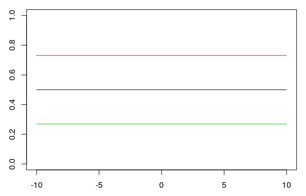

# Logistic Regression

## Load Packages and Data

Please load the following packages and data frames:

```{r}
library(magrittr)
library(tidyverse)
url <- "http://www.phonetik.uni-muenchen.de/~jmh/lehre/Rdf"
ovowel <- read.table(file.path(url, "ovokal.txt")) %>% as_tibble() %>% 
  rename(vowel = Vokal, year = Jahr, subject = Vpn) %>% 
  mutate(vowel = ifelse(vowel == "hoch", "high", "low"))
pvp <- read.table(file.path(url, "pvp.txt")) %>% as_tibble() %>% 
  rename(response = Urteil)
sz <- read.table(file.path(url, "sz.txt")) %>% as_tibble() %>% 
  rename(fricative = Frikativ, dialect = Dialekt)
```

## From Linear to Logistic Regression

Logistic regression (just like linear regression) is a statistical test that examines whether a dependent variable is influenced by an independent factor. In contrast to the linear regression, the dependent variable in a logistic regression is always **categorical and binary**, while the independent variable can be **either numeric (continuous) or categorical**. Logistic regression allows us to estimate the probability of a particular value, assuming a relationship exists between the dependent and independent variables.

Examples:

- To what extent is the vocalization of a final /l/ in English (*feel* vs. '*feeu*') influenced by dialect?
  + Dependent variable: Vocalization (categorical with two levels: yes, no)
  + Independent variable: Dialect (categorical with two or more levels)

- Is "passt" more likely to be produced with /ʃ/ in Augsburg compared to Munich?
  + Dependent variable: Fricative (categorical with two levels: /s/, /ʃ/)
  + Independent variable: Dialect (categorical with two levels: Augsburg, Munich)

- The vowel /a/ in /lam/ is synthesized with different durations and played back to listeners. Do the participants hear "lahm" (long /a:/) more often than "Lamm" (short /a/) as the vowel duration increases?
  + Dependent variable: Vowel (categorical with two levels: /a/, /a:/)
  + Independent variable: Duration (continuous)
  
Since the dependent variable in logistic regression is always a factor with two levels, these levels can also be coded as 1 and 0, and we can ask what the probability $P$ is that the dependent variable $y$ takes the value 1 based on the given data: $P(y = 1)$. Similarly, we can ask for the probability $Q$ that $y$ takes the value 0: $1 - P(y = 1)$. For the third example above, this would mean the following:

- $P$: Probability that subjects hear "lahm" with increasing vowel duration ("success," because based on our knowledge or previous findings, e.g., from other experiments, we assume that subjects should hear "lahm" with increasing vowel duration)
- $Q$: Probability that subjects hear "Lamm" with increasing vowel duration ("failure," because again, based on our previous knowledge of this phenomenon, we assume that it would be strange if subjects heard "Lamm" with increasing vowel duration)

The division (ratio) of $P$ and $Q$ is called the **odds** (probability of winning):

$Odds = \frac{P(y = 1)}{1 - P(y = 1)} = \frac{P}{Q}$ 

The odds of winning always lie within a range of 0 to infinity. One might consider simply using the odds as the dependent variable in a linear regression, since it's no longer a categorical, binary dependent variable. The problem is that `lm()` doesn't know that the odds can only take values from zero to infinity and would therefore also predict values outside this range. Furthermore, the ratio of $P$ to $Q$ says nothing about how many observations were used in calculating this ratio (the more observations, the more meaningful the calculated odds). So we need a function that transforms the odds into something that, firstly, falls within the range $\pm$infinity and, secondly, weights the proportions based on the number of observations. This function is generally called a **link function** and, in the case of logistic regression, is the **logit transformation of the odds**. The logit is the logarithm of the odds of winning and is therefore also referred to as **log odds**:

$log(\frac{P}{Q})$

### An Example for $P$, $Q$, and Logit

Between 1950 and 2005, words like *lost* in an aristocratic form of English (*Received Pronunciation*) were increasingly produced low vowel /lɔst/ instead of with the high vowel /lost/. We have data in the `ovowel` data frame to support this hypothesis:

```{r}
head(ovowel)
```

Our research question is: *Is the pronunciation of the vowel (high vs. low = dependent variable) influenced by the year (1950...2005 = independent numerical variable)?*

We want to calculate $P$ (the probability that the vowel was low) and $Q$ (the probability that the vowel was high) for each year. Based on our current understanding, the direction of change in the pronunciation of the vowel is from high to low, so we define it as "success" if the vowel was produced low and as "failure" if it was produced high. As a first step in calculating $P$ and $Q$, we code low and high pronunciation as 1 and 0, respectively, as `TRUE` and `FALSE`:

```{r}
ovowel %<>% mutate(success = ifelse(vowel == "low", TRUE, FALSE),
                   failure = !success)
head(ovowel)
```

Then we take the first year, 1950, and calculate $P$ and $Q$ by counting how many "successes" and "failures" we have for that year:

```{r}
P <- ovowel %>%
  filter(year == 1950) %>% 
  summarise(P = sum(success)) %>% 
  pull(P)
P
Q <- ovowel %>%
  filter(year == 1950) %>% 
  summarise(Q = sum(failure)) %>% 
  pull(Q)
Q
```

This means that in 1950, the vowel /o/ in words like *lost* was only produced 5 times as a low vowel, but 30 times as a high vowel. We would have to do this for every level of the independent variable (for every year)... But that would be very cumbersome. So we group the data frame by year:

```{r}
df <- ovowel %>%
  group_by(year) %>%
  summarise(P = sum(success), Q = sum(failure))
df
```

Using $P$ and $Q$ we can now calculate the log odds (the logit):

```{r}
df$log_odds <- log(df$P/df$Q)
df
```

Let's look at the distribution of log odds over the decades:

```{r}
ggplot(df) + 
  aes(x = year, y = log_odds) + 
  geom_point()
```

It is these log odds that we will use to construct a regression line using logistic regression. This regression line is defined in the same way as the linear regression line, but it estimates the log odds:

$log(\frac{P}{Q}) = bx + k$

Once again, 

- $b$ is the slope
- $x$ is a value on the x-axis
- $k$ is the y-intercept

Here, however, we cannot calculate $b$ and $k$ as easily as in linear regression; that is, we have them estimated directly.

### The Logistic Regression Line

For linear regression, we estimated the regression coefficients using the `lm()` function, which employs the least squares method. The **logistic regression line**, on the other hand, is approximated using the **maximum likelihood** method, which ensures that the estimated data points of the logistic model are as close as possible to the actual values. To estimate the regression coefficients, we use the function `glm()`, which stands for **Generalized Linear Model**. In addition to the formula `y ~ x` and the data frame, the function receives the argument `family = binomial`, which tells the function to perform the logit transformation. The dependent variable must be a factor; if necessary, you must convert the variable into a factor using `as.factor()`:

```{r}
class(ovowel$vowel) # not a factor
lreg <- glm(as.factor(vowel) ~ year, family = binomial, data = ovowel)
```

We'll look at the summary of this model later. First, we'll show an alternative to the above application of `glm()` to the original data frame. `glm()` can also be executed on $P$ and $Q$ from the combined data frame `df` by concatenating $P$ and $Q$ using `cbind()` and using them as dependent variables:

```{r}
lreg2 <- glm(cbind(P, Q) ~ year, family = binomial, data = df)
```

We can use `coef()` to display the regression coefficients:

```{r}
coefs <- coef(lreg)
coefs

# or with $coefficients
lreg$coefficients
```

Using these parameters, the straight regression line can be superimposed onto the data in the logit space with either `geom_smooth()` (which receives `method = "glm"` as an argument) or `geom_abline()` (with the estimated `coefs`).

```{r}
# with geom_smooth():
ggplot(df) + 
  aes(x = year, y = log_odds) + 
  geom_point() + 
  geom_smooth(method = "glm", se = F)

# with geom_abline():
ggplot(df) + 
  aes(x = year, y = log_odds) + 
  geom_point() + 
  geom_abline(intercept = coefs[1], slope = coefs[2], color = "blue")
```

The values estimated by logistic regression are the *log odds*. We can again use the `predict()` function to display the estimated *log odds*:

```{r}
log_odds_estimate <- predict(lreg)
log_odds_estimate
```

The output of `predict()` in this case consists of 220 numbers, one number per row in the original data frame `ovowel`. As you can see, the estimated log odds are repeated. This is because one log odd value is calculated for each level (or value) of the independent variable; in this case, there are six unique log odd values, one for each year:

```{r}
unique(log_odds_estimate)
```

We can plot these predicted values in red on our plot from above and find that the predicted values lie exactly on the regression line (we use `geom_abline()` here):

```{r}
ggplot(df) + 
  aes(x = year, y = log_odds) + 
  geom_point() + 
  geom_abline(intercept = coefs[1], slope = coefs[2], color = "blue") +
  geom_point(data = data.frame(x = unique(ovowel$year), y = unique(log_odds_estimate)),
             mapping = aes(x, y),
             color = "red")
```

Just like with linear regression, we can also use `predict()` to predict the *log odds* values for x-values that are not present in the original dataset. For example, if we want to estimate the logit values for the years 2000 to 2020, it works as follows:

```{r}
predict(lreg, data.frame(year = 2000:2020))
```

### Regression with `glm()`

The result of the function `glm()` is an object of the classes "glm" and "lm":

```{r}
class(lreg)
```

We apply the `summary()` function to the result of the logistic regression `lreg` and look at the result again line by line:

```{r}
summary(lreg)
```

The summary begins again with the *call*, i.e., the function that was used.

#### Coefficients

The table of regression coefficients follows:

{width=60%}

The first row of this table contains the values for the intercept, the second for slope. The first column again shows the estimates for the regression coefficients, which were determined using a maximum likelihood method. The second column shows the standard error, which describes how reliable the estimates are (the smaller the better). A **Wald test** was performed on the two estimates, which checks whether the estimates differ significantly from zero. The result of this test is the **$z$-value**, which can also be calculated by dividing the estimate by the standard error. We are particularly interested in the second row, whose $z$-value and $p$-value show whether the independent variable `year` contributes significantly to explaining the log odds values. If the $p$-value, which is in the fourth column, is less than 0.05 (see also the significance level asterisks), then the coefficient differs significantly from zero. In the case of the dependent variable, we see that the $p$-value is less than 0.001, i.e., the variable is a good predictor for the log odds.

By default, a statement about the **dispersion parameter** is printed after the coefficients table. We can ignore this.

#### Deviances and AIC

The following two lines contain the **null deviance** and the **residual deviance** as well as the **AIC** (*Akaike Information Criterion*):

{width=60%}

The null deviance describes how well a model without independent variables would explain the data. A model without independent variables is characterized solely by the intercept. On its own, the null deviance is difficult to interpret. Therefore, the residual deviance is listed directly below it, describing how well our full model explains the data. The difference between null and residual deviance reveals how helpful our independent variable is in the model. The degrees of freedom are calculated by subtracting the number of parameters in the model from the number of observations in the data frame. With null deviance, there is only one parameter (the intercept), while with residual deviance, there are two (the intercept and the independent variable). The smaller the deviations (i.e., the discrepancies between the actual and the estimated values), the better.

**AIC** stands for **Akaike Information Criterion** and is particularly helpful when comparing different regression models for the same dataset (for example, if you were to calculate another model with more than one independent variable for `ovowel`). The smaller the AIC, the better the model describes the variance in the data. Since we only have the one model here, AIC is irrelevant for our purposes.

#### Fisher Scoring Iterations

In logistic regression, an iterative algorithm calculates the regression parameters, and the Fisher scoring iterations indicate how many iterations were required. This is also irrelevant for our purposes.

{width=60%}

#### Deviance Residuals

The **deviance residuals** are the differences between the empirically observed and estimated values. They are not shown in the result of the logistic regression, but we can look at them using `resid()` and compute the usual summary statistics for them with `summary()`:

```{r}
summary(resid(lreg))
```

### The $\chi^2$-Test & Reporting Results

For the linear regression, the $F$-test was our test statistic. Instead, we perform a **$\chi^2$-test** for the logistic regression, which checks whether our model is a better fit for our data than an intercept-only model. You already know this test from the mixed models; it compares to models to each other. Since we already saw in the coefficients table above that the Wald test was significant for our independent variable, it is likely that our full model is better than a model without independent variables. We once again use the `anova()` function for this:

```{r}
anova(lreg)
```

The result of the $\chi^2$-test has two rows: one for the null model (intercept-only) and the other for the model with the independent variable `year`. The degrees of freedom for null and residual deviation, which are reported in the column `Resid. Dev.`, are found in the column `Resid. Df`. These values were reported in abbreviated form in the summary of the logistic model. From the $\chi^2$-test result, we are particularly interested in the value in the column `Pr(>Chi)`, which contains the $p$-value. If this value is less than 0.05 (see also the significance asterisks), then the model with the variable `year` is a better fit for the data than the null model.

Our initial research question was: *Is the pronunciation of the vowel (high vs. low) influenced by the year?* 

We can now report: *Year had a significant influence on the proportion of 'lost' with low/high vowel ($\chi^2$[1] = 61.1, $p$ < 0.001).*

## The Sigmoid Function and Tipping Point

We presented the results of a logistic regression above in the logit space. However, one can also use the y-intercept and the slope to plot **proportions** on the y-axis instead of log odds. In this case, the regression line is no longer straight, but **sigmoidal** (S-shaped). The formula for the sigmoid function is:

$f(x) = \frac{e^{bx+k}}{1 + e^{bx+k}}$

In this formula, $e$ is the exponential function, $b$ and $k$ are the slope and the intercept, respectively. The larger the slope $b$ is (in the figure: 1, 0.5, 0.25), the steeper the sigmoid curve (black, red, green) becomes:


When the slope is zero, the y-axis is a straight line with a y-value of 0.5. Changing the y-intercept $k$ (0, 1, -1 in the plot) when the slope is $b = 0$ shifts the straight horizontal line up or down (black, red, green):



### The Tipping Point

The **tipping point** is the point at which the sigmoid curve is **steepest**. At this point, the value on the y-axis (the proportion) is always 0.5 (shown below as a horizontal line). The x-value of the tipping point is calculated using $\frac{-k}{b}$. For $k = 4$ and $b = 0.8$, for example, this would be $-4/0.8 = -5$ (dashed line):


### Plotting Proportions

For our example above, we now want to plot proportions and then fit a sigmoidal regression curve to our data. We take our aggregated data frame `df` and calculate the proportion of $P$ (the proportion of "successes") per year:

```{r}
df$proportions <- df$P / (df$P + df$Q)
df
```

For the year 1950, the proportion of "successes" (where the vowel /o/ was produced low) is 14.3%, for the year 1960 it is already 53.8%, and so on. We can now plot these proportions stored in the newly created column `df$proportions` and then use `geom_smooth()` to draw a sigmoidal regression line through the data. To this end, we use the arguments `method = "glm"` (*generalized linear model*), `se = F` (don't show standard error), and additionally `method.args = list(family = "quasibinomial")` so that the function knows that we're plotting proportions.

```{r}
ggplot(df) + 
  aes(x = year, y = proportions) + 
  geom_point() + 
  geom_smooth(method = "glm", se = F,
              method.args = list(family = "quasibinomial"))
```

In this plot, the complete "S" of the sigmoidal curve is not visible because our x-axis is limited. However, we can easily calculate further proportion values using `predict()`. As we saw earlier, `predict()` returns the log odds, not the proportions. We obtain the proportions by using the argument `type = "response"` in `predict()`:

```{r}
predict(lreg, type = "response")
```

These are now the estimated values for all 220 observations in the original data frame. We now want some estimates for the years before 1950 and after 2010. So we also give the `predict()` function a data frame with the desired years:

```{r}
more_props <- predict(lreg, 
                      data.frame(year = c(1910, 1920, 1930, 1940, 2020, 2030)), 
                      type = "response")
more_props
```

We will now create a data frame containing only the year and proportions, using the original data frame and the values just estimated:

```{r}
df_new <- data.frame(year = c(df$year, 1910, 1920, 1930, 1940, 2020, 2030),
                     proportions = c(df$proportions, more_props))

ggplot(df_new) + 
  aes(x = year, y = proportions) + 
  geom_point() + 
  geom_smooth(method = "glm", se = F,
              method.args = list(family = "quasibinomial"))
```

We can also calculate the tipping point for this data, using the `coefs` already stored above:

```{r}
-coefs[1] / coefs[2]
```

According to our model, the year in which the pronunciation of /o/ in the *Received Pronunciation* changes from "high" to "low" is approximately 1965.

## Tipping Points in Perceptual Studies

Tipping points are frequently used in perception tests, which are constructed as follows: We synthesized an 11-step continuum between /pUp/ and /pYp/. Phonetically, the difference between /U/ and /Y/ is the second formant, which is low for /U/ and high for /Y/. We gradually varied this F2 value in the continuum over 11 steps. The first and last tokens in this continuum sound very clearly like PUPP or PÜPP, but in between, it can be difficult for listeners to distinguish between PUPP and PÜPP. Each token from the continuum was then played to several German participants in randomized order, and the participant had to decide whether it was PUPP or PÜPP. We are interested to find out at which F2 value the participants' perception switches from PUPP to PÜPP. In other words, we are interested in the tipping point.

We have stored data from such a perception experiment in the data frame `pvp`:

```{r}
head(pvp)
unique(pvp$response)
unique(pvp$F2)
```

We expect that, with increasing F2 levels, subjects will be more likely to hear /Y/ than /U/, so we code the response /Y/ as success and /U/ as failure:

```{r}
pvp %<>% 
  mutate(success = ifelse(response == "Y", T, F),
         failure = !success)
head(pvp)
```

For the steps of the F2 continuum, we calculate $P$ and $Q$:

```{r}
df <- pvp %>%
  group_by(F2) %>%
  summarise(P = sum(success), Q = sum(failure))
df
```

We then calculate the proportions of $P$ and $Q$ and plot the sigmoidal regression line in the data:

```{r}
df$proportions <- df$P / (df$P + df$Q)
df
ggplot(df) + 
  aes(x = F2, y = proportions) + 
  geom_point() + 
  geom_smooth(method = "glm", se = F, 
              method.args = list(family = "quasibinomial"))
```

To determine the tipping point of this sigmoid curve, we calculate the Generalized Linear Model:

```{r}
pvp.glm <- glm(as.factor(response) ~ F2, family = binomial, data = pvp)
```

Using the estimated regression coefficients, we can now calculate the subjects' perceptual tipping point:

```{r}
coefs <- coef(pvp.glm)
-coefs[1] / coefs[2]
```

This means that above an F2 value of approximately 1151 Hz, the test subjects hear "PÜPP" rather than "PUPP".

Finally, we want to determine whether the test subjects' judgments were actually influenced by F2. For this, we use the $\chi^2$-test.

```{r}
anova(pvp.glm)
```

We report: *The proportion of pUp/pYp responses was significantly influenced by F2 ($\chi^2$[1] = 109.0, $p$ < 0.001).*

## Categorical Independent Factor

The logistic regression can be used in a similar way when the independent variable is categorical. The key difference is that no tipping point needs to be calculated and no sigmoid needs to be plotted.

In the data frame `sz`, we stored information about how 20 participants pronounced the word "Sonne" (sun): either with an initial [s] (voiceless) or an initial [z] (voiced). Of the 20 participants, 9 came from Bavaria and 11 from Schleswig-Holstein:

```{r}
head(sz)
```

Our question is: *Is voicing (two levels: s, z) influenced by dialect (two levels: BY, SH)?*

Since both variables are categorical in this case, we can create a bar plot to get an idea of the data:

```{r}
ggplot(sz) + 
  aes(fill = fricative, x = dialect) + 
  geom_bar(position = "fill")
```

It appears that the initial fricative is produced significantly more often voiceless in Bavaria than in Schleswig-Holstein. Now, as before, we apply a logistic regression followed by a $\chi^2$-test to the data:

```{r}
sz.glm <- glm(as.factor(fricative) ~ dialect, family = binomial, data = sz)
anova(sz.glm, test = "Chisq")
```

The $\chi^2$-test shows: *The distribution of voiced and voiceless /s/ in words like Sonne was significantly influenced by dialect ($\chi^2$[1] = 5.3, $p$ < 0.05).*
